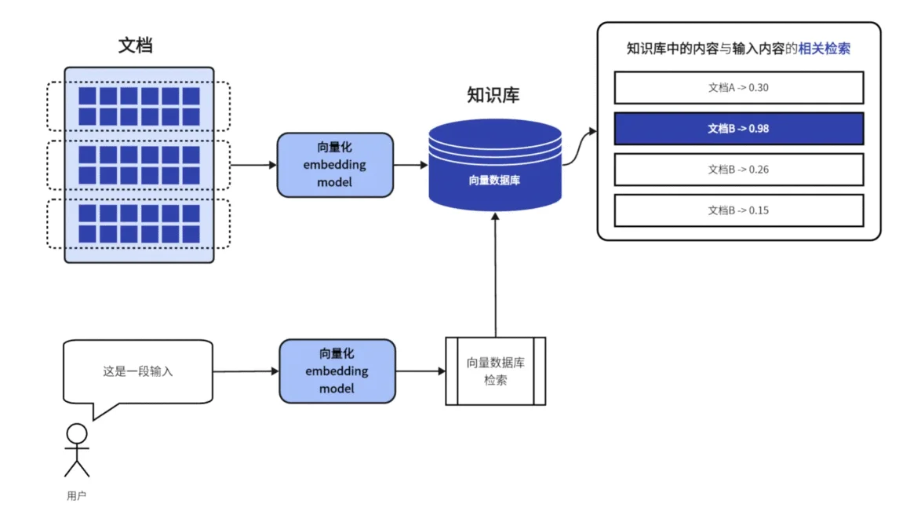
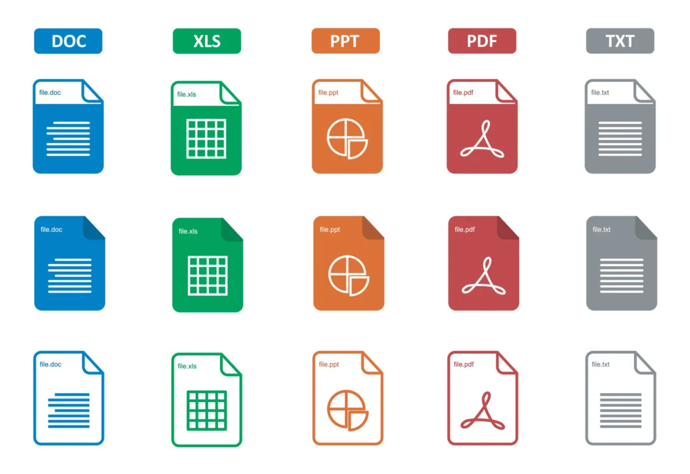
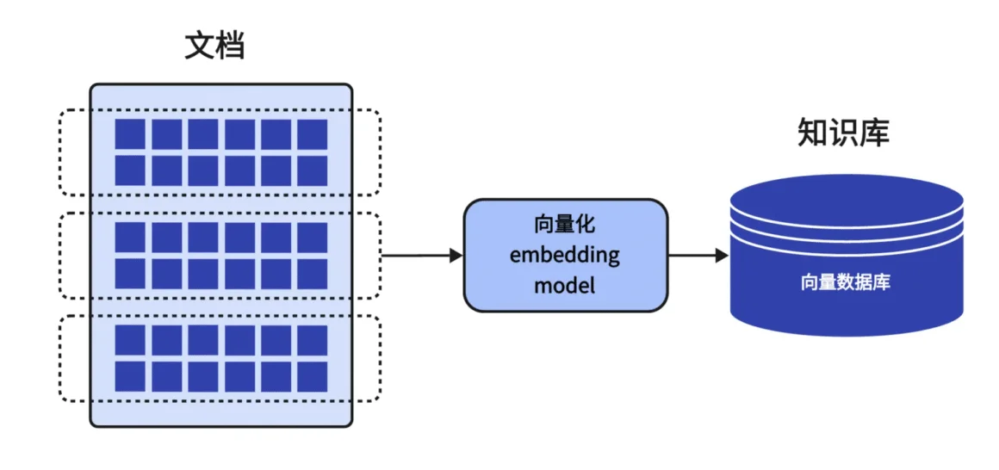

MetaX今天整理了一套完整的从0开始搭建 **RAG（Retrieval-Augmented Generation）知识库** 并实现知识变现的全流程教程。内容涵盖从行业赛道调研、知识体系规划，到使用 n8n 搭建工作流、构建知识库、实现对话系统等每一个关键步骤。希望这份干货能为有志于知识变现的小伙伴提供实用参考。

目前市面上关于 RAG 知识库变现的教程几乎为空白，这仍是一个**蓝海领域**。希望大家勇于尝试，在实践中走出一条属于自己的独特路径。变现没有捷径，唯有在垂直领域深耕、持续输出价值，才是通往成功的必由之路。

需要提醒的是，RAG 知识库的搭建并非一蹴而就，其中涉及大量如资料搜集、信息整理、文本嵌入等工作。但别担心，为了帮大家**大幅提升效率**，MetaX已制作了一整套高效的 n8n 工作流，将逐步对外发布，敬请期待！

## **一. 引言**

在数字时代，“知识付费”已成为内容创业的重要形式。通过将专业知识体系转化为付费产品，可以实现一次制作、长期收益的商业模式。特别是借助 **RAG（Retrieval-Augmented Generation，检索增强生成）** 技术构建的智能知识库，为知识变现带来了全新的可能性 。RAG 简单来说，就是将大语言模型与外部知识源结合，在回答用户提问时先检索相关资料，再生成准确的回答 。与传统静态文档或课程相比，基于 RAG 的知识库具有以下优越特性：

+   **一次制作，长久收益**：知识库搭建完成后，可无限次供用户查询，持续产生收益，无需重复制作内容。
    
+   **附加价值高**：通过智能问答形式提供服务，用户体验更好，愿意为互动性和效率付费，产品附加值更高。
    
+   **蓝海市场**：将 AI 技术与知识付费结合尚处于早期阶段，竞争相对较小，具有“蓝海”优势，抢先布局可获取领先红利。
    
+   **强扩展性**：知识库内容可不断更新扩充，适应新的需求；同时一个流程成熟后可复制到不同领域，批量化生成系列产品。
    
+   **市场空间大**：大众对专业知识获取的需求日益增长，从职场技能到生活百科，各领域潜在用户规模巨大。
    

当然，知识付费领域也存在**知识产权保护难**等挑战。但基于 RAG 的知识库因其提供的是**按需查询**结果，而非直接分发整份内容，某种程度上可以缓解盗版风险——用户很难一次性获取全部知识库内容，只能通过交互逐步获取知识要点，这为原创知识提供了一层“动态保护”。总的来说，RAG 知识库将AI的强大理解与生成能力用于知识服务，具备传统图文课程无法比拟的优势，是值得深入探索的知识变现途径。

本教程将手把手教你如何从零开始，利用开源自动化工具 **n8n** 打造一个可复制的 RAG 知识库，并最终实现上架销售、知识变现的全流程。**MetaX工作流**频道的作者MetaX率先提出了这一解决方案，并提供了预先搭建好的 n8n 工作流模板，极大降低了技术门槛。换句话说，你可以直接使用现成的工作流，无需从头开发AI模型或编写代码，就能快速构建属于自己的智能知识库产品。

接下来，我们将按照实际项目流程，详细讲解每个阶段的操作步骤和注意事项，包括：

1.  **行业调研**：选择细分领域，确定知识库的变现方向
    
2.  **知识体系规划**：梳理知识框架，搭建内容体系
    
3.  **文档获取**：检索并收集知识材料
    
4.  **文档标准化**：整理清洗资料，统一格式和标签
    
5.  **n8n 构建向量知识库**：嵌入文档内容，建立向量数据库
    
6.  **搭建 RAG 问答系统**：集成大语言模型，实现智能问答
    
7.  **宣传资料制作**：准备展示和营销材料
    
8.  **上架销售变现**：选择平台渠道，将产品推向市场
    

无论你是零基础小白，还是有一定技术背景，本教程都将以通俗易懂的语言、清晰的结构和丰富的图文示例，帮助你完成从0到1的整个过程。让我们开始吧！

## **二. 行业调研：确定知识库方向**

**知识库选题**是项目成功的基石。在动手搭建之前，你需要明确要做哪个领域的知识库，以及这个领域是否具有商业变现的潜力。行业调研主要涉及以下几点：

+   **细分领域选择**：尽量选择你熟悉且感兴趣的领域，同时该领域有明确的受众群体和付费意愿。例如职场技能（面试指南、职业资格考试）、垂直爱好（茶艺品鉴、瑜伽训练）、专业咨询（法律问答、财税指导）等。领域不宜过于宽泛，越垂直细分，越能吸引深度付费用户。
    
+   **目标用户分析**：思考该领域的目标用户是谁，他们有什么痛点或高频问题？这些问题是否足够迫切，值得他们付费寻求答案？例如，备考某证书的学员会有大量相关疑问，希望获得权威解答；新手养猫的人会遇到各种养护难题；企业HR可能需要即时查询劳动法条款等。用户痛点越强，知识库的价值越高。
    
+   **竞品和替代品调研**：查找市面上是否已有类似主题的知识付费产品或公开免费的资料来源。付费产品可以是线上课程、电子书、问答社区会员等。评估它们的内容深度、价格、用户评价。若已有众多优质免费内容，你的付费知识库吸引力会降低。但如果几乎没有专门的解决方案（蓝海领域），或者现有内容很分散缺乏系统性，那么就是很好的切入点。
    
+   **付费意愿与定价**：通过调研了解目标用户在该领域的付费习惯与心理价位。例如可以浏览知乎、微信公众平台上的付费专栏，了解订阅人数和价格区间；或者调查类似课程/书籍的定价。确保你的知识库主题有一定的付费意愿支撑，定价既要反映内容价值，又符合用户预期。
    
+   **政策与合规**：确认所选领域内容合法合规，避免涉及敏感或违规信息。特别是医学、金融投资等领域有相关政策监管，要确保内容来源可靠并遵循法规。
    

调研的方法可以多样化：利用搜索引擎查询相关关键词、浏览行业报告和市场分析、逛知乎/论坛获取用户提问及讨论热点、参加目标用户的社群了解他们的真实需求等等。通过充分的前期调研，你应当产出一个明确的知识库选题和定位描述，包括：“**我要面向谁，提供什么独特价值，他们为什么需要付费使用这个知识库**”。这将为后续内容规划指明方向。

实例: 假设经过调研，你决定制作一个“跨境电商运营知识库”。你发现跨境电商卖家群体庞大，但相关知识碎片化散落在各论坛博客；卖家在选品、物流、运营、政策上都有大量疑问，希望有系统的解答平台。同时市面缺乏专门的AI问答产品来解决这些问题。这就成为了一个有潜在市场空间的选题。

## **三. 知识体系规划：搭建内容框架**

确定选题后，下一步是规划知识库的内容框架，相当于搭建“知识树”的过程。有了清晰的知识体系，后续内容收集和整理才能有条不紊地进行。规划时，可以遵循从宏观到微观的思路：

**（1）确定知识模块和一级目录**：根据领域的内在逻辑，将整个知识划分为若干模块或章节。这类似于书籍的目录结构。例如以“跨境电商运营”知识库为例，可以确定几个核心模块：市场调研、选品策略、物流与仓储、营销推广、平台政策法规、店铺管理等等。每个模块就是知识库的一一级分类。

**（2）细化二级三级主题**：在每个模块下，再细分具体主题或知识点。可以采用头脑风暴或思维导图工具（如 XMind、Mindline 等）将相关概念全部列举出来。例如“选品策略”模块下可细分：选品调研方法、热销品类分析、供应链资源、定价策略、避坑指南……逐层分解，形成树状的主题结构。初次规划时不必拘泥层级，尽可能全面地罗列你能想到的知识点。

**（3）梳理逻辑关系**：将罗列的众多知识点进行整理归类，建立层次关系和先后顺序。确保知识体系是**结构清晰、层次分明**的。例如基础概念类的应放在前面，进阶策略类的在后；有因果或依赖关系的内容应相互链接。你可以绘制一张**知识地图**或大纲，直观展示整个领域的内容分布。

**（4）重点与范围**：考虑用户需求，标出知识体系中的重点内容和扩展内容。保证核心痛点都有覆盖，不遗漏关键章节。同时注意控制知识库范围，适度“留白”。比如跨境电商领域非常广，不可能面面俱到，要聚焦主要环节深入讲解，对于边缘小众话题可以暂不收录或待以后扩充。**可复制性**也很重要——你规划的体系应该具有通用性和模板价值，将来可以复用在其他类似领域的知识库上。

**（5）确定呈现形式**：想象用户将通过问答交互获取知识库内容，因此内容最好**模块化、问答化**。你可以为每个细小知识点拟定可能的用户提问，以及对应要点。例如在“物流与仓储”模块下，用户可能问：“如何选择跨境电商物流方式？”、“国际快递和专线有什么区别？” 等。规划阶段就可以给出这些问题的解答框架。这有助于后续撰写或搜集资料时更有针对性，也确保知识库能真正回答用户实际问题。

完成知识体系规划后，你应当得到一份较为详尽的**知识大纲**（建议文档或思维导图形式保存）。大纲清晰列出了模块、子主题和知识点，并可能配有示例问题。这个大纲不仅指导你搜集内容素材，也将在最终知识库产品中转化为内容标签或分类，用于组织检索结果，方便用户浏览。

小贴士: 初学者在规划知识体系时，可以借鉴已有的书籍目录、行业培训课程大纲、维基百科的分类体系等作为参考。比如你要做“咖啡制作知识库”，不妨找一本咖啡制作教程书的目录结构，看看作者是如何分章节讲解的。在此基础上进行调整、扩充，使之更贴近交互式问答的需求。

## **四. 文档获取：收集与检索资料**

有了详细的内容大纲，接下来就要为知识库**搜集素材**。这一阶段的目标是获取覆盖大纲中各个知识点的资料文档。资料来源可以多种多样，常见途径包括：

+   **互联网搜索**：使用搜索引擎查询大纲中每个知识点的相关内容。例如搜索专业术语、问题句、加上限定关键词（如filetype:pdf、site:edu等）找到公开的文档、报告、论文等。对于热点问题，可以搜知乎问答、论坛帖子获取他人总结的经验。
    
+   **权威网站**：锁定本领域权威的信息源网站。例如政府/协会发布的指南文件、大型企业的白皮书、知名博主的系列文章。手动或使用工具批量下载这些站点上的文章页面。若内容以HTML页面形式为主，可考虑利用爬虫抓取。
    
+   **电子书与教程**: 如果有相关的电子书、培训教材，可以将其中的精华内容提取出来。注意版权问题，不建议直接使用整本付费书籍内容，但可以参考其知识要点，用自己的话整理概括，或引用少量公开试读章节。
    
+   **自有资料**: 如果你本人在该领域有积累（笔记、PPT、报告等），这些原创资料非常宝贵，尽管格式各异，但可以通过编辑整理纳入知识库。自有内容在版权和独特性上都有优势。
    
+   **问卷和采访**: 有条件的话，可以访谈业内专家或收集用户提问，获取一手资料。这些内容可以整理成问答形式，直接丰富知识库的Q&A，对用户来说更具实战价值。
    

在资料获取过程中，要注意**广度覆盖**与**质量筛选**并重。一方面尽量为每个知识点都找到材料，避免知识库有空白；另一方面获取后要初步判断资料的可信度和实用性，剔除陈旧、错误或重复的内容。例如，同一知识如果多处都有讲解，可优选权威来源或表述清晰的一篇。在下载保存资料时，建议同时记录**来源信息**（如URL、作者、发布时间），以便日后整理引用。

**工具提示**：对于需要批量获取网页内容的任务，可以借助自动化工具 **n8n** 提供的抓取功能或者其他爬虫。例如MetaX工作流提供了一个 **n8n + crawl4ai** 的工作流模板，可以一键抓取指定网站的所有文章并保存。这对于收集某博客整个系列文章特别有用。当然，小白用户如果不熟悉抓取技术，也可以从手动方法入手：逐个打开网页复制粘贴内容到本地文档。开始时资料量不宜过大，以免后续整理负担过重。

**资料格式**：获取的资料形态各异，包括PDF、Word文档、网页HTML、图片截图等。为了后续处理方便，最好将资料**转存为纯文本**格式（例如.txt文件），或者能够复制出文字的格式。PDF 可以使用 PDF 转文本工具提取文字；网页可以粘贴到纯文本编辑器；图片上的文字可利用 OCR 工具识别。确保每份资料的文字内容都可编辑、检索。

完成本阶段时，你应该拥有一个原始资料库，包含了与你知识大纲对应的大量文字内容文件。例如建立一个文件夹，按照模块分类存放搜集的资料文件。原始资料可能冗长杂乱，但不用担心，下一步我们会对其进行整理提炼。

举例: 继续以上“跨境电商运营知识库”案例。通过检索，你下载了某跨境电商论坛上的FAQ合集、海关总署发布的最新跨境电商政策PDF、一份知名跨境电商卖家写的运营笔记Word文档，以及自己多年运营经验的随笔记录。现在这些材料散落在不同文件中，接下来将对它们进行标准化整理。

## **五. 文档标准化：清洗与标签整理**

原始资料到手后，需要对其进行**标准化处理**，将杂乱的原始文本转化为结构统一、易于检索的小段内容。这一步相当关键，因为RAG知识库的效果很大程度上取决于知识碎片的质量。标准化主要包含如下工作：

**（1）内容筛选与精简**：通读每份资料，剔除其中无关的信息和噪音。例如网页中的导航、广告、评论区内容都应去掉；PDF中的冗长前言、客套话可删减；只保留对知识点有用的核心段落。对于重复的内容（不同来源讲述相同知识），也无需保留多份，以最优版本为准。经过清洗，资料应该大幅瘦身，只剩精华部分。

**（2）拆分与段落整理**：将长篇资料按照主题或自然段落**拆分**成若干小段。每段最好围绕一个子主题，3-5句话为宜。这是因为在后续向量嵌入时，过长的文本块效果不佳，而且回答时不需要太多无关句子混在一起。拆分时可以参考你之前的大纲，把内容归并到相应知识点下。例如，把某篇文章的第3段关于“选品调研方法”的内容摘录出来，形成一段文本。确保每个文本段落都**自成一体**，表达完整的一个知识要点。

**（3）添加标题与标签**：给每个整理后的内容段加上简明扼要的**标题**，并根据大纲分类打上**标签**。标题用来概括该知识点，例如“物流渠道选择注意事项”、“选品调查的3个步骤”等。标签则可对应模块或主题，比如选品策略、物流仓储等。这些元数据有助于日后查询和管理：用户提问时相关标签可以辅助检索，回答时标题可作为引用提示。此外，记录原始来源（作者或网站名）等信息作为附加标签，也能为答案增加可信度（在需要时引用来源）。

**（4）统一格式**：确保所有文本段落在格式上保持一致。例如都采用 utf-8 编码，无多余空行或乱码，标点符号规范（全角中文标点），数字单位格式统一等。尤其从不同来源拷贝的文本，可能存在换行符、缩进不统一的问题，可通过查找替换或脚本批量清理。格式统一能减少后续解析的错误。

**（5）存储组织**：将标准化后的知识段落汇总管理。你可以使用 Excel/表格将“标题-内容-标签-来源”作为列，整理成一张知识表格；或将每段内容保存为单独的文本文件，文件名以标题或编号命名，并放入对应文件夹。选择你熟悉的方式即可，关键是保证**每条知识段落都是一个独立最小单元**，带有清晰的标题和标签标记。

经过这一步，你的知识库内容已经“定型”——不再是大篇幅文章的堆叠，而是**结构化的知识块集合**。例如，你可能整理出300条知识段落，分别涵盖了大纲中的各细目，每条都只有几句话长，标题清晰，标签标注所在模块。

继续实例: 运营笔记原文中有一段“选品时要注意市场容量和竞品数量……”，你将其提炼浓缩为：“**选品策略：评估市场竞争**：在选择产品时，先评估市场容量和现有竞品数量，避免进入高度饱和的品类。” 并打上标签选品策略。像这样处理后得到的精炼知识段，就是后续供AI检索和引用的基本单元。

## **六. n8n 构建向量知识库：文档嵌入**

完成知识内容的标准化后，我们进入技术实现部分：**将知识库内容向量化，构建可检索的向量数据库**。这一步将借助开源零代码工具 **n8n** 来完成。n8n 提供了直观的工作流界面，可以串联API和应用，实现我们需要的文本向量嵌入与存储，全程无需编程。更重要的是，**MetaX工作流已经预先搭建好了完整的 n8n 工作流模板**，涵盖了文档嵌入的整个流程，我们只需做少量配置即可直接使用，大大降低了实现难度。

### **6.1 工具和环境准备**

+   **向量数据库（Vector DB）**：我们需要一个向量数据库来存储嵌入的文本向量，以支持后续的相似度检索。MetaX工作流模板默认使用 **Pinecone** 向量数据库 。Pinecone是流行的向量数据库云服务，拥有免费套餐。请在 Pinecone 官方网站注册账号，获取 API Key，并创建一个索引（Index）用于存储向量。记录下你的 Pinecone **向量库名称（Index）**。
    
+   **OpenAI 接口密钥**：文本嵌入需要使用 OpenAI 的嵌入模型（如 text-embedding-small），MetaX的工作流中通过调用 OpenAI API 来获取文本向量。因此你需要申请一个 OpenAI API Key（如果已有 ChatGPT API 的 Key 则可直接使用）。有了 Key 后，在 n8n 中配置 OpenAI 凭证：打开 n8n 的 Credentials（凭证）设置，新建一个 **OpenAI API** 凭证，填入你的 API Key 并保存。这样在工作流中就能方便地调用 OpenAI 的文本嵌入节点。(注意：OpenAI API 是付费服务，每嵌入1K字符约$0.0004，构建知识库时可能产生一定费用。可先在OpenAI账户充值或设定好频率。)
    
+   **n8n 工作流模板**：获取MetaX提供的 RAG 知识库工作流模板文件（JSON 格式）。如果你是通过MetaX的教程获得本指南，相信已经能下载到该 JSON 文件。进入 n8n 编辑界面，选择“Import”导入工作流，将模板 JSON 文件导入。导入成功后，你将在n8n里看到一个预先搭好的复杂工作流，其中包含了文档导入、文本拆分、向量生成、向量存储以及问答流程等节点。接下来我们会逐步讲解如何使用和配置它。
    

### **6.2 文档嵌入流程配置**

导入的工作流实际上分为两部分：**文档处理部分**（将现有知识文档生成向量并存入数据库），以及**问答交互部分**（针对用户提问检索知识库并生成回答）。本节我们先聚焦前半部分，即文档嵌入建库流程。

用户提供文本文档，系统通过Embedding模型将文本转换为向量存入向量数据库中。后续用户提问时，再将问题向量与数据库比对，检索出相关知识片段，由LLM生成答案。

具体来说，文档嵌入流程包括以下关键步骤：

1.  **载入文档**：读取你整理好的知识文本段落数据。MetaX工作流提供了多种文档载入方式。例如支持上传 PDF 文件，工作流会自动提取文本；也支持指定 URL 抓取在线文档；或者直接在 n8n 中内置你的文本数据。根据你的实际情况选择：如果知识内容主要在一个 PDF，可采用 PDF 上传节点；如果是分散的文本文件，可以考虑将其合并成一个JSON或CSV然后由 n8n 读取。在MetaX模板中，有一个 “Default Data Loader” 默认数据加载节点 和“Recursive Character Text Splitter”节点 。通常你只需将知识文本提供给 Data Loader，它会自动调用拆分节点，将长文本拆成合适长度的段落（如果你已经手工拆分了，可以降低拆分粒度或跳过）。确保这一环节最终输出了**若干待嵌入的文本块**。
    
2.  **生成文本向量**：将每个文本块通过 OpenAI Embedding API 转换为向量表示。这一步由 **Embeddings OpenAI** 节点完成 。在该节点中，选择你配置好的 OpenAI 凭证，模型默认使用 text-embedding-ada-002（或者模板中注明的模型，如 text-embedding-3-small 等）。n8n 会自动遍历每段文本调用 OpenAI接口，获取到一组高维向量（例如每段输出一个包含1536维度的向量）。这些向量本质上捕捉了文本语义信息，供相似度比较使用。
    
3.  **存储向量至数据库**：将生成的向量和对应的文本内容存入 Pinecone 向量数据库中。这通过 **Pinecone Vector Store** 节点的“Upsert”操作实现 。模板已经配置好连接 Pinecone 的节点，你需要在其中填入自己的 Pinecone API Key、环境（Environment）、索引名称等参数，使 n8n 能连接到你的 Pinecone 服务。然后指定将上一步得到的文本和向量列表批量写入。每条数据通常还可包含一个唯一ID和元数据（如标题、标签），模板可能已将标题或来源作为元数据一同存储。执行该节点后，n8n 会将所有文本段嵌入记录发送给 Pinecone，并完成数据库索引建立。
    
4.  **验证嵌入结果**：当工作流运行完上述步骤，你可以登录 Pinecone 的控制台，检查对应索引的内容是否成功插入。通常 Pinecone Dashboard 会显示向量数量、维度等信息 。你应能看到向量数量与文本段数量一致，例如 “vectors: 300”。这表示你的知识库内容已全部向量化并存储，可以被检索调用了 。至此，一个基础的**向量化知识库**便构建完成。
    

在MetaX的 n8n 工作流模板中，这部分流程可能已经串联好，并设置为手动触发。你只需在 n8n 界面点击执行，或发送请求触发，它就会跑完整个管道。从上传文档到 Pinecone 存储，一气呵成，实现真正的“无痛上手” 。

注意: 如果你的知识库内容量很大（比如上万段文本），嵌入和上传过程会比较耗时，而且OpenAI调用会产生费用。建议先用少量数据测试流程，确认无误后再跑全量数据。n8n 支持在节点间添加 **等待**或**批处理**设置，比如每秒限制调用次数，以防止过快请求导致API报错。另外，也可以分批导入，比如每次跑100条文本，分多次将所有内容写入 Pinecone（Pinecone支持后续追加数据）。

嵌入完成后，你已经拥有了一个可用的“**向量知识库**”。接下来要做的，就是构建用户查询接口，让用户的提问能检索这个知识库并得到智能回答。

## **七. 搭建 RAG 问答系统：集成 LLM 实现智能问答**

当知识库的向量数据库就绪，我们便可以构建前端的**问答系统**。这个系统接受用户提出的问题，通过 RAG 技术从知识库检索相关内容，并调用大语言模型（LLM）生成答案。仍然借助 n8n，我们可以很方便地搭建这样一个自动化问答工作流。同样，MetaX提供的工作流模板包含了这一部分，你只需做少量修改即可让它运行。

### **7.1 问答流程概述**

RAG 问答流程可以概括为：**用户提问 → 查询向量数据库 → 获取相关知识段落 → 组装提示词 → 调用LLM生成答案** 。在 n8n 实现中，各个步骤由不同节点承担，典型流程如下：

1.  **接收用户问题**：通过触发节点捕获用户的提问。n8n 支持多种触发方式，例如Webhook（Web请求）、定时触发，甚至直接连接聊天平台。MetaX模板中使用了 **Chat Trigger** 节点 来作为问答入口。Chat Trigger 可以对接前端聊天界面或聊天软件消息，一旦有新问题，就将问题文本传入后续节点。在测试阶段，你也可以直接在n8n里手动触发并输入问题模拟用户。
    
2.  **将问题向量化**：为了在向量数据库中检索，我们需要将用户问题也转换成向量。同样使用 OpenAI 的 Embedding 接口，将问题字符串转为语义向量。这一步可能在模板中通过 **OpenAI Chat Vector Store** 节点或直接再次使用 Embeddings 节点实现（具体实现方式可能略有不同，有的将查询向量化和检索整合在一个节点）。总之，得到用户提问的向量表示。
    
3.  **检索相关知识**：使用 Pinecone 向量存储节点执行**相似度检索**（Similarity Search）。即以问题向量为查询，在 Pinecone 索引中找出最相近的若干条知识向量。模板中 Pinecone 节点会配置为 “Retrieve” 模式，返回例如前3条最相关的知识段落 。这些段落就是可能用来回答问题的依据材料。n8n 会将检索结果（文本内容及其元数据）传递给后续节点。
    
4.  **调用大语言模型生成答案**：这是核心步骤，使用 LLM 来编写回答。模板中采用 **n8n AI Agent** 节点来组织这个过程 。AI Agent 节点相当于一个智能控制中枢，它将用户问题和检索到的资料组合作为提示，发送给 LLM，然后获取回答。具体而言，Agent 节点配置里包括：
    
    +   选择聊天模型（OpenAI ChatGPT 等）。MetaX模板里选择了 OpenAI GPT-4 或 GPT-3.5 模型，此处他们称为“GPT-4o-mini” 。实际上可以根据你的API权限选择，比如 gpt-3.5-turbo 以降低成本。
        
    +   工具设置：Agent 会使用一个 **Vector Store Tool** 来与向量数据库交互 。这个工具就是告诉 Agent 如何利用上一步的 Pinecone 检索结果。当 Agent 需要更多信息时，会调用这个工具获取知识段。在模板中，Vector Store Tool 已配置好，会自动被Agent使用，无需手动操作 。
        
    +   **系统提示词**：Agent 节点允许设置一个 System Message（系统消息）作为对话上下文 。这里我们可以提供指导，如“你是一个知识库问答助手，只根据提供的资料回答，不要编造答案。” MetaX模板可能已写好一个系统提示，确保AI回答专业、有礼且不乱答。在 n8n 中，你可以根据你的知识库性质自定义这段内容以优化回答风格。
        
    +   **记忆机制**：Agent 节点支持记忆对话上下文（如“Window Buffer Memory”窗口记忆）【25†look】。这对多轮对话很重要，但如果你的应用场景是一次性问答，可以暂时忽略记忆节点的配置。模板通常包含一个记忆节点连接在Agent上，以便连续提问时AI能记住之前的对话。
        
    
    配置完AI Agent节点后，它会将用户问题和系统消息、检索到的知识片段一起发送给选定的 LLM，并得到模型生成的回答文本。
    
5.  **输出答案**：最后，将模型的回答返回给用户。根据触发方式不同，输出方式也不同：如果用Webhook，则将回答作为HTTP响应返回；如果用聊天平台，则发送消息到对应会话。在 n8n 中，这通常由触发节点或 Agent 节点直接处理。如果在测试，可在日志中查看输出或在 n8n 执行界面看到模型返回的答案。
    

整个问答流程运行起来只需几秒钟：当用户提出问题，n8n 会自动完成向量检索和AI生成，将精准答案返回给用户。这真正实现了一个**智能问答知识库**的功能。

### **7.2 工作流测试与优化**

现在，你已经配置好工作流的问答部分，是时候进行测试。进入 n8n 编辑器，触发 Chat Trigger 节点（或Webhook）并输入一个问题，尽量选择你知识库范围内的问题来测试准确性。例如针对跨境电商知识库，提问：“我应该如何选择跨境物流方式以降低成本？” 然后观察 n8n 的执行过程：

+   Embedding节点是否成功将问题转换向量（无报错）。
    
+   Pinecone检索节点是否返回合理的知识段（可在节点输出中看到检索到的文本，检查是否跟问题相关，例如它找到了“物流渠道选择”相关段落）。
    
+   AI Agent节点调用LLM是否成功，回答内容是否符合预期（在节点输出中查看回答文本）。
    

如果第一次测试回答不理想，可以从以下方面优化：

+   **增加知识库覆盖**：发现某问题没找到相关段落？可能是知识库中缺少该方面内容。此时回到资料收集阶段补充相应资料，再运行嵌入流程更新数据库。Pinecone中的数据可随时增量添加新的向量。
    
+   **调整检索参数**：Pinecone 检索节点通常可以设置返回结果数量、相似度阈值等。如果出现检索结果不相关，考虑增加返回数量再由AI自行筛选，或者调整相似度评分门槛排除不相干内容。也可在提示词中引导AI忽略无关材料。
    
+   **修改系统提示**：System Message 对回答风格和范围影响很大。比如你可以强调“如果资料不足不要凭空编造”，或指定回答格式（步骤列表、引用来源等）。根据测试中的观察，不断迭代提示词来引导模型朝理想方向回答。
    
+   **模型选择**：如果使用的是GPT-3.5感觉答案不够专业，可以尝试升级GPT-4（需要有权限，且费用更高）。或者部署开源模型，如Claude或国内大模型接口，但那可能需要调整n8n节点或通过HTTP请求节点调用第三方API。MetaX工作流模板默认OpenAI接口是为了方便小白，你也可以探索替换为本地模型以减少成本。
    

调试修改后，多问几轮不同类型的问题，确保知识库回答稳定且准确率高。尤其要测试一些**边界情况**：例如问一个超出知识库范围的问题，看AI是否恰当回应（理想情况下应承认无法回答或给出友好回复，而不是乱答）。你可以在System提示中添加类似要求：“如果问题超出知识库知识范围，只回答‘抱歉，我无法解答这个问题’”。反复完善，直到对问答效果满意为止。

此时，一个属于你的 **RAG智能知识库** 已经搭建成功！它具备以下特点：

+   能够准确识别用户的问题并从知识库中找到相关信息；
    
+   利用大模型理解问题并融合资料，给出专业详实的回答；
    
+   不局限于死板的FAQ，而是可以处理灵活多样的提问；
    
+   知识库内容可扩展更新，新知识随时可以加入，保持答案与时俱进。
    

重要的是，你几乎没有写一行代码，就借助 n8n 工作流把复杂的检索+生成过程自动化了 。这正是低代码工具的强大之处，让非技术人士也能构建AI应用。

在开始对外提供服务之前，最后别忘了为用户界面做些准备。当前，我们在 n8n 中测试问答还是通过其自带界面或Webhook接口。实际发布产品时，你需要给用户提供一个交互界面，例如：

+   简易网页前端：可以制作一个网页，里面接入一个聊天对话框，通过调用你的 n8n Webhook API 来获取回答。前端可以用现成的Chat UI库，几行JavaScript即可对接API，非常轻量。
    
+   第三方平台接入：如果期望用户通过微信、Telegram等聊天工具访问，你可以利用 n8n 的相应节点（如 Telegram Bot节点、微信公众号接口等）将你的知识库连接到这些平台上。用户就在熟悉的聊天软件里与知识库对话，实现类似Chatbot的体验。
    
+   **MetaX工作流特色**：MetaX在其视频教程中还展示了将知识库嵌入个人网站、接入聊天软件的过程 。这些进阶集成并不复杂，n8n 已支持，只需在现有工作流基础上增加对应触发节点即可。
    

在确保技术方案跑通且体验良好后，就可以进入下一步：把你的知识库打造成一个正式的产品，对外宣传和销售。

## **八. 宣传资料制作：设计推广内容**

一个再好的知识库产品，如果养在深闺无人识，也无法带来变现收益。因此，到了**宣传推广**环节，我们需要精心制作展示资料，把知识库的价值直观、生动地呈现给潜在用户，激发他们的兴趣并促成购买。宣传资料通常包括：

+   **产品介绍文案**：撰写一篇详细的图文介绍，类似产品说明书或营销软文。在文案中突出以下要点：你的知识库解决了用户哪些痛点；包含哪些模块和内容亮点；采用了AI智能问答有何独特优势；如何使用（使用方式、平台）；以及价格和购买方式等。语言上应抓住读者痛点，着重强调本产品带来的效率提升、专业指导等附加值。例如：“本知识库内含500+跨境电商运营秘籍，行业专家经验AI即时解答，帮你避开90%新手误区，提高运营业绩”——像这样的卖点要突出。
    
+   **功能演示视频/动态图**：很多用户喜欢直观的演示。你可以录制一段操作演示视频（哪怕几分钟即可），展示用户提问和AI回答的实际场景。比如打开你的网页前端，提几个典型问题，让观众看到知识库准确回答的过程。这比纯文字更具说服力，证明你的产品确实可用且效果不错。如果不方便录视频，录制成动图GIF插入介绍页也可以。
    
+   **流程图和示意图**：虽然用户不一定关心幕后技术实现，但简单的示意图可以帮助他们理解产品原理，增进信任感。例如制作一张流程图，展示“用户提问 -> 知识库检索 -> AI回答”的过程（可简化表示）。再比如用图标形式说明支持的平台（手机、电脑网页、小程序等）。图文结合能提升宣传材料的可读性和专业度。
    
+   **常见问题答疑 (FAQ)**：整理一些用户在购买前可能问的问题，并给予回答。这可以在介绍文案末尾以FAQ形式列出。例如：“这个知识库的数据来源是哪里？答：来自权威公开资料和专家原创经验。”“购买后可以使用多久？答：一次购买永久使用，后续内容免费更新。” 等等。提前回答常见疑虑，有助于消除用户顾虑，提高转化率。
    
+   **视觉设计**：准备一张吸引眼球的**封面海报**或标题图片，包含产品名称、宣传口号和形象元素。颜色和风格尽量贴合主题（比如跨境电商可以用地球、箱包、箭头上升等元素）。如果发布在微信、知乎等平台，封面图会是第一印象，要抓住受众。其他图片如功能截图、演示片段，也建议配上简单注释说明。
    

制作宣传资料时要注意文字精炼、突出卖点。用户往往浏览几秒就决定是否有兴趣，所以标题和开头必须抓人眼球。例如主标题可以是“【AI知识库】跨境电商运营一站式智库，上万卖家亲测提效神器！”之类，直截了当告诉用户这是干什么的，有什么好处。

同时，**诚实可信**也很重要。不要过度夸大效果，例如暗示保证赚钱之类，以免引发用户不满甚至法律风险。实事求是地宣传，例如用具体数据或案例支撑：“来自10年资深运营经理的干货，涵盖X平台、Y平台成功案例”，这样用户更容易相信你的内容质量。

在实际操作层面，你可以将以上内容整合发布到多个渠道：可以是个人博客文章、微信公众号推文、知乎专栏文章，甚至制作成PDF宣传册供分发。多渠道铺开，增加曝光。同时善用社群和人际传播：比如在相关的微信群、论坛分享你的产品介绍，或请KOL试用推荐。当然，发布平台选择时也要考虑**变现渠道**，这在下一节详述。

总之，本阶段的成果应是一套完善的产品介绍材料，让不了解你的用户通过阅读/观看宣传资料，就能充分认识到你的知识库的价值和功能，产生购买意愿。这是将“流量”转化为“付费用户”的关键一环，一定要用心打磨。

## **九. 上架销售：知识库产品变现**

有了成型的产品和精美的宣传内容，最后一步就是将其**推向市场、实现变现**。根据你的资源和受众，有多种知识付费渠道可供选择。以下是几个常见的上架与销售路径：

+   **私域销售**：通过自己的渠道直接卖给用户。例如在微信公众号文章插入购买链接，用户支付后获取使用权限；或在QQ群/微信群里推广，由熟人圈口碑扩散销售。这种方式灵活度高，收益全部归自己，但需要有一定粉丝基础和信任背书。可以使用支付插件（如“小鹅通”或“知识星球”等）来收款和交付。比如，设置一个知识星球圈子，付费加入后提供知识库访问方式或账户给成员。
    
+   **第三方知识付费平台**：将产品上架到已有的知识付费平台，如知乎盐选专栏、得到App、喜马拉雅付费专辑、看云文档付费阅读等。选择此类平台的好处是它自带一定流量和支付体系，用户购买体验顺畅。但需遵守平台分成（一般会抽取收入的一定比例）和内容规范。有的可能不支持互动式产品，只能卖图文或音视频。因此你需要包装你的知识库，比如以年费会员形式出售，购买后用户被引导到你的独立网站使用AI问答服务。
    
+   **独立网站/应用**：如果具备开发能力，可以把知识库打造成独立的网站或移动App，内置付费墙。用户注册并支付订阅费后，登录即可使用问答功能。这种完全自主的方式需要投入开发和运维成本，但长远来看可沉淀自己的用户资产。对于刚起步个人而言可以先做简易版：例如用 WordPress 建站，安装会员管理和支付插件，再将 n8n 的前端嵌入其中（通过iframe或简单JS调用），实现用户登录后访问聊天界面。
    
+   **定制服务变现**：除了面向大众零售，你也可以考虑B端变现路径——为企业或机构定制知识库服务，按项目收费。如果你的知识库在某专业领域极具价值，可能有企业愿意购买内部使用的版本。比如为一家咨询公司部署一个行业法规问答知识库。这种模式客单价高，可以一对一谈合作。但需要你有渠道接触客户，且提供后续技术支持。这更偏向自由顾问或小团队业务模式。
    

无论选择哪种渠道，以下几点通用的**变现策略**值得注意：

+   **定价策略**：确定销售价格时，可考虑按使用期限定价（如包月/包年订阅）或一次性买断。订阅制有持续收入但需要不断提供价值；一次性买断价格可定高一些但后续很难再收费。也可以两者结合：比如首年XXX元，续费XX元/年获得更新。定价要参考竞品和目标用户承受能力，同时体现内容价值。不要一味压低价格，否则容易削弱在用户心中的专业形象。宁可针对有顾虑的用户提供**试用**或**演示**，也不随意贱卖。
    
+   **促销和引流**：刚上线时可以搞一些促销活动来引流，如**免费体验**（限定问答次数或期限）、**折扣优惠**（前100名半价等），或者**联合推广**（和相关领域KOL互推，各送优惠券）。还可以在知乎等平台以问答形式软宣你的产品链接，吸引有需求的人。前期获取种子用户和口碑非常重要，可以邀请一些种子用户免费试用换取评价和反馈，然后在宣传中引用这些真实好评，增强说服力。
    
+   **服务与增值**：知识库产品不仅是卖内容，也是卖服务。要明确购买后用户可以得到什么支持。例如持续更新（承诺每月新增内容）、问题答疑（建群提供客服答疑）、使用指导（提供详细使用手册）等。让用户感觉物超所值。MetaX在自己的服务中就提供了专属社群和答疑支持 ，增强了用户黏性。你可以视个人精力决定附加服务，但一定要在宣传中告知用户，增加购买信心。
    
+   **合法合规**：在销售过程中，务必确保遵守相关法律法规和平台规则。比如开具发票、明示退款政策、保护用户隐私数据等。尤其如果针对toB服务，更需要签订合同明确授权和保密事项。作为知识付费产品，也要防范盗版传播的风险，可以在技术上做一定限制（如账号绑定设备、回答长度限制防批量导出等），并保留追究盗版的权利声明。
    

当一切准备就绪，就大胆地把你的知识库产品推向市场吧！最初可能只有零星的购买，但不要气馁，通过不断优化产品内容和用户体验、加大推广力度，你的用户基数会逐步增长。一旦积累起一定规模的付费用户，你的知识库将源源不断地产生被动收入，实现真正的知识变现。

最后提醒一句：注重用户反馈。在运营过程中，收集用户使用意见，观察他们提的问题类型。如果发现知识库某方面回答不够好，及时迭代内容和模型提示。保持产品的生命力和口碑，才能走得长远。

## **十. 结语**

恭喜你完成了从0到1构建RAG知识库并实现知识变现的学习！回顾整个过程，我们经历了选题调研、内容构建、技术实现到商业落地的完整链条。这不仅仅是搭建了一个AI问答知识库，更是掌握了一套**可复制的知识变现工作流**。未来你完全可以把这套流程应用到更多领域：无论是法律法规、医疗健康、教育培训，还是企业内部知识管理，都可以用类似的方法打造定制化的智能知识库产品。

在这个过程中，我们也见证了AI与自动化工具的威力：借助 n8n 等低代码平台，个人开发者可以整合强大的大语言模型和向量数据库，在知识服务领域创作出具有商业价值的产品。这放在几年以前是难以想象的。而现在，这片领域依然是蓝海，等待着更多创意和实践。希望本教程能够启发和帮助到你，让你少走弯路，快速上线自己的知识付费产品。

当然，理论永远是纸上谈兵，真正的收获来自实践。请把本教程中的指导付诸行动，从一个小主题入手，哪怕内容不多、用户不多，先做出来再说。在实践中不断打磨、丰富，然后逐步拓展。知识变现是一个长期的过程，优质的内容和服务会替你留住用户、吸引用户。坚持下去，你的知识库不仅会给他人带来价值，也将为你带来可观的回报。

最后，感谢MetaX工作流提供的创新思路和技术支持。如果你在操作过程中遇到问题，也可以参考MetaX的频道内容或相关社区寻求帮助。相信在不久的将来，你也能成为知识付费浪潮中的成功一员，利用AI实现知识价值的变现！

祝你的知识库产品大卖！🚀

