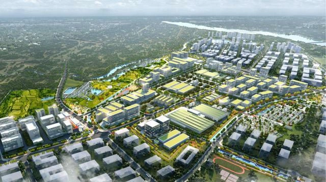

**当前各大购物平台充斥着各类面向不同行业的知识报告，售价从几元到几十元不等，且销量惊人。这一现象充分说明，行业从业人员对行业报告存在强烈需求，他们需要通过这些报告来指导文档撰写、行业调研等工作。然而，MetaX认为，这类知识资料的变现方式仍属于1.0阶段。此类模式虽门槛低、变现快，但也存在知识产权风险高、内容易被复制的弊端。**

**因此，MetaX提出“知识变现2.0”模式，即通过基于RAG（Retrieval-Augmented Generation）技术构建行业知识库来实现深度变现。这种方式不仅大大提升了内容的独特性与专业性，还能结合大语言模型的能力，更好地融入目标用户的实际工作流程，提供持续、动态的知识服务，增强用户粘性。**

**此次，MetaX首次提出“行业付费RAG知识库”这一变现模式，希望有志于知识创新和AI应用的小伙伴们一起深入研究、探索实践，找一条自己的变现之路！**

MetaX今天更新一套指导 n8n 工作流构建付费行业 RAG 知识系统的教程，基于今天的教程，可以面向行业开发垂直领域的知识库，实现知识获利。针对RAG（Retrieval‑Augmented Generation）知识库变现正处于尚待挖掘的蓝海阶段。本报告聚焦新能源、制造、科技、金融、医疗、消费、交通、农业、基建与公共事业九大核心赛道，系统深入剖析各行业的知识体系、核心关键词、价值要点、简要概述及目标读者画像，助你精准规划并高效搭建行业知识库，实现卓有成效的变现。

## **一. 能源与环保**

### **1.1 新能源汽车**

**知识体系分类：** 市场概览、技术趋势、政策法规、产业链分析、竞争格局、基础设施与用户行为

**核心关键词：** 新能源汽车、电动汽车、动力电池、充电桩、续航里程、混合动力、氢燃料电池、智能电动

**知识库介绍：** 新能源汽车知识库涵盖该领域的全面信息，包括市场规模、技术研发进展、政策文件以及产业链数据等。例如，2023年中国新能源汽车销量达到约949.5万辆，市场占有率31.6% 。数据类型包括销量统计、行业分析报告、政策法规文本、企业年报及新闻报道等，主要来源于政府机构、行业协会、研究院所和主流媒体。知识库内容持续更新（如每月更新），文档类型涵盖市场调研报告、技术白皮书、政策解读、学术论文、公司动态等，以确保信息的时效性和权威性。

**商业/决策价值：** 该知识库可帮助企业和决策者掌握新能源汽车行业的关键动态，为市场洞察和战略制定提供支持。制造企业利用知识库及时了解市场需求变化和竞争对手动向，指导产品规划和技术路线选择；投资者据此评估产业趋势和创新技术方向，发现投资机会并识别潜在风险；管理层与政策研究者跟踪法规政策（如补贴政策调整）以确保合规经营，并提前应对行业趋势。总体而言，新能源汽车知识库能够提升市场洞察力、支持技术评估、加强风险管控，为新能源汽车领域的商业决策提供数据支撑。

**目标读者：** 新能源汽车企业战略规划者、产品经理、行业分析师、投资人、政策制定者等。

### **1.2 储能技术**

**知识体系分类：** 市场概览、技术路线、政策标准、应用场景、产业链分析、竞争格局

**核心关键词：** 储能、电池储能、锂离子电池、液流电池、超级电容、梯次利用、抽水蓄能、微电网

**知识库介绍：** 储能技术知识库汇集了储能产业的全面资讯，包括市场规模增长、主流技术路线、新材料与工艺、政策标准以及典型应用案例等内容。该知识库覆盖电化学储能（如锂电池、钠离子电池）、物理储能（如抽水蓄能、压缩空气）等各类技术的信息，以及光伏+储能、风电+储能、电网调频调峰等应用场景的数据。数据来源涵盖行业报告、科技论文、标准规范文件（如储能并网技术标准）、政府能源规划和新闻动态，数据类型包括装机容量统计、项目案例分析、技术指标对比、投融资信息等。知识库每月更新，收录的文档类型包括行业白皮书、技术报告、政策解读、项目案例研究等。

**商业/决策价值：** 储能技术知识库能够为能源企业、电力公司以及投资机构提供决策支持。通过该知识库，电力设备制造商和新能源发电企业可跟踪储能技术的发展趋势，选择合适的技术方案并优化产业布局；电网和电力运营企业可利用其中的数据分析储能在电力调度中的作用，提高电网稳定性和新能源消纳率；投资人和行业分析师可以评估储能市场前景、政策环境和领先企业动向，判断投资机遇与风险。总体来说，该知识库有助于从业者把握储能产业的市场走势与技术演进，在能源转型中进行科学的技术评估和风险管控。

**目标读者：** 新能源发电企业管理者、电力运营机构、储能技术研发人员、能源行业分析师、政府能源政策制定者、投资人等。

### **1.3 碳中和／碳交易**

**知识体系分类：** 市场机制概览、政策法规、碳交易体系、技术解决方案、产业链角色、国际合作

**核心关键词：** 碳中和、碳达峰、碳交易、碳市场、碳配额、碳排放权、碳足迹、CCUS（碳捕集利用与封存）、碳信用、ESG

**知识库介绍：** 碳中和／碳交易知识库涵盖全球和地区碳减排领域的重要信息，包括碳市场机制设计、碳定价现状、减排技术及项目案例、相关政策法规等。知识库囊括了各国碳中和战略和时间表（如中国力争2030年前碳达峰、2060年前实现碳中和 ）、碳交易体系运行数据（如配额价格走势、交易量）、温室气体核算与报告标准，以及碳捕集、碳补偿项目等内容。数据来源主要包括政府和国际组织发布的气候政策文件、碳市场运营机构报告（如欧盟ETS、中国全国碳市场数据）、科研机构的技术评估报告和行业新闻。知识库定期更新，收录政策解读、市场分析报告、项目案例研究、标准指南、学术论文等多种文档类型。

**商业/决策价值：** 碳中和／碳交易知识库可为企业、投资者和政策制定者在低碳转型中提供支持。高排放企业可以利用知识库了解碳交易机制和配额价格走势，制定碳资产管理策略并投资减排技术，以降低碳成本和履约风险；金融机构与投资者可跟踪碳市场动态和碳金融产品创新，发掘绿色投资机会和评估气候相关风险；政府部门和咨询机构则能基于知识库分析国际国内政策走向和最佳实践，为制定碳减排政策、完善碳市场机制提供参考。通过该知识库，相关决策者可获得市场洞察和技术评估能力，在实现碳中和目标的过程中有效管控风险、抓住机遇。

**目标读者：** 高排放行业企业管理层、环境与可持续发展经理、碳交易分析师、绿色金融投资者、环境政策制定者、咨询顾问等。

### **1.4 风电、光伏**

**知识体系分类：** 市场概览、技术趋势（风机/组件）、政策规划、产业链分析、项目开发与运营、竞争格局

**核心关键词：** 风电、光伏、可再生能源、风力发电、太阳能发电、光伏组件、风力涡轮机、逆变器、海上风电、分布式光伏、平价上网

**知识库介绍：** 风电、光伏知识库汇总了风能和太阳能发电行业的全面信息，覆盖市场规模与装机容量、技术演进、政策规划和产业链等方面。内容包括全球及地区风电、光伏累计装机及新增装机数据，发电成本变化趋势，前沿技术（如大型化风机、高效光伏电池技术）、国家能源政策与补贴计划，以及产业链上游原材料（如硅料、玻璃）、中游设备制造（如整机厂、组件厂）和下游电站运营的动态。数据来源涵盖国际能源署(IEA)报告、行业协会统计（如全球风能理事会GWEC、中国光伏行业协会等）、政府能源发展规划、新能源企业财报及行业新闻等。知识库定期更新，文档类型包括年度统计报告、技术路线白皮书、政策文件、项目案例分析、市场调研报告等。

**商业/决策价值：** 该知识库为新能源领域的企业和决策者提供了关键资讯支持。设备制造企业可以据此了解最新技术趋势和市场需求，优化产品研发方向；电站开发商和运营商通过市场和政策信息制定投资计划和选址策略，评估项目收益与风险；供应链参与者和投资者能够分析产业链供需和龙头企业表现，寻找合作及投资机会。政策制定者和研究机构也可借助知识库追踪行业发展，为能源政策和规划提供依据。总体而言，风电、光伏知识库帮助从业者在快速发展的可再生能源市场中获得市场洞察、技术评估和风险管控能力，从而做出更明智的战略决策。

**目标读者：** 新能源设备制造商、项目开发及运营商、能源行业分析师、投资人、能源政策规划者、供应链管理人员等。

### **1.5 传统油气**

**知识体系分类：** 市场供需概览、政策与监管、上中下游产业链、技术趋势（勘探/开采/炼化）、全球格局与地缘政治、竞争格局

**核心关键词：** 石油、天然气、原油价格、石油勘探、页岩油、液化天然气(LNG)、炼油、管道运输、能源安全、石化产业

**知识库介绍：** 传统油气知识库覆盖石油和天然气行业的全貌信息，包括全球和区域市场供需与价格走势、行业政策法规、全产业链运营数据以及前沿技术动态。内容涉及上游的油气勘探开发进展、储量和产量数据，中游管道运输和LNG贸易动态，下游炼油化工产能与产品市场，及国际油价波动和OPEC+政策影响等。此外，知识库收录油气行业技术创新（如非常规油气开采技术、数字化油田）、环保法规（如减排标准）及能源安全战略等资料。数据来源包括国际能源机构和石油公司年度统计、公报（如BP世界能源统计）、各国能源政策文件、行业协会报告以及能源新闻媒体。更新频率为周或月度，文档类型涵盖市场分析报告、政策解读、技术专刊、公司年报和行业期刊文章等。

**商业/决策价值：** 传统油气知识库对于石油天然气行业的企业和政策制定者具有重要决策价值。上游勘探与生产企业可通过知识库掌握市场价格趋势和政策走向，优化勘探开发投资与产销计划；炼化和化工企业利用其中的数据分析原料供给与市场需求，制定生产经营策略并管控价格波动风险；政府部门与监管机构参考国际国内行业信息，完善能源政策和应急预案，保障能源安全；投资机构和贸易商则可综合市场和地缘政治情报研判走势，把握交易和投资机会。总体而言，该知识库为传统油气领域提供了全面的市场洞察和风险管控支持，使相关方能够在波动的能源市场中做出稳健的决策。

**目标读者：** 石油天然气企业管理层、市场分析师、能源交易员、炼化行业从业者、能源政策制定者、投资研究员等。

### **1.6 环保与可持续发展**

**知识体系分类：** 市场概览、政策法规与标准、技术与解决方案、产业链与服务模式、环保产业细分（大气/水/固废等）、行业案例

**核心关键词：** 环境保护、可持续发展、节能减排、污水处理、固废处理、环境监测、循环经济、清洁技术、绿色金融、生态修复

**知识库介绍：** 环保与可持续发展知识库汇集了环保产业和可持续发展领域的综合信息，包括环保市场规模、各细分领域（如水处理、大气治理、固废回收）的技术和项目案例、相关法律法规与行业标准，以及企业社会责任和绿色金融动态等。知识库内容覆盖环保设备制造与工程服务、环境监测技术、新兴的清洁技术（如污水资源化、垃圾发电）、以及可持续发展战略和指标（如ESG评价、联合国可持续发展目标SDGs）等方面。数据来源主要来自环保部门发布的行业报告、环保法律法规文件、行业协会和研究机构成果、典型案例研究以及媒体报道。知识库定期更新，文档类型包括政策法规解读、技术方案白皮书、行业发展报告、企业可持续发展报告、学术论文等。

**商业/决策价值：** 环保与可持续发展知识库为企业提升环境管理和履行社会责任，以及政府制定环保政策提供了重要支持。环保技术和服务企业可借助知识库了解市场需求及政策方向，开发符合标准的产品和服务；制造业等各行业企业利用知识库寻找节能减排技术方案，改进工艺以达成合规和可持续目标；投资者和金融机构则通过相关数据评估绿色项目的商业价值和环境效益，推进绿色投资决策；政府和公益组织可以参考行业信息和最佳实践，制定环境治理政策和推动可持续发展项目。通过该知识库，各相关方能够获得在环保产业的市场洞察、技术评估和风险管控能力，更有效地推进环境可持续目标的实现。

**目标读者：** 环保技术企业、各行业企业的环境管理负责人、可持续发展咨询顾问、绿色金融投资者、政策制定者、科研人员等。

## **二. 制造与工业**

### **2.1 机器人与自动化**

**知识体系分类：** 市场概览、技术趋势（AI与机器人）、政策法规、产业链分析、应用场景、竞争格局

**核心关键词：** 工业机器人、协作机器人、自动化生产线、机器视觉、控制系统、人机协作、机器人集成、制造自动化

**知识库介绍：** 机器人与自动化知识库涵盖机器人技术及工业自动化领域的全面信息，包括市场规模、技术进展、政策标准和产业生态等方面。例如，2021年中国工业机器人安装量增长51%，达到268,195台，约占全球安装总量的52% 。知识库收录工业机器人和自动化生产的市场统计数据、最新技术（如AI算法在机器人控制中的应用、机器视觉、传感器等）、国家产业扶持政策与行业标准（如机器人安全规范）、以及主要企业动态和应用案例。数据来源包括国际机器人联合会(IFR)报告、行业白皮书、国家政策文件、企业年报和行业新闻资讯，数据类型涵盖销量与装机量统计、技术指标、专利摘要、案例分析等。知识库定期更新，文档类型包括市场分析报告、技术白皮书、标准规范、案例研究文章和学术论文等。

**商业/决策价值：** 该知识库为制造业企业、技术研发人员和投资决策者提供了重要价值支持。制造企业管理者可以通过知识库了解最新自动化技术趋势和市场成本收益分析，从而制定产线升级改造计划，提升生产效率；机器人研发与集成企业可跟踪政策导向和客户需求，优化产品开发和业务布局；投资者和行业分析师则能评估机器人产业的发展潜力和竞争格局，辅助投资决策和战略规划；政府部门也可参考知识库数据，制定产业扶持政策和人才培养计划。总体而言，机器人与自动化知识库帮助相关从业者获取深度的市场洞察和技术评估能力，在推动工业4.0和智能制造的进程中有效管控风险、把握机遇。

**目标读者：** 制造企业技术主管、生产经理、机器人行业分析师、投资人、机器人研发工程师、产业政策制定者等。

### **2.2 智能制造／工业 4.0**

**知识体系分类：** 行业概览、数字化技术应用、政策规划与标准、产业链与生态、典型案例、未来趋势

**核心关键词：** 智能制造、工业4.0、数字化工厂、工业物联网(IIoT)、数字孪生、制造执行系统(MES)、两化融合、柔性生产、预测性维护、精益生产

**知识库介绍：** 智能制造／工业4.0知识库聚焦制造业数字化转型的综合信息，涵盖全球“工业4.0”趋势、中国智能制造推进情况、相关技术应用和标准规范等内容。知识库包括智能制造的市场规模及渗透率数据、关键技术（如工业物联网、云平台、人工智能在制造中的应用、数字孪生和仿真技术）、国家政策（如“中国制造2025”战略、智能制造试点示范项目政策）以及行业标准（如智能工厂评价标准）等。此外，知识库收录不同细分行业的智能制造典型案例和最佳实践，如汽车、电子、装备行业的数字化车间应用。数据来源主要来自政府规划文件、行业研究报告、咨询机构白皮书（如德勤、麦肯锡的行业分析）、学术论文以及企业案例发布。知识库定期更新，文档类型涵盖政策解读报告、技术白皮书、案例研究、市场分析及标准规范文件等。

**商业/决策价值：** 智能制造／工业4.0知识库为制造企业转型升级和产业政策制定提供决策依据。制造企业高管和生产管理者可借助知识库了解行业数字化转型的趋势和同行经验，制定自身智能工厂改造规划，提高生产效率和产品品质；技术供应商和系统集成商通过掌握市场需求和新技术发展，优化产品和解决方案，寻求商机；投资机构和行业分析师能够评估智能制造领域的市场前景和领先企业，指导投资布局；政府主管部门参考知识库资料，跟踪产业进展和痛点，出台相应扶持政策和标准，推动工业转型。总体而言，该知识库有助于相关各方获取对智能制造的深入洞察和技术评估能力，支持在数字化转型中的战略决策和风险管控。

**目标读者：** 制造业企业管理层、工厂运营经理、工业互联网/IT解决方案提供商、行业分析师、投资者、工业政策制定者等。

### **2.3 半导体与芯片**

**知识体系分类：** 行业现状与市场规模、芯片设计与架构、制造工艺与装备、政策法规与产业计划、产业链分析（设计/制造/封测）、竞争格局

**核心关键词：** 半导体、芯片、集成电路、晶圆代工、制程工艺(EUV/3nm)、芯片设计、EDA软件、封装测试、存储芯片、芯片国产化、供应链安全

**知识库介绍：** 半导体与芯片知识库涵盖全球半导体产业和中国芯片行业的关键资讯，包含市场规模、技术发展和政策环境等方面的信息。内容包括全球半导体销售额和各细分市场(如逻辑、存储)数据，中国芯片进口额（自2018年以来每年超过3000亿美元 ）与自给率状况，前沿制造工艺（如极紫外光刻EUV技术节点）、新型芯片架构（Chiplet、RISC-V 等）以及行业投融资动态。知识库也收录各国支持半导体产业的政策计划（如美国CHIPS法案、中国“大基金”等）、出口管制和知识产权相关法规，以及产业链主要环节（设计公司、晶圆厂、封测厂、设备材料供应商）的竞争格局与合作情况。数据来源包括行业协会（如半导体行业协会SIA）、研究咨询报告、政府政策文件、企业财报和科技新闻等。知识库频繁更新，文档类型涵盖市场研究报告、政策解读、技术论文、供应链分析报告、行业快讯等。

**商业/决策价值：** 半导体与芯片知识库对芯片行业企业、政策制定者和投资者具有战略价值。芯片设计公司和制造企业利用知识库了解市场需求和技术趋势，指导产品研发方向和产能扩充决策，并掌握供应链风险（如关键设备、材料依赖）；投资机构可通过知识库评估半导体各细分领域的增长潜力和企业竞争力，挖掘投资机会同时规避政策和市场风险；政府部门和行业联盟据此跟踪全球产业动态和国内短板，制定产业扶持与科技研发政策，推进自主可控进程。总体来说，该知识库提供的市场洞察和技术评估能力有助于行业参与者在快速变化的芯片产业中制定明智决策、加强风险管控。

**目标读者：** 芯片设计和制造企业管理层、研发工程师、行业分析师、风险投资人、供应链经理、信息产业政策制定者等。

### **2.4 工业园区与产业集群**

**知识体系分类：** 园区类型与布局、政策与规划、基础设施与配套、产业链协同、招商引资与运营模式、典型产业集群案例

**核心关键词：** 工业园区、产业集群、经济特区、开发区、园区管理、产业政策、供应链协同、招商引资、产业转移、创新生态

**知识库介绍：** 工业园区与产业集群知识库汇聚了关于产业园区发展的全景信息，包括不同类型园区（国家级开发区、高新区、特色产业园等）的分布与定位、政府支持政策、基础设施和配套服务情况，以及园区内产业链协同和创新生态等内容。知识库涵盖各地园区的规划设计方案、入驻产业及龙头企业数据、园区招商引资政策（如税收优惠、用地政策）、以及园区运营管理模式（政府主导型、市场化运营等）的资料。同时，包括国内外成功产业集群案例（如硅谷高科技集群、深圳电子信息产业集群）以及区域产业转移动态。数据来源有政府部门发布的园区规划文件、统计公报，产业研究机构的园区发展报告，园区管理委员会的年报和新闻稿，以及学术界对产业集群的研究文章。知识库定期更新，文档类型涵盖政策文件、区域发展报告、案例分析、学术研究报告等。

**商业/决策价值：** 工业园区与产业集群知识库为政府规划者、园区运营者和企业决策提供了宝贵信息。地方政府和园区管理机构可基于知识库了解其它地区的园区成功经验，优化自身园区规划和招商策略，促进产业集聚和区域经济发展；企业决策者可以评估不同园区和集群的优势（如供应链完备度、政策优惠）以决定选址和投资布局，寻找最佳经营环境；投资者和咨询顾问则通过分析园区和集群的发展态势，判断区域产业的成长潜力和风险。借助该知识库，各相关方能够更好地洞察产业集群效应和园区运营模式，从而在产业发展和区域布局决策中实现科学规划、降低风险。

**目标读者：** 地方政府产业规划人员、园区管理者、企业战略规划与选址负责人、投资招商顾问、产业研究人员等。

### **2.5 先进材料／新材料**

**知识体系分类：** 行业概览、材料分类与特性、新材料技术研发、应用领域、政策与标准、产业链与市场格局

**核心关键词：** 新材料、先进材料、纳米材料、石墨烯、复合材料、稀土功能材料、高温合金、半导体材料、3D打印材料、材料科学研究

**知识库介绍：** 先进材料／新材料知识库涵盖材料科学领域的新兴技术与产业发展的关键信息，包括不同类型新材料的研发进展、性能特点、应用前景和市场情况。内容涉及纳米材料（如纳米管、量子点）、二维材料（如石墨烯）的突破，新能源材料（如钙钛矿太阳能电池材料）、生物医用材料、航空航天材料以及先进复合材料等热点方向。知识库也包含国家新材料产业政策与标准（如关键材料攻关项目、材料认证标准）、行业规模与产能数据，以及材料在各下游产业（电子、汽车、航空、医疗等）的应用案例和需求趋势。数据来源包括科技期刊论文、行业协会报告、新材料产业白皮书、政府专项规划和新闻报道，数据类型涵盖材料性能指标、专利成果、市场规模估算、企业产品信息等。知识库定期更新，收录文档类型有技术研究报告、行业分析、政策文件、标准规范和典型应用案例分析等。

**商业/决策价值：** 先进材料／新材料知识库为材料研发人员、制造企业和投资者提供决策支持。研发机构和企业可通过知识库了解全球最新材料科技成果和竞争动态，找准研发方向并加速成果转化；制造业企业（如电子、汽车厂商）据此发现新材料在产品升级中的应用机会，评估性能与成本，选择合适的材料方案提升产品竞争力；投资机构利用知识库掌握新材料领域的市场前景和领先企业技术实力，指导对新材料初创公司的投资决策；政府部门则参考相关信息制定支持新材料研发和产业化的政策措施。总的来说，该知识库提供的全面洞察和技术评估能力有助于相关各方抓住新材料产业机遇、管控技术和市场风险，推动产业创新发展。

**目标读者：** 材料科学研究人员、新材料企业研发及市场经理、制造业技术工程师、风险投资人、产业政策制定者、行业分析师等。

### **2.6 化工**

**知识体系分类：** 行业概览、细分产品与工艺、市场供需与价格、政策环保法规、安全标准、产业链分析与竞争格局

**核心关键词：** 化工、石油化工、精细化工、化工工艺、催化剂、化学品、安全生产、环保法规、上下游产业、原料价格

**知识库介绍：** 化工行业知识库整合了化学工业各领域的关键信息，包括基础化工原料（如乙烯、丙烯）、化工工艺流程、精细化工产品（如特种化学品、农药、医药中间体）、以及行业市场供需格局等。内容涵盖国内外化工市场规模与产量数据、原油及原料价格走势对行业的影响、主要化工产品的产能和消费量统计、技术工艺改进动向（如绿色化学工艺、催化剂创新）、以及环保安全法规（如“三废”处理标准、危化品运输规定）对行业的要求。知识库还收录化工园区发展情况、龙头化工企业经营动态和兼并重组信息。数据来源包括行业协会报告（如中国石化联合会数据）、化工市场资讯、电商交易平台价格数据、政府安监环保部门法规文件、科研院所技术报告和行业新闻等。知识库定期更新，文档类型覆盖市场分析、价格月报、技术论文、政策标准文件、企业年报及行业案例分析等。

**商业/决策价值：** 化工知识库为化工企业经营管理和行业监管提供重要参考。化工企业管理层可借助知识库跟踪市场供需和价格变化，优化采购和生产计划，并了解最新环保安全法规以确保合规运营；研发和工程团队能参考技术资料改进工艺流程、开发高附加值产品，提高竞争力；下游制造企业（如塑料、制药企业）利用知识库了解原材料市场走势，做好供应链管理和成本控制；投资分析师和银行可评估化工行业周期和企业财务健康，指导授信和投资决策；监管机构则通过行业信息加强对安全生产和环境治理的监管举措。总体而言，化工知识库增强了相关方对行业趋势、技术水平和风险因素的洞察能力，支持其在复杂多变的化工市场中作出稳健决策。

**目标读者：** 化工企业管理人员、生产和研发工程师、下游制造企业采购经理、行业分析师、投资人、安全环保监管者等。

## **三. 科技与互联网**

### **3.1 人工智能／机器学习​**

**知识体系分类：** 概念与发展历程、核心技术与算法、应用场景、政策法规与伦理、产业生态、竞争格局

**核心关键词：** 人工智能、机器学习、深度学习、神经网络、自然语言处理、计算机视觉、生成式AI、大模型、数据挖掘、AI伦理

**知识库介绍：** 人工智能／机器学习知识库涵盖该领域的基础知识和最新动态，包括AI技术演变、关键算法突破、典型应用和政策规范等。内容囊括人工智能的发展历程和基础概念（如机器学习方法、神经网络原理）、当代前沿技术（如Transformer模型、生成式AI在图像和文本领域的应用）、以及AI在各行业的应用案例（如自动驾驶、医疗影像识别、智能客服）。知识库也收录人工智能治理相关政策与伦理准则（如算法透明、隐私保护法规，2023年中国发布的生成式AI服务管理办法等）和AI产业生态体系信息（创业公司动态、科技巨头研发布局、人才供需）。数据来源包括顶级AI学术会议论文、科技公司技术博客和白皮书、市场研究报告（IDC等提供的AI市场规模数据）、政府政策文件和行业新闻报道。知识库频繁更新，文档类型涵盖技术论文解读、行业报告、政策解读、案例分析及新闻综述等。

**商业/决策价值：** 该知识库为企业、高校研发者和政策制定者在人工智能领域提供决策支持。研发人员和产品经理可以通过知识库掌握最新算法和工具进展，指导技术路线选择和产品创新；企业战略规划者和投资者则能洞察AI应用趋势和竞品动向，发掘商业机会并评估潜在风险；政策监管者和伦理委员会可借鉴知识库中各国AI治理实践，制定平衡创新与安全的监管政策和伦理指南。总体而言，人工智能知识库提升了相关从业者对AI技术和产业的洞察力与评估能力，有助于他们在快速演进的AI领域中做出明智决策，抓住机遇并有效管控风险。**目标读者：** AI研究人员、数据科学家、产品经理、科技企业战略规划者、风险投资人、政府监管者、伦理研究者等。

### **3.2 金融科技（FinTech）**

**知识体系分类：** 行业概览、支付与数字银行、借贷与征信、财富管理科技、监管政策、技术架构与安全

**核心关键词：** 金融科技、移动支付、数字银行、区块链金融、智能风控、监管科技(RegTech)、保险科技(InsurTech)、开放银行、数字货币

**知识库介绍：** 金融科技知识库涵盖了科技对金融行业改造的方方面面信息，包括支付、银行、借贷、投资和保险等细分领域的创新动态和监管环境。内容涉及移动支付和数字钱包的普及（例如中国移动支付交易额和用户数的持续增长趋势）、数字银行和互联网银行的运营模式、新型线上借贷和消费金融产品、智能投顾与算法交易等财富管理科技应用，以及保险科技创新（如大数据定价、在线理赔）。知识库同时收录金融监管部门出台的针对FinTech的政策文件和监管 sandbox 动态、数据安全与隐私合规要求，以及支撑FinTech的技术架构（如区块链在贸易融资中的应用、AI风控系统）。数据来源包括央行和金融监管机构报告、行业调研和咨询报告（如毕马威、埃&米的FinTech报告）、FinTech企业白皮书、学术研究和财经新闻。知识库定期更新，文档类型涵盖政策法规解读、市场分析报告、技术案例研究、行业新闻简报等。

**商业/决策价值：** 金融科技知识库可为传统金融机构、FinTech创业公司和监管部门提供重要决策参考。银行和支付公司管理者利用知识库把握最新技术趋势（如开放银行、分布式账本）和用户需求变化，制定数字化转型和产品创新策略；FinTech初创企业可以了解监管动向和市场空白，调整业务模式并寻求合作机遇；投资者通过知识库评估金融科技各赛道的成长潜力和竞争格局，决定投资方向；监管机构借鉴知识库中国内外经验，平衡创新与风险，完善监管框架。总体而言，该知识库提升了金融从业者对市场洞察和技术评估的能力，支持在快速演变的金融科技领域进行战略规划、风险管理和创新决策。

**目标读者：** 银行和支付机构管理层、FinTech公司产品经理、风险投资和证券分析师、金融监管者、IT架构师、咨询顾问等。

### **3.3 区块链与加密货币**

**知识体系分类：** 基础概念与架构、主流区块链平台、数字资产与应用、监管政策与合规、安全技术、市场生态与趋势

**核心关键词：** 区块链、加密货币、比特币、以太坊、智能合约、去中心化金融(DeFi)、NFT、共识算法、矿工与节点、数字交易所

**知识库介绍：** 区块链与加密货币知识库囊括了分布式账本技术和数字资产领域的全面信息。内容包括区块链的基础原理（如共识机制、加密算法）、主流公有链平台（比特币、以太坊等）的技术特点和性能发展（如以太坊2.0的升级）、以及新兴应用场景（DeFi协议、NFT数字藏品、供应链溯源、智能合约在各行业的落地）。知识库也收录加密货币市场数据（价格走势、市场规模、交易量）、主要数字资产交易平台和钱包技术、安全事件分析（交易所被盗、智能合约漏洞）以及各国对加密资产的监管政策（例如ICO禁令、交易所牌照要求、央行态度等）。此外，包含区块链联盟链和企业应用动态，以及Web3.0的发展趋势。数据来源来自行业网站（如CoinMarketCap数据）、区块链分析报告、技术白皮书（例如比特币白皮书、以太坊黄皮书）、监管机构公告和区块链社区新闻。知识库高频更新，文档类型包括市场行情报告、政策法规文件、技术指南、风险分析报告和行业资讯等。

**商业/决策价值：** 该知识库为从事区块链与数字资产领域的技术人员、投资者和监管者提供关键价值。开发者和创业团队可以通过知识库跟踪最新区块链技术进展和应用创新，指导产品开发和技术方案选择；加密资产投资者和交易员能够获得市场数据和项目分析，辅助投资决策和风险控制；金融机构和企业高管借助知识库评估区块链技术在业务中的可行性，探索数字化转型机会；监管政策制定者则可参考全球监管动向和平衡行业发展的经验，制定合适的法律框架和风控措施。总体而言，区块链与加密货币知识库提升了用户对这一新兴领域的洞察和评估能力，使其在创新与风险并存的环境中做出更明智的决策。

**目标读者：** 区块链开发工程师、加密货币投资者、金融机构战略经理、监管机构人员、技术顾问、Web3创业者等。

### **3.4 网络安全**

**知识体系分类：** 威胁概览、安全技术与工具、安全管理框架、法规与合规、细分领域安全(网络/应用/云等)、行业态势

**核心关键词：** 网络安全、信息安全、黑客攻击、恶意软件、漏洞管理、加密技术、防火墙、入侵检测、零信任架构、数据隐私、网络安全法

**知识库介绍：** 网络安全知识库涵盖了信息安全领域的关键内容，包括最新的安全威胁态势、安全技术手段、管理实践和法规标准等。内容涉及常见网络攻击类型和案例分析（如勒索软件攻击、APT高级持续威胁）、安全防护技术（防火墙、杀毒软件、入侵检测、防DDoS等系统，以及新兴的零信任安全架构）、以及企业安全管理框架（如ISO 27001标准、NIST网络安全框架）和应急响应流程。知识库也收录各国数据保护法律和网络安全法规要求（如GDPR、中国网络安全法等）、行业合规标准，以及云安全、物联网安全、工控安全等细分领域的特殊安全挑战和解决方案。数据来源包括安全厂商年度威胁报告、漏洞数据库(CVE)信息、安全研究机构的分析文章、官方安全公告和法规文本、以及安全媒体的新闻简讯。知识库持续更新，文档类型涵盖技术白皮书、威胁情报报告、政策法规解读、实践指南和案例分析等。

**商业/决策价值：** 网络安全知识库为企业IT管理者、安全专业人员和政策制定者提供了全面的参考信息。企业和机构可利用知识库了解最新威胁情报和安全技术发展，及时强化自身防御体系并制定安全策略，降低遭受攻击和数据泄露的风险；安全服务提供商和技术开发者可以跟踪安全市场需求和前沿技术，改进产品和服务，提升竞争力；投资者和行业分析师通过知识库评估网络安全行业趋势和重点厂商表现，识别投资机会；政府监管部门则参考全球安全事件和法规经验，完善本国网络安全法律和标准体系。总之，该知识库增强了各相关方在网络安全领域的洞察力和应对能力，有助于在日益复杂的网络环境中实现有效的风险管控和决策制定。

**目标读者：** 企业CIO/CISO、安全工程师、IT管理员、网络安全咨询顾问、投资分析师、网络安全监管者等。

### **3.5 物联网（IoT）**

**知识体系分类：** 行业概览、关键技术与标准、应用场景（工业/消费）、安全与隐私、产业链分析、市场趋势

**核心关键词：** 物联网、传感器、智能设备、工业物联网、智慧家居、车联网(V2X)、边缘计算、NB-IoT、数据采集、互联标准

**知识库介绍：** 物联网（IoT）知识库汇总了连接万物的互联网技术及产业的全面信息，包括IoT市场规模与设备数量增长、关键技术和通信协议、各领域应用案例和安全挑战等内容。据IoT Analytics数据预计，到2025年全球物联网设备连接数将超过300亿 ，显示出行业的高速发展。知识库涵盖IoT核心技术（短距离通信协议如Zigbee、广域物联网通信如NB-IoT/LoRa、传感器技术、边缘计算架构）、行业标准（如设备互操作协议、物联网数据格式标准）、以及IoT平台和云服务生态。还包含不同应用场景的案例：消费领域的智能家居、可穿戴设备，工业领域的智慧工厂、车联网和智慧城市部署等。数据来源包括行业市场调研（IDC、Gartner等IoT报告）、通信标准组织文件、物联网平台厂商白皮书、案例分析和科技媒体报道。知识库定期更新，文档类型覆盖市场分析报告、技术标准说明、应用案例研究、新闻动态和安全指南等。

**商业/决策价值：** 物联网知识库为制造企业、技术开发者和决策机构提供关键洞察。硬件制造商和IoT方案提供商可利用知识库了解市场需求和技术趋势，指导产品开发和业务拓展；传统行业企业管理者通过案例学习如何应用IoT提高运营效率、实施数字化转型，并注意数据安全和隐私合规；投资者和分析师据此评估IoT市场的增长潜力和领先企业生态，识别有前景的投资方向；政府与标准组织则参考知识库资料推动标准制定和产业规划，支持智慧城市等项目落地。总体而言，该知识库提升了各相关方在物联网领域的市场洞察、技术评估和风险意识，帮助他们在万物互联的浪潮中做出明智策略。

**目标读者：** IoT设备制造商、软件平台开发者、传统行业数字化转型负责人、科技投资人、行业分析师、标准制定者等。

### **3.6 云计算／大数据**

**知识体系分类：** 市场格局与服务模式、云计算技术架构、大数据技术与生态、应用场景、数据治理与安全、行业标准与政策

**核心关键词：** 云计算、大数据、IaaS、PaaS、SaaS、分布式存储、数据分析、数据挖掘、数据湖、云安全、隐私合规

**知识库介绍：** 云计算／大数据知识库涵盖云服务和大数据处理领域的完整信息，包括市场规模和主要厂商、技术架构和解决方案、应用案例以及政策标准等内容。云计算方面，知识库收录全球和国内云服务市场份额、IaaS/PaaS/SaaS等服务模式的发展趋势，主流云平台技术（如容器、微服务、Serverless架构）的演进，以及云原生应用案例。大数据方面，涵盖数据存储与处理技术（如Hadoop/Spark生态、NoSQL数据库、实时流处理）、数据分析与AI结合、以及数据可视化与商业智能应用案例。知识库也包含数据安全和隐私合规要求（如GDPR对大数据的影响、中国数据安全法要求）、以及各行业通过云和大数据实现数字化转型的案例。数据来源包括市场研究报告（如IDC、艾瑞报告中的云市场数据）、云服务商与大数据解决方案提供商的白皮书、开源社区文档、政府发布的数字化转型政策和媒体报道。知识库定期更新，文档类型覆盖市场分析报告、技术指南、案例研究、政策解读及新闻资讯。

**商业/决策价值：** 云计算／大数据知识库为企业IT决策者、开发人员和政策制定者提供全局视野和决策依据。企业管理层可以通过知识库评估云服务的成本效益和最佳实践，制定上云策略和大数据项目规划，驱动业务创新；IT架构师和开发团队可参考技术资料设计高可用、可伸缩的系统架构，并借鉴数据分析应用案例提升业务洞察；投资者和行业分析师利用知识库了解市场格局和增长点，挖掘云服务和大数据领域的投资机会；政府和监管机构则参考产业信息完善数字基础设施规划和数据治理政策。总体来说，该知识库提升了相关各方对云计算和大数据的洞察力和技术评估能力，帮助他们在数字经济时代做出优化的战略选择并有效管控数据安全与合规风险。

**目标读者：** 企业CIO/CTO、IT架构师、数据科学家、云服务产品经理、行业分析师、投资人、信息化政策制定者等。

### **3.7 5G／电信**

**知识体系分类：** 行业现状与市场指标、通信技术标准、网络建设与运营、应用场景（IoT/边缘等）、政策与监管、竞争格局

**核心关键词：** 5G、移动通信、频谱、基站、运营商、通信设备、光纤网络、6G研发、网络切片、通信标准、用户普及率

**知识库介绍：** 5G／电信知识库涵盖移动通信和电信行业的核心信息，包括最新一代通信技术的部署情况、技术标准和应用进展、市场和监管等方面。内容包括5G网络建设进度及覆盖数据（截至2023年底中国累计建成5G基站337.7万个 、用户数及渗透率等指标）、5G关键技术（如毫米波、大规模MIMO、独立组网SA架构）、以及行业标准组织(3GPP)发布的技术规范。知识库收录5G典型应用案例（如车联网、智慧城市、工业互联网中的5G应用）、以及展望未来的6G概念研发进展。也涵盖电信运营商的市场表现和资费策略、通信设备厂商(华为、爱立信等)的产品动态、国家监管政策（如频谱拍卖、共建共享政策、安全审查）等。数据来源包括工信部等监管机构发布的数据、通信行业协会报告、通信技术白皮书、运营商财报和新闻。知识库定期更新，文档类型覆盖行业统计报告、技术规范文件、案例分析、政策解读、新闻资讯等。

**商业/决策价值：** 5G／电信知识库为通信行业企业和相关决策者提供了全面的信息支持。电信运营商管理层可以据此了解产业趋势和用户需求，优化网络投资和业务拓展策略；通信设备厂商利用知识库跟踪技术演进和标准进程，调整研发方向并了解竞争对手动态；垂直行业企业（如制造、医疗）可参考5G应用案例评估引入5G提升业务效率的可行性；投资分析师通过行业数据和政策信息判断电信行业的增长潜力和风险；监管机构借鉴知识库资料，监督5G建设进度、制定频谱政策并保障网络安全。综上，5G／电信知识库提升了行业相关方对市场洞察和技术评估的能力，使其能够在快速变化的通信行业环境中进行明智的战略规划和风险管控。

**目标读者：** 电信运营商决策层、通信设备企业研发和市场人员、行业分析师、投资人、垂直行业CTO、通信政策监管者等。

## **四. 金融与投资**

### **4.1 宏观经济分析**

**知识体系分类：** 宏观指标体系、政策环境（货币/财政）、经济结构与行业关联、国际经济与贸易、周期分析、预测模型

**核心关键词：** 宏观经济、GDP增长、通货膨胀、失业率、利率、货币政策、财政政策、经济周期、国际贸易、汇率、央行、经济预测

**知识库介绍：** 宏观经济分析知识库汇集了对一国或全球经济运行的关键数据和分析工具，包括主要宏观经济指标、政策动态、结构性因素和预测模型等。内容涵盖GDP、通胀(CPI)、就业、工业生产、消费和投资等核心指标的历史数据与最新发布，中央银行货币政策（如利率调整、公开市场操作）和财政政策（政府支出、税收）的动向与效果分析，经济周期阶段识别（繁荣、衰退）以及各行业对宏观环境的敏感性。知识库也收录国际经济环境信息，如主要经济体的联动，国际贸易与资本流动数据，以及汇率、大宗商品价格对宏观的影响。资料来源包括各国统计局和央行发布的数据报告、IMF和世界银行等机构的经济展望、研究机构宏观分析报告、财经媒体解读和学术论文。知识库定期更新，文档类型包含经济数据月报/季报、政策解读、宏观研究报告、经济预测模型文档和时事评论等。

**商业/决策价值：** 宏观经济分析知识库对政府决策部门、金融机构和企业战略规划都有重要价值。政府经济管理部门可以基于知识库准确把握经济运行态势，制定或调整宏观调控政策；银行和投资机构的经济学家使用宏观数据和分析评估市场环境，为货币信贷政策、资产配置策略提供依据；企业高管通过宏观信息预测市场需求和成本变化，在业务布局和投资时机上做出前瞻决策；国际贸易从业者也可参考全球宏观趋势，预判汇率和贸易环境变化。总体而言，宏观经济知识库提升了相关人士对经济全局的洞察和预测能力，使其能够在复杂多变的经济环境中更好地管控风险和制定战略。

**目标读者：** 政府经济规划部门官员、银行和证券公司宏观分析师、基金经理、跨国企业战略规划人员、经济研究学者等。

### **4.2 量化投资／算法交易**

**知识体系分类：** 投资策略类型、数学模型与算法、交易技术与基础设施、数据与因子研究、风险管理、监管规范

**核心关键词：** 量化投资、算法交易、高频交易、统计套利、量化因子、回测、交易算法、机器学习模型、对冲基金、交易成本、风险模型

**知识库介绍：** 量化投资／算法交易知识库涵盖以数量模型驱动的金融交易方法的全面信息，包括各种量化策略、算法和交易基础设施。内容涉及不同量化策略类型（如动量策略、均值回归、套利策略）、投资因子的研究（价值、动量、质量等因子历史表现）、以及算法交易技术（订单拆分算法VWAP、TWAP，高频交易技术及其对交易所基础设施的要求）。知识库也收录策略开发流程（历史数据回测、蒙特卡洛模拟）、风险模型（如VAR计算、极端风险管理）以及交易执行和交易成本分析的方法论。此外，包含量化行业的发展概况、著名量化基金案例（如文艺复兴科技基金的策略）、市场监管机构对算法交易的规定（防范市场操纵、熔断机制等）。数据来源包括学术论文、对冲基金致投资者信、交易所技术白皮书、金融协会研究报告，以及监管指南和金融媒体报道。知识库定期更新，文档类型涵盖策略研究论文、模型教程、市场分析、技术指南和行业访谈等。

**商业/决策价值：** 量化投资／算法交易知识库为专业投资者和金融机构提供了宝贵的智力支持。对冲基金经理和量化分析师可利用知识库获取新策略思路和前沿研究成果，完善模型和算法，提高投资回报；证券公司和银行的交易部门可参考算法交易技术资料改进交易执行效率并降低交易成本；金融机构的风险管理人员通过了解各种量化策略的风险特征，强化监控和风控措施；监管者也可借鉴知识库中国内外经验，制定监管规则以维护市场公平和稳定。总体而言，该知识库增强了金融市场参与者对复杂量化方法的理解和评估能力，使其在竞争激烈的市场中更好地进行策略开发、风险管控和合规操作。

**目标读者：** 对冲基金和资管机构量化投资经理、交易员、量化分析师、风险控制经理、金融市场监管人员、金融工程研究人员等。

### **4.3 银行与支付**

**知识体系分类：** 银行业概览、银行业务与产品、支付体系与创新、监管法规、金融科技融合、风险管理

**核心关键词：** 银行业、商业银行、支付系统、移动支付、数字支付、贷款与存款、清算结算、跨境支付、普惠金融、监管合规、反洗钱

**知识库介绍：** 银行与支付知识库涵盖传统银行业和支付领域的关键信息，包括银行业务模式、支付技术创新和监管环境等。内容涉及商业银行的主要业务（公司信贷、零售银行、银行卡业务）、银行经营指标（资产规模、不良贷款率、资本充足率等）和行业格局（国有大行、股份制银行、地方银行及外资银行在华布局）。支付方面，知识库收录支付产业的发展趋势（非现金支付占比提升、线上线下融合）、新型支付技术与模式（移动支付二维码、NFC、实时支付系统、数字钱包）、以及清算基础设施（如银联、网联体系）。同时包括监管要求（如资本监管巴塞尔协议、支付机构牌照管理、反洗钱和KYC规定）和金融科技对银行支付的影响（如开放银行、第三方支付崛起带来的竞争与合作）。数据来源有央行及银保监会发布的行业统计与规定、银行年报和研究报告、支付行业报告及新闻报道。知识库定期更新，文档类型涵盖行业统计报告、政策法规文件、技术趋势分析、案例研究和新闻简报等。

**商业/决策价值：** 银行与支付知识库为银行管理者、支付公司以及监管机构提供决策支持。银行决策层可以根据知识库掌握行业趋势和客户偏好变化，推进数字化转型、丰富产品服务并优化风险管控策略；支付机构和金融科技公司通过知识库了解监管要求和银行合作机会，创新支付产品和商业模式；投资者和分析师利用行业数据评估银行和支付行业的增长潜力和竞争格局，指导投资判断；监管者则参考国内外经验完善金融监管政策，维护金融稳定和消费者权益。总体而言，该知识库提高了金融从业者对银行和支付行业的洞察力和专业判断能力，帮助他们在变革的金融环境中制定明智的战略和管理措施。

**目标读者：** 商业银行管理人员、支付机构运营经理、金融科技产品经理、行业分析师、投资银行研究员、金融监管者等。

### **4.4 证券／基金**

**知识体系分类：** 资本市场概览、证券品种与交易机制、基金产品类型、监管法规、市场结构与参与者、投资策略与业绩

**核心关键词：** 证券市场、股票、债券、基金、IPO、交易所、ETF、资产管理、券商、二级市场、监管机构、投资组合

**知识库介绍：** 证券／基金知识库汇聚资本市场和资产管理行业的全面信息，包括证券市场的运作机制、金融产品、监管制度和行业动态等。内容涵盖股票和债券市场规模及主要指数表现、交易机制与规则（如竞价交易、科创板注册制、新三板交易机制）、证券公司业务（经纪、承销、投行、资产管理）概况，以及各类基金产品（开放式公募基金、封闭式基金、ETF、对冲基金等）的类型特点和规模数据。知识库也包括行业监管法规与自律规则（如证券法、基金法、信息披露要求）、市场参与者（交易所、监管机构、投资者结构）的介绍，以及投资策略如主动管理VS被动指数化投资的比较、基金业绩排行榜和评价方法。数据来源来自证券交易所发布的数据统计、基金业协会报告、券商研究报告、监管机构公告（证监会政策、处罚案例）、财经媒体和行业期刊。知识库定期更新，文档类型涵盖市场统计年鉴、法规条例文本、行业分析报告、产品研报、学术论文及新闻资讯等。

**商业/决策价值：** 证券／基金知识库为投资从业者、金融机构管理层和监管者提供全方位的信息支撑。投资顾问和基金经理可利用知识库掌握市场行情和产品创新，为资产配置和产品设计提供依据；证券公司经营管理层可参考行业趋势和监管动态，完善业务布局和合规管理，提高竞争力；普通投资者通过知识库了解不同证券和基金产品的特点与风险，更理性地进行投资决策；监管者和交易所也借鉴知识库信息监测市场健康状况，出台相应措施维护市场秩序并推动长期发展。综合来说，该知识库增强了资本市场参与各方对市场机制和产品的理解，以及对行业趋势和风险的研判能力，支持他们在资本市场中做出稳健的决策。

**目标读者：** 券商分析师、基金经理、财富管理顾问、证券公司管理者、普通投资者、监管机构人员、金融学研究者等。

### **4.5 保险**

**知识体系分类：** 行业概览、险种分类（寿险/财险等）、产品设计与精算、监管政策、销售渠道与服务、风险管理与再保险

**核心关键词：** 保险业、寿险、财险、再保险、保费、理赔、精算、保险科技、监管、风险管理、保险产品、保单

**知识库介绍：** 保险行业知识库涵盖寿险、财险等保险市场的关键数据和专业知识，包括行业规模、产品形态、精算与风险管理以及监管环境等内容。内容涉及寿险（人寿保险、年金险、健康险）与财险（车险、财产险、责任险等）的保费收入和市场份额数据、保险产品结构及创新（如万能险、投连险、新型健康险）、精算假设与定价原理、赔付率及准备金管理。知识库也收录保险销售渠道转型（代理人队伍、银保、互联网保险）、保险科技InsurTech的应用（例如线上投保、大数据风控、智能理赔），以及行业监管政策法规（如保险法、偿付能力监管规则、费率市场化改革等）。此外，还涵盖再保险市场动态和巨灾风险管理实践。数据来源包括中国银保监会发布的行业统计和监管文件、行业协会（如中国保险行业协会）的报告、保险公司年报和投资者材料、精算研究论文以及保险行业新闻。知识库定期更新，文档类型涵盖行业报告、政策解读、产品分析、学术论文、市场简报等。

**商业/决策价值：** 保险知识库为保险公司管理层、产品精算师和监管机构提供决策依据。保险公司可根据知识库了解市场需求变化和竞争格局，开发有针对性的产品并调整渠道策略；精算师和风险管理人员利用行业数据和经验研究优化定价模型、完善准备金和再保安排，提升公司稳健性；保险代理和经纪从业者通过知识库丰富对产品和市场的认识，更好地服务客户；投资者和分析师则评估保险公司的经营表现和行业趋势，做出投资判断；监管者据此监控行业风险、制定政策引导行业健康发展。总体来说，该知识库增强了保险领域从业者的市场洞察和专业判断能力，支持他们在瞬息万变的市场和监管环境中有效管控风险、推动创新。

**目标读者：** 保险公司高管、精算师、产品经理、保险经纪与代理人、行业分析师、投资人、保险监管人员等。

### **4.6 数字货币／央行数字人民币**

**知识体系分类：** 数字货币概念与类型、央行数字货币(CBDC)设计、试点进展、技术架构与安全、政策法规、应用场景与影响

**核心关键词：** 数字货币、中央银行数字货币(CBDC)、数字人民币、电子支付、区块链、分布式账本、支付体系、货币政策、金融稳定、隐私保护

**知识库介绍：** 数字货币／央行数字人民币知识库涵盖全球数字货币发展的动态，特别关注各国央行数字货币的研发和中国数字人民币(DCEP)的进展。内容包括数字货币的基本概念与分类（如央行数字货币、稳定币、加密货币的区别）、各国央行数字货币项目的设计方案（集中式账户体系 vs 分布式技术）、中国数字人民币试点情况（试点城市范围、交易笔数和金额、用户钱包数量等最新数据）、技术实现架构（双层运营体系、密码安全技术）、以及数字货币对支付体系、货币政策和金融稳定的潜在影响分析。知识库也收录相关法律法规和监管框架（如对匿名可控、反洗钱的要求）、金融机构和企业在数字人民币生态中的参与（钱包运营、场景应用）和公众接受度调查等。数据来源来自央行官方发布（如中国人民银行数字人民币白皮书）、国际组织报告（IMF关于CBDC影响评估）、学术研究、财经媒体报道和技术提供商文档。知识库及时更新，文档类型包含政策白皮书、技术报告、试点数据分析、学术论文和新闻资讯等。

**商业/决策价值：** 数字货币／央行数字人民币知识库为金融决策者、银行和科技企业提供重要指引。央行和监管机构可通过知识库了解全球数字货币实践，以完善自身CBDC设计并评估对金融体系的影响；商业银行和支付机构借鉴知识库内容，提早布局数字人民币生态，改造支付清算系统并开发相关产品服务，避免在新支付时代掉队；科技公司与商贸企业利用知识库掌握数字货币应用场景和接口标准，及时升级技术方案或拓展支付场景；学术和投资界也可据此评估数字货币对经济和市场的冲击，发掘创新和投资机会。总体而言，该知识库提高了相关参与方对数字货币浪潮的洞察和应对能力，帮助他们在数字货币时代做好战略规划和风险管理。

**目标读者：** 中央银行和监管机构人员、商业银行和支付公司管理层、FinTech企业产品经理、区块链技术人员、经济研究者、政策分析师等。

## **五. 医疗与健康**

### **5.1 医美（医疗美容）**

**知识体系分类：** 行业概览、项目与技术、市场需求与趋势、监管与资质、产业链（药品/器械/机构）、竞争格局

**核心关键词：** 医疗美容、整形手术、微整形、激光美容、注射填充、医美机构、消费趋势、监管资质、术后管理、美容设备

**知识库介绍：** 医美知识库涵盖医疗美容行业的全方位信息，包括市场规模增长、热门项目技术、消费者偏好及监管环境等。内容涉及主要医美项目（如双眼皮成形、隆鼻、吸脂等外科手术和玻尿酸填充、肉毒素注射等非手术微整形）的原理和最新技术进展，医美药品器械（激光设备、注射材料）的研发与审批动态，以及医美机构（医院科室、连锁医美诊所）的经营模式和服务流程。知识库也收录医美消费人群和需求趋势分析（年轻化、人均消费额提升等）、行业规范与监管政策（医生资质要求、机构执业许可、广告合规等）、以及上下游产业链信息（药品和器械供应商、美容咨询服务等）。数据来源包括卫健部门和行业协会的数据统计、市场调研报告、医疗期刊论文、典型机构案例、监管通知和行业新闻。知识库定期更新，文档类型涵盖行业分析报告、项目科普文章、政策法规文件、消费调研、案例分享等。

**商业/决策价值：** 医美知识库为医美机构管理者、从业医生和投资者提供了重要的决策支持。医美诊所和医院科室负责人可以通过知识库了解市场热点项目和技术演变，优化服务项目组合并确保合规经营；医美医生和从业人员可参考最新技术和临床案例，不断提升专业水平并关注安全规范；投资者和行业分析师利用知识库评估医美行业增长潜力和领先机构的商业模式，发现投资机会并识别政策风险；监管者也可借鉴知识库信息加强对行业的监督与行业标准制定。总体而言，该知识库提升了医美领域从业者对于市场洞察、技术评估和风险管控的能力，使他们能够更好地满足消费者需求并推动行业健康发展。

**目标读者：** 医美机构经营者、整形科医生、美容咨询顾问、行业投资分析师、医美产品供应商、卫生监管人员等。

### **5.2 生物技术／制药**

**知识体系分类：** 行业现状与规模、药物研发管线、技术平台（基因/细胞等）、法规审批、产业链（研发-临床-生产-销售）、竞争格局

**核心关键词：** 生物技术、制药行业、新药研发、临床试验、药物审批、创新药、仿制药、疫苗、生物制剂、医药市场、FDA/NMPA审批

**知识库介绍：** 生物技术／制药知识库汇集了医药行业的核心信息，包括新药研发动态、技术平台、监管环境和市场状况等。内容涵盖全球和中国医药市场规模与增长率、研发投入情况，主要治疗领域的新药研发管线（如肿瘤免疫疗法、抗体药物、基因治疗、mRNA疫苗等）的进展阶段和关键临床试验结果，制药技术平台与工艺创新（如单克隆抗体生产、生物类似药、细胞和基因疗法技术）。知识库也收录药品监管审批流程及政策（中国药品审评审批改革、美国FDA新药申请指导）、药品专利与知识产权信息、药价和医保政策影响，以及制药产业链从研发、临床试验CRO、生产CMO到流通的企业格局。数据来源包括医药行业协会报告、上市药企年报和研发管线披露、临床试验数据库、监管机构公告、医药期刊和行业新闻。知识库定期更新，文档类型包含行业白皮书、药品审评报告、科研论文摘要、政策解读、市场分析和新闻快讯等。

**商业/决策价值：** 生物技术／制药知识库为制药企业管理层、研发人员和投资者等提供关键情报。制药公司可以据此了解竞争对手管线和最新科研成果，发现合作和并购机会，优化自身研发战略；研发科学家和临床经理参考知识库的技术与试验数据，调整研发方向并设计高效的临床方案；投资机构通过知识库评估医药子行业前景和重点公司价值，指导投资并识别研发失败或政策变化等风险；监管政策制定者和行业协会也可借鉴行业数据，制定支持创新药发展的政策或鼓励仿制药替代的措施。总体而言，该知识库增强了医药领域各参与方对市场趋势、技术评估和监管风险的洞察能力，有助于他们在高投入高风险的生物制药行业做出更加明智的决策。

**目标读者：** 制药公司高管、研发和项目管理人员、医药投资分析师、风投/PE投资经理、医药政策制定者、药品监管人员、医药咨询顾问等。

### **5.3 医疗器械**

**知识体系分类：** 行业规模与结构、细分领域（诊断/治疗/耗材）、技术创新、监管与注册、生产与质量体系、市场竞争格局

**核心关键词：** 医疗器械、诊断设备、影像设备、体外诊断(IVD)、植入器械、手术机器人、医疗耗材、CFDA注册、FDA批准、医疗设备市场

**知识库介绍：** 医疗器械知识库涵盖医疗设备行业的关键信息，包括市场格局、产品类别、技术趋势和监管要求等。内容涉及医疗器械行业整体规模和增长、主要细分市场（医学影像设备如CT/MRI、体外诊断检测试剂、心血管植入器械、手术器械、家用医疗设备等）的市场数据和需求趋势，以及最新技术创新（如AI辅助诊断、微创手术机器人、可穿戴监测设备）。知识库也收录医疗器械的监管与注册流程（中国NMPA分类注册制度、美国FDA 510(k)和PMA审批要求）、医疗器械质量管理体系（如ISO 13485标准）以及行业法规（如医疗器械监督管理条例）。此外，包含主要医疗器械企业的动向、新品发布、专利和并购信息，和医院采购及招标的政策影响。数据来源包括行业协会和市场调研报告、医疗器械企业年报、监管机构审批公告和不良事件通报、医学工程期刊和新闻媒体报道。知识库定期更新，文档类型覆盖行业统计报告、产品技术白皮书、法规解读、市场分析、医院采购案例和新闻资讯等。

**商业/决策价值：** 医疗器械知识库为设备制造企业、医院管理者和监管机构提供了重要的参考信息。制造企业管理层可以根据知识库了解市场需求结构和技术演进方向，指导研发投入和产品线规划，并遵循监管信息确保产品合规上市；医院和医疗机构通过知识库比较不同厂商产品性能与成本，优化设备采购决策和更新计划；投资者和行业分析师借助知识库评估医疗器械各细分领域的增长潜力和领先公司优势，进行投资取舍；监管部门可参考行业数据和国际经验，完善医疗器械监管体系和标准制定。综上所述，该知识库提升了各相关方对医疗器械行业的洞察与评估能力，帮助他们在技术密集且监管严格的医疗设备市场中有效决策、管控风险、推动创新。

**目标读者：** 医疗器械企业高管、产品研发和注册经理、医院设备采购主管、医疗行业投资分析师、风投/私募投资者、医疗监管人员、生物医学工程研究者等。

### **5.4 远程医疗／数字医疗**

**知识体系分类：** 行业概览、技术平台与工具、应用模式（在线问诊/监测）、政策与支付、市场接受度、案例与成效

**核心关键词：** 远程医疗、数字医疗、电子健康记录(EHR)、移动健康、健康应用、在线问诊、医疗AI、健康管理、医疗大数据、医患远程沟通、虚拟医院、互联网医院

**知识库介绍：** 远程医疗／数字医疗知识库涵盖数字技术在医疗服务领域的应用及行业发展情况，包括市场规模、技术平台、服务模式和政策支持等方面。内容涉及在线问诊和医疗咨询平台的发展（如互联网医院模式、线上诊疗量）、数字健康应用（远程会诊、慢病管理APP、可穿戴设备健康监测）的功能和普及率，以及电子健康记录互联互通和医疗数据平台建设情况。知识库也收录数字医疗相关政策法规（如互联网诊疗管理办法、医保对远程医疗服务费用的覆盖政策）、行业标准和数据安全规范，以及远程医疗在基层医疗、应对疫情等场景的案例成效。数据来源包括卫健委等官方发布的互联网医疗试点数据、行业研究报告、数字医疗企业财报或运营数据、医疗IT方案白皮书、学术论文和媒体报道。知识库定期更新，文档类型涵盖政策解读、市场分析、技术解决方案介绍、典型案例研究和用户调研结果等。

**商业/决策价值：** 远程医疗／数字医疗知识库为医疗机构管理者、数字健康企业和政策制定者提供重要决策依据。医院管理者可以通过知识库了解数字医疗工具的效果和同行经验，制定线上线下一体化服务策略，提高医疗服务可及性和效率；数字健康企业（如在线诊疗平台）利用行业数据和用户反馈优化产品功能、拓展合作伙伴，并确保遵守监管要求；医保和监管部门根据知识库分析远程医疗的费用效益和质量控制，出台支持政策并规范行业秩序；投资者和研究者也通过知识库评估数字医疗行业前景和领先企业模式，识别投资与创新机会。总体而言，该知识库增强了各相关方对数字医疗发展的洞察和评估能力，帮助他们把握医疗数字化转型的趋势，提升决策质量并推动医疗服务模式的创新。

**目标读者：** 医院和医疗集团管理层、互联网医疗平台运营者、医疗IT解决方案提供商、健康险和医保部门人员、医疗产业投资人、卫生政策研究者等。

### **5.5 养老产业**

**知识体系分类：** 人口老龄化趋势、养老服务模式、养老设施与地产、政策法规与保障、产业链（医疗/护理/用品）、市场需求与消费

**核心关键词：** 养老产业、老龄化、养老服务、养老院、居家养老、社区养老、护理人员、养老金、养老保险、医养结合、养老政策

**知识库介绍：** 养老产业知识库涵盖老龄社会背景下养老服务和相关产业的发展信息，包括人口数据、服务模式、设施建设、政策支持和市场状况等。内容涉及中国及全球老龄化趋势（预计2025年中国60岁及以上老年人口将达3亿，占总人口的五分之一 ）、老年人养老需求特征，主要养老模式（居家养老、社区日间照料、机构养老）及各自的发展状况，养老机构（养老院、护理院）的数量、床位占比及运营模式，以及“医养结合”等新型模式进展。知识库也收录养老相关的产业链情况：养老地产开发、适老化改造、养老金融产品（商业养老保险、以房养老等）、养老用品和康复辅具市场等。同时包含国家和地方出台的养老服务政策、养老保险制度改革动态、护理人员培训和资格标准等。数据来源包括民政部和统计部门的人口及养老服务统计、公立和私立养老机构调研报告、行业协会发布的养老产业报告、政策文件和学术研究文章。知识库定期更新，文档类型涵盖人口统计年鉴、政策法规文件、行业白皮书、市场调研报告、案例分析及新闻等。

**商业/决策价值：** 养老产业知识库为政府社会政策制定者、养老机构运营者和相关产业投资者提供全面的决策支持。政府部门可依据知识库掌握老龄化趋势和服务供给不足之处，制定和完善养老服务体系规划、财政补贴和监管标准；养老机构和养老社区开发商利用市场和政策信息优化选址布局、服务定位和运营管理，提高服务质量和效益；保险公司和金融机构通过知识库了解养老金融市场需求，设计创新的养老保险和理财产品；养老用品和科技公司则发现适老产品需求和技术应用场景，推动产品研发。总体而言，该知识库增强了各方对于养老市场的洞察和预见能力，使他们能够在应对人口老龄化挑战和机遇时做出更加科学有效的决策，保障养老产业可持续发展。

**目标读者：** 政府民政和社保部门官员、养老机构管理层、养老地产开发商、保险公司产品经理、养老产业投资人、社会政策研究者等。

### **5.6 健康管理与大健康**

**知识体系分类：** 行业概览、预防医疗与保健、健康管理服务模式、健康产业链（体检/健身/营养）、政策支持与标准、市场趋势

**核心关键词：** 健康管理、大健康、预防医学、体检服务、保健品、健身运动、慢病管理、心理健康、健康保险、数字健康管理

**知识库介绍：** 健康管理与大健康知识库涵盖广义健康产业的相关信息，包括预防医疗、保健和健康促进服务等方面的内容。知识库包括健康体检行业的发展数据（体检中心数量、人均体检率）、慢性病管理和健康干预项目（如糖尿病、高血压管理计划）的模式和效果、营养保健品市场规模和主要产品类别（维生素补充剂、中草药保健品等）、健身与运动产业（健身俱乐部会员数、运动APP使用情况）以及心理健康服务的兴起等。还收录企业健康管理服务（员工福利健康计划）、健康保险与健康管理结合的新模式，以及大健康产业中各子领域（医疗服务、保健食品、健康管理咨询、健康地产等）产业链情况和投资动态。政策方面，涵盖政府推动“治未病”预防保健的政策文件、行业标准和规范（如健康管理师职业标准）等。数据来源包括卫健委和疾控中心报告、行业协会统计、咨询机构的大健康产业研究报告、企业年报、政策文件和媒体报道。知识库定期更新，文档类型有行业概览报告、市场调研、案例研究、政策解读和健康科普等。

**商业/决策价值：** 健康管理与大健康知识库为健康产业的服务提供者、企业和政策制定者提供战略参考。健康体检机构和连锁健身企业可通过知识库了解消费者健康意识和需求变化，丰富服务内容、改善用户体验；保健品和营养食品企业利用行业趋势数据进行产品开发和市场营销布局，把握健康消费升级的机会；用人单位的人力资源部门可以参考健康管理的成功案例，设计员工健康计划以提高员工福祉和生产力；保险公司则根据知识库洞察，发展健康### 六、消费与服务

### **5.7 餐饮业**

**知识体系分类：** 行业规模与消费趋势、餐饮业态分类（正餐/快餐等）、连锁与独立经营模式、供应链与食材采购、食品安全与监管、数字化与营销

**核心关键词：** 餐饮业、美食、餐厅、餐饮连锁、外卖、餐饮消费、食品安全、餐饮管理、烹饪工艺、餐饮数字化、顾客体验

**知识库介绍：** 餐饮业知识库涵盖饮食服务行业的发展动态和管理知识，包括市场规模与消费趋势、不同业态模式、供应链管理以及监管标准等。内容涉及餐饮市场总体规模及增长、居民消费在餐饮上的支出比重变化，餐饮业态分类如正餐、快餐、小吃、饮品店等各自的市场份额和特点，以及连锁品牌化趋势和网红餐厅现象。知识库收录餐饮企业经营管理经验（选址策略、菜品研发、服务提升）、餐饮供应链（原材料采购、冷链物流）的案例与最佳实践，以及食品安全法规要求（食品原料溯源、卫生标准、许可制度）和餐饮服务标准。还涵盖数字化在餐饮行业的应用，如线上订餐与外卖平台的兴起、餐厅的数字化营销和会员管理、餐饮点评社区对消费者选择的影响等。数据来源包括统计部门与餐饮协会数据、市场研究报告、知名餐饮企业财报和案例、食品监管部门发布的标准和处罚案例、以及行业媒体报道。知识库定期更新，文档类型有行业白皮书、消费者调研、管理案例分析、政策标准文件、新闻资讯等。

**商业/决策价值：** 餐饮业知识库为餐饮企业经营者、创业者和行业分析师提供重要信息支持。餐饮店老板和管理者可以借鉴知识库中行业趋势和成功经验，优化菜单定位、服务品质和供应链成本控制，以满足不断变化的消费者需求；餐饮连锁品牌通过行业数据分析调整扩张策略和门店选址，提高品牌竞争力；供应链企业和食材供应商利用知识库了解餐饮客户需求，改进供货服务并保证食品安全；投资者和分析师据此评估餐饮市场景气度和连锁品牌的成长潜力，发现投资机会与风险；监管者参考行业反馈完善食品安全监管措施。总体而言，餐饮业知识库提升了相关从业者对市场洞察、运营优化和风险管理的能力，帮助他们在竞争激烈且消费者偏好快速变化的餐饮市场中制定明智的经营和监管决策。

**目标读者：** 餐饮店主和管理人员、餐饮连锁总部管理者、食品供应链企业经理、餐饮行业分析师、创业投资者、市场监管人员等。

### **5.8 零售与电商**

**知识体系分类：** 行业规模与结构、线上线下融合（新零售）、消费者行为分析、供应链与物流、数字营销与技术、监管政策与平台治理

**核心关键词：** 零售业、电子商务、新零售、网购、O2O、全渠道、物流配送、供应链管理、消费者体验、直播带货、平台经济、反垄断

**知识库介绍：** 零售与电商知识库涵盖传统零售和电子商务领域的综合信息，包括市场规模、运营模式革新、消费者趋势和监管环境等。内容涉及社会消费品零售总额及电商渗透率的变化趋势（如2021年中国零售销售中电商占比达到52.1% ）、主要电商平台（淘宝、京东、拼多多等）和线下零售商的发展战略，全渠道营销模式（线上线下融合的新零售概念）、以及物流和供应链创新（仓储自动化、即时配送体系）。知识库也收录消费者购物行为分析（移动购物习惯、社交电商、直播电商兴起）、数字营销技术（大数据推荐、私域流量运营）和电商创新（社区团购、跨境电商）。同时包含政府对零售和电商平台的监管动态（如反垄断调查、电商法实施、消费者保护法规）以及平台治理（打假、数据合规）的举措。数据来源包括商务部和统计局数据、行业研究机构报告、电商平台运营公布数据、零售企业年报、互联网行业白皮书和科技财经媒体报道。知识库定期更新，文档类型有市场统计与分析报告、案例研究、政策法规文件、技术应用介绍、行业新闻等。

**商业/决策价值：** 零售与电商知识库为零售企业管理层、电商从业者和投资者提供全面的决策参考。传统零售企业管理层可从知识库了解数字化转型趋势和消费者线上行为，制定全渠道战略、优化门店体验并加强供应链效率；电商平台和商家利用行业信息洞察市场竞争格局和新流量获取方式，调整产品运营和营销投放策略；物流和供应链企业可参考知识库中电商物流的发展需求，升级配送网络并寻求与平台合作机会；投资者和分析师通过数据评估零售电商行业前景和领先企业业绩，进行投资判断；监管部门根据知识库掌握平台经济的新问题新业态，完善监管政策保障市场公平。总体而言，该知识库增强了相关各方对零售与电商市场的洞察力、技术评估和风险意识，使他们能够在动态变化的消费市场中抓住机遇并规避风险。

**目标读者：** 零售企业高管、电商平台运营经理、品牌商电商负责人、物流供应链经理、行业分析师、创投投资人、市场监管机构人员等。

### **5.9 旅游与酒店**

**知识体系分类：** 市场规模与客源构成、旅游类型与产品、酒店业态与运营、行业季节性与趋势、政策与签证、数字化营销与OTA平台

**核心关键词：** 旅游业、酒店业、出境游、国内游、在线旅游(OTA)、民宿、游客消费、文化旅游、会展旅游、景区管理、旅游政策、疫情影响

**知识库介绍：** 旅游与酒店知识库涵盖旅行和住宿行业的整体信息，包括市场规模与结构、服务产品、运营管理及政策环境等。内容涉及旅游业的总体规模及增速、国内游和出境游的人次与消费额变化、热门旅游目的地和线路趋势，以及酒店行业的指标（酒店客房数、入住率、平均房价RevPAR等）和酒店类型（高端酒店、经济连锁酒店、民宿短租等）的发展情况。知识库收录在线旅游(OTA)平台和旅行社的业务模式与市场份额，航空公司和高铁客运对旅游流量的作用，文旅融合（文化遗产旅游、主题公园、会展旅游等新业态）的兴起。还包含旅游行业的季节性特征、节假日消费特点，以及近期如疫情对旅游出行的影响与恢复情况。政策方面，涵盖签证和出入境政策调整、旅游促进政策、酒店星级评定标准和疫情防控措施等。数据来源包括文化和旅游部数据、公民出入境统计、行业协会报告、旅游咨询机构分析、酒店集团财报、OTA平台公布数据和新闻。知识库定期更新，文档类型有行业统计年报、市场调研报告、政策公告、案例分析、媒体深度报道等。

**商业/决策价值：** 旅游与酒店知识库为旅游从业企业、酒店管理者和相关投资者提供决策支持。旅游运营商和OTA平台可根据知识库了解游客需求和市场走向，设计有针对性的产品和营销策略，如开发本地游、新兴目的地或定制化体验；酒店管理集团利用行业数据调整开店与定价策略，优化服务以提高入住率和客户满意度；景区和目的地管理者通过知识库掌握客源市场变化和竞品动态，改善旅游设施和推广方案，提升吸引力；投资机构和分析师参考知识库评估旅游及酒店行业复苏情况和长期增长潜力，寻找投资良机；政府文化旅游部门亦可据此制定旅游振兴政策、推动服务品质提升。综合来看，该知识库提升了各相关方对旅游和酒店市场的洞察力与应变能力，使他们能够在充满机遇与挑战的旅游产业环境中制定有效战略、实现持续发展。

**目标读者：** 旅游公司产品经理、OTA平台运营者、酒店集团管理层、景区管理部门、行业研究分析师、投资者、文化旅游政策制定者等。

### **5.10 汽车后市场（维修、出行服务）**

**知识体系分类：** 行业范围与规模、汽车保养维修、零配件供应、二手车交易、出行服务（租赁/网约车）、数字化平台与模式、监管与标准

**核心关键词：** 汽车后市场、汽车保养、维修服务、汽车配件、4S店、连锁维修、二手车、汽车租赁、共享出行、网约车平台、服务质量

**知识库介绍：** 汽车后市场知识库涵盖车辆销售以外围绕汽车使用周期的各种服务和产业信息，包括维修保养、零配件、二手车和出行服务等。内容涉及汽车保有量及其增长（截至2023年底中国汽车保有量约3.36亿辆 ），由此带动的维修保养市场规模和连锁化趋势（4S店、独立维修连锁、路边店分布），汽车零配件生产和流通体系（原厂件与替换件、电商配件平台）。知识库也收录二手车市场的交易量、定价行情、二手车电商的发展，以及汽车租赁行业（含短租、长租）和网约车出行服务（平台监管、网约车合规数量）的动态。还涵盖汽车改装美容、汽车金融保险（延保、二手车金融）等延伸服务，以及各细分领域数字化平台的应用（如线上预约保养、配件B2B交易平台、二手车线上拍卖、共享汽车APP）和行业标准法规（维修资质认证、二手车限迁政策等）。数据来源包括公安交管部门汽车保有量统计、行业协会发布的后市场报告、二手车流通协会数据、网约车监管信息、企业财报和媒体报道。知识库定期更新，文档类型有行业研究报告、市场数据简报、政策法规文件、案例分析、新闻资讯等。

**商业/决策价值：** 汽车后市场知识库为维修服务企业、零配件厂商、出行平台和投资者提供全景式的信息支持。维修连锁和4S集团管理者可从知识库了解市场需求和竞争格局，优化网点布局、提升服务标准并引入数字化管理；零配件生产和经销企业根据行业趋势调整产品策略和渠道模式（如发展线上销售），确保供应链效率和质量；二手车和出行服务平台利用知识库掌握用户偏好和政策环境，改进运营策略和用户体验，推动业务增长；投资者和分析师通过知识库评估后市场各板块的成长潜力和整合机会，指导投资并监控风险；监管部门也可参考行业数据完善相关标准（维修质量、网约车管理等）保障消费者权益。总体而言，汽车后市场知识库增强了行业参与各方对市场现状和未来趋势的洞察，使其能够在汽车保有量持续增长的大环境下抓住服务需求、创新商业模式并有效管控风险。

**目标读者：** 维修保养连锁企业管理层、汽车零部件厂家和经销商、二手车交易平台运营者、租车及网约车平台经理、行业投资分析师、交通监管人员等。

### **5.11 媒体与娱乐**

**知识体系分类：** 行业板块（影视/音乐/游戏等）、内容生产与发行、数字平台与流媒体、受众行为与市场趋势、政策监管与版权、市场营收与广告

**核心关键词：** 媒体娱乐、电影票房、电视剧、流媒体、短视频、音乐产业、游戏产业、IP内容、广告营销、版权监管、观众体验

**知识库介绍：** 媒体与娱乐知识库涵盖影视、音乐、游戏、新闻出版等文化创意产业的关键信息，包括内容产出、渠道发行、消费趋势及行业收入等方面的信息。内容涵盖电影和电视剧市场的数据（年度票房、电视剧收视率、网络剧播放量）、音乐产业（实体唱片与数字音乐收入、演唱会市场）、游戏产业（用户规模、营收、电竞赛事）等各板块的发展状况。知识库也收录数字媒体平台的兴起（如流媒体视频平台、短视频应用的用户规模和使用习惯）、传统媒体（电视台、电台、报刊）的数字化转型，以及内容生产模式的变化（UGC与PGC、自媒体生态）。此外，包含媒体娱乐领域的监管政策与版权法规（内容审查、分级制度、版权保护打击盗版的措施）以及行业商业模式（如广告收入模式、订阅收费模式）和龙头企业动态。数据来源包括广电总局等官方统计、行业协会报告、市场调研（艺恩数据等）、互联网平台公开数据、媒体报道和行业分析文章。知识库定期更新，文档类型涵盖行业年报、市场分析报告、政策解读、案例研究及新闻资讯等。

**商业/决策价值：** 媒体与娱乐知识库为内容创作公司、平台运营商和投资者提供决策支持。影视制作与发行公司可以根据知识库了解观众偏好和市场空白，指导选题和宣发策略，提高内容成功率；媒体平台和渠道方（电视台、流媒体）据此优化内容采购和推荐算法，提升用户留存和商业转化；广告主和营销公司通过行业数据选择最佳媒体投放渠道和合作内容，实现更高的传播效果；投资机构和分析师利用知识库评估文娱各细分市场的增长潜力和政策风险，决策对影视项目、音乐版权或游戏公司的投资；监管部门参考知识库信息掌握行业发展态势，完善监管举措以促进产业健康发展。总体而言，该知识库增强了相关从业者对媒体娱乐行业的洞察力和专业判断，帮助他们在快速演变的内容市场中制定明智的创作、运营与投资决策。

**目标读者：** 影视制作人、流媒体平台策划经理、音乐厂牌和游戏公司管理者、广告营销策划人员、行业分析师、文化监管者等。

### **5.12 教育培训**

**知识体系分类：** 教育阶段与细分市场(K12/高等/职业)、培训类别(学科/职业技能)、在线教育技术、政策法规、市场需求与竞争格局、教学模式创新

**核心关键词：** 教育培训、K12教育、辅导机构、校外培训、职业培训、在线教育、MOOC、双减政策、教育科技、终身学习、教学质量

**知识库介绍：** 教育培训知识库覆盖学校教育和课外培训行业的重要信息，包括各细分市场的发展现状、政策环境和教学模式创新等。内容涉及K12基础教育领域的校外辅导市场规模变化（例如2021年“双减”政策后学科培训规模大幅萎缩）、素质教育和兴趣培训（艺术、编程等）兴起，职业教育与继续教育市场（职业技能培训、企业内训、考证培训）的需求情况以及高等教育的发展（高校招生、留学市场）。知识库收录在线教育平台和技术的应用（如直播课堂、录播课程、AI自适应学习系统、MOOC）的普及程度和效果评价，教育企业和培训机构的商业模式变化，以及教育领域的投融资动态。也包含教育政策法规（民办教育管理、校外培训监管、学费和办学许可规定）和行业标准。数据来源包括教育部统计、公办和民办学校数据、行业协会和咨询公司的教育市场报告、教育科技公司白皮书、政策文件和媒体报道。知识库定期更新，文档类型涵盖政策解读报告、市场调研分析、案例研究、教学法论文和新闻资讯等。

**商业/决策价值：** 教育培训知识库为教育机构、EdTech企业和政策制定者提供了关键决策依据。培训机构和教育服务公司可根据知识库了解市场需求转变和政策红线，调整产品定位（如由学科辅导转向素质教育）、改进教学服务并确保合规经营；学校和教育部门借鉴行业数据推进教学改革和产教融合，优化资源配置提升教学质量；教育科技创业者通过知识库掌握技术趋势和用户反馈，开发更契合市场的数字化教学工具；投资者和分析师利用知识库评估教育行业不同细分的增长潜力和风险（政策风险尤为突出），进行投资布局或战略决策；政府教育监管部门参考知识库信息监督校外培训市场秩序，制定政策引导教育行业良性发展。总体而言，该知识库提高了教育领域相关各方对行业趋势、技术手段和政策影响的洞察力，帮助他们在充满变革的教育市场中制定科学的发展策略与风控措施。

**目标读者：** 培训机构管理者、学校管理者、教育科技产品经理、教育行业投资人、教育政策制定与监管人员、教育研究学者等。

### **5.13 体育产业**

**知识体系分类：** 行业概览与规模、体育赛事与职业联赛、健身与体育消费、体育用品制造与销售、政策规划、产业融合（体育+旅游等）

**核心关键词：** 体育产业、职业联赛、体育赛事、体育传媒、健身休闲、体育用品、体育营销、奥运、体育政策、体育消费、场馆运营

**知识库介绍：** 体育产业知识库涵盖竞技体育和大众健身消费领域的综合信息，包括赛事运营、体育消费市场、产业结构和政策规划等。内容涉及体育产业总规模及占GDP比重（国家规划提出到2025年体育产业总规模将达到5万亿元 ）、职业体育联赛（足球、中超、篮球CBA等联赛）的商业开发和票务转播收入、重大赛事（奥运会、亚运会等）的举办对产业的带动。知识库也收录大众健身市场数据（健身房会员数、运动参与率、户外运动兴起如路跑、冰雪运动推广）、体育用品行业（运动服饰、器材设备的产销量和品牌竞争）、体育场馆和体育培训等服务业态的发展状况。另外包括体育与旅游、教育、传媒等跨界融合的新业态，以及政府出台的体育发展政策和全民健身计划。数据来源有国家体育总局及统计局发布的数据、行业协会和咨询机构报告、职业联盟年报、上市体育公司的财务披露、赛事媒体报道。知识库定期更新，文档类型涵盖政策规划文件、行业研究报告、赛事商业分析、市场调研和新闻资讯等。

**商业/决策价值：** 体育产业知识库为俱乐部运营者、装备制造企业、投资者和政策制定者提供战略支持。职业俱乐部和赛事组织方可依托知识库了解球迷市场和赞助商诉求，优化商业开发和赛事运营，提高盈利能力；体育用品企业通过行业趋势调整产品研发与营销策略，抓住大众健身热潮带来的销售增长点；投资机构利用知识库评估体育产业各子领域的增长潜力，如职业联赛商业价值或健身连锁前景，指导投资决策；地方政府和体育管理部门参考知识库制定体育产业发展规划和场馆建设方案，促进体育消费和健康事业。总体而言，该知识库提升了相关各方对体育市场供需及发展路径的洞察，使其能够在体育产业蓬勃发展的大背景下有针对性地进行资源投入、创新服务并有效管控风险。

**目标读者：** 职业体育俱乐部管理层、赛事运营公司、体育用品企业经理、体育行业投资人、体育管理部门官员、体育营销与咨询顾问等。

## **六. 交通与物流**

### **6.1 自动驾驶／智能网联**

**知识体系分类：** 自动驾驶技术分级(L1-L5)、核心传感与算法、车路协同(V2X)、测试与示范应用、法规标准与伦理、安全与产业链

**核心关键词：** 自动驾驶、无人驾驶、ADAS、激光雷达、计算机视觉、V2X通信、高精地图、Robotaxi、道路测试、车辆网联、安全冗余

**知识库介绍：** 自动驾驶／智能网联知识库汇集了智能车辆技术和产业发展的关键信息，包括技术原理、测试应用、政策标准和市场格局等。内容涵盖自动驾驶分级标准及各级别实现现状，核心传感器技术（激光雷达、摄像头、雷达融合）、决策算法（深度学习感知、路径规划、控制算法）的最新突破和难点，以及车联网（V2V/V2I通信、5G在车联网中的应用）与智慧交通基础设施配套建设情况。知识库收录自动驾驶测试里程和示范运营数据（如Robotaxi试点城市的服务里程、乘客量）、主要企业和科研机构的项目进展（Waymo、特斯拉FSD、百度Apollo、小马智行等的技术路线及里程碑），以及行业标准法规（道路测试许可管理办法、自动驾驶功能安全标准）和伦理讨论（事故责任认定）。数据来源包括行业白皮书和技术报告、公司发布的自动驾驶安全测试报告、学术会议论文、交通监管部门公告和科技新闻报道。知识库定期更新，文档类型涵盖技术综述、测试报告、政策法规文本、市场分析和案例报道等。

**商业/决策价值：** 自动驾驶／智能网联知识库为汽车制造商、技术公司、投资者和监管者提供决策支持。车企和自动驾驶技术公司可借助知识库了解行业整体进展和竞品动态，调整研发策略、寻找合作伙伴并改进安全冗余设计；交通运输监管部门通过知识库掌握技术成熟度和测试数据，制定科学的上路测试管理办法和安全标准，引导产业有序发展；投资方利用知识库评估自动驾驶赛道的商业化前景和各参与者的技术实力，确定投资布局并警惕技术和法规风险；智慧城市规划者也可参考知识库协调车路协同基础设施建设。总体而言，该知识库提升了各相关方对自动驾驶技术及产业的洞察和评估能力，使其能够在这一前沿领域做出更理性的战略规划、风控管理和政策设计。

**目标读者：** 汽车及零部件企业研发经理、自动驾驶技术公司工程师、交通行业投资分析师、城市交通规划部门、汽车行业监管者、智能交通解决方案提供商等。

### **6.2 航空航天**

**知识体系分类：** 民航运输业（航空公司/机场）、航空制造业（飞机/发动机）、航天产业（卫星/火箭）、技术创新（新能源飞机/航天技术）、政策监管与安全、市场竞争格局

**核心关键词：** 航空业、航空公司、客运量、飞机制造、商用飞机、航天发射、卫星产业、SpaceX、COMAC、航空安全、航天政策

**知识库介绍：** 航空航天知识库涵盖民用航空和航天产业的全貌信息，包括运输服务、制造业和太空经济等方面。内容涉及全球和国内航空客运市场（航空公司客运量、机队规模、航线网络）和货运市场的发展动态，航空制造业格局（波音、空客双寡头竞争，中国商飞C919等国产客机项目进展、发动机等核心配套）、以及航空运营监管（飞行安全标准、民航局政策、疫情对航空业的影响与恢复）。航天部分涵盖航天发射市场（年度发射次数、商业航天公司如SpaceX的重用火箭技术、卫星星座布局）、卫星应用产业（通信、导航、遥感卫星服务的市场规模）和深空探测项目进展。知识库也收录航空航天技术创新（电动飞机、超音速客机研发、新型运载火箭、航天器回收技术）和政府政策（国家航天发展规划、民航产业扶持政策、空域管理改革）等信息。数据来源包括国际民航组织(IATA)报告、波音空客市场展望、NASA/中国航天局新闻、公民航局发布的数据、公航企业财报和行业新闻。知识库定期更新，文档类型有行业年度报告、政策文件、公司公告、技术论文概要和媒体资讯等。

**商业/决策价值：** 航空航天知识库为航空公司、制造企业、投资机构和监管者提供战略情报。航空公司管理层可以基于知识库分析市场需求变化（如低成本航空兴起、后疫情旅游复苏）和油价、政策等因素，优化航线布局和机队规划，提高运营效率；飞机与航天器制造企业利用行业预测调整产能和研发布局，紧跟技术趋势保持竞争优势；投资者和行业分析师借助知识库评估航空业周期性和航天产业的长期增长点（如商业卫星互联网计划），决策资本投入并防范行业风险；政府部门则参考知识库信息支持重大项目论证、制定航空航天产业政策和安全监管措施。总体而言，该知识库加强了相关各方对航空航天市场和技术发展的洞察力，帮助他们在高投入、高技术壁垒的航空航天领域做出更明智的决策，推动产业持续健康发展。

**目标读者：** 航空公司管理者、飞机制造及航天企业高管、航空航天领域投资分析师、行业研究员、民航和航天管理部门官员、航空航天工程技术人员等。

### **6.3 航运与海运物流**

**知识体系分类：** 行业规模与贸易量、船运市场（集装箱/散货/油运）、航运公司经营、港口与基础设施、航运技术与数字化、法规与国际合作

**核心关键词：** 航运业、海运、集装箱运输、干散货、油轮市场、航运价格指数（BDI）、港口吞吐量、航运联盟、船舶制造、航运金融、国际海事法规

**知识库介绍：** 航运与海运物流知识库涵盖全球海上运输行业和港口物流的关键数据与信息，包括贸易流量、市场行情、基础设施和监管环境等方面。内容涉及全球海运贸易总量及分布（集装箱箱量、干散货吨位、原油和LNG运输量）、航运子市场的周期波动（集装箱运价指数、波罗的海干散货指数BDI的走势）、主要航运公司和联盟的经营策略和市场份额（如马士基、MSC、中远海运等以及三大联盟格局），以及港口发展（港口吞吐量排名、自动化码头技术、港口集疏运网络）。知识库收录航运业的技术进步（新型大型船舶设计、智能航运、航运减排绿色技术）、船舶制造和修造产业动态，以及国际海事组织(IMO)的法规公约（船舶排放限制、安全与劳工标准）和各国航运政策（航道建设、“一带一路”港口合作等）。数据来源包括联合国贸发会议(UNCTAD)航运报告、克拉克松航运情报、各大港口年报、航运企业财报和公告、行业研究报告和航运新闻。知识库定期更新，文档类型有行业统计报告、市场分析、政策法规文本、技术发展报告和新闻资讯等。

**商业/决策价值：** 航运与海运物流知识库为航运公司高管、港口运营者、贸易企业和政策制定者提供决策参考。航运公司可依据知识库掌握市场供需和运价走势，合理安排船舶运力和租赁策略、对冲市场风险；港口和物流企业通过行业信息优化港口投资、提高运营效率，并布局综合物流服务；进出口贸易企业利用知识库关注运输成本和航线变化，选择可靠的物流方案降低供应链风险；金融机构和投资者通过知识库评估航运与港口行业景气程度和资产价值，进行航运金融和投资决策；政府海事管理部门参考知识库制定航运产业支持政策、加强国际航运合作并落实环保安全法规。总体而言，该知识库增强了各相关方对全球航运物流体系的洞察和预判能力，使他们能够在国际贸易和物流中做出优化决策并有效管控风险。

**目标读者：** 航运公司管理层、港口运营商、国际贸易与物流经理、航运产业分析师、航运金融与投资从业者、海事监管和政策制定者等。

### **6.4 城市与智慧交通**

**知识体系分类：** 城市交通系统概览、公共交通与基建、智慧交通技术应用、交通管理政策、出行模式与新业态、案例与效果评估

**核心关键词：** 城市交通、公共交通、地铁、巴士、交通拥堵、智慧交通、信号控制、智能出行、共享单车、MaaS、城市规划、交通大数据

**知识库介绍：** 城市与智慧交通知识库涵盖城市内部交通运输体系和智慧交通建设的相关信息，包括基础设施、运营模式、智能技术和政策规划等。内容涉及大城市交通现状（机动车保有量、通勤出行结构、拥堵指数）、公共交通网络的发展（地铁里程、BRT快速公交、公交线路覆盖率），以及缓解拥堵的政策措施（机动车限行、拥堵收费、停车管理）。知识库收录智慧交通技术应用：智能信号控制系统的部署效果、交通实时监控与数据分析、智慧公交和轨道交通调度系统，以及新兴出行方式（共享单车、电动滑板车等微出行）的管理和融入公共交通体系。还包括都市圈交通一体化规划（市郊铁路、城际轨交）、以及交通领域的碳减排和可持续发展举措。典型智慧交通城市案例（如杭州“城市大脑”、新加坡智慧交通项目）的实施经验和效果评估也是知识库的重要组成部分。数据来源包括城市交通年报、交通管理部门发布的数据和规划文件、智慧城市和智慧交通白皮书、科研院所研究报告、学术论文和行业媒体报道。知识库定期更新，文档类型有政策规划、技术白皮书、案例分析、统计报告、新闻资讯等。

**商业/决策价值：** 城市与智慧交通知识库为城市规划者、交通管理部门和相关企业提供决策依据。城市规划和交通管理机构可基于知识库了解本地与其他城市的交通运行指标和治理措施效果，制定或调整综合交通规划、智慧交通方案，提高交通效率并降低拥堵和污染；公共交通运营企业利用技术经验改进服务调度和乘客体验，提升运营效能；智慧交通技术公司通过知识库了解城市需求和政策动向，优化产品解决方案并寻找商业机会；研究机构和咨询顾问据此评估城市交通项目的社会经济效益，提出改进建议；市民和公众也可从知识库提炼的信息中受益，了解城市交通的发展方向并参与公共讨论。总体而言，该知识库提升了各相关方对于城市交通现状与创新的认知深度和全局视野，使其能够在智慧城市建设中制定科学有效的交通决策与解决方案。

**目标读者：** 城市规划师、交通管理部门官员、公共交通企业管理者、智慧交通技术供应商、城市发展研究人员、市政基础设施投资者等。

## **七. 农业与食品**

### **7.1 现代农业／农业科技**

**知识体系分类：** 农业生产概览、农业机械化与自动化、种子与生物技术、数字农业与物联网、政策补贴与产业政策、可持续农业实践

**核心关键词：** 现代农业、智慧农业、农业机械、精准农业、无人机喷洒、转基因作物、种子改良、土壤监测、农场管理、粮食产量、农业政策

**知识库介绍：** 现代农业／农业科技知识库涵盖农业领域的新技术应用和现代化发展趋势，包括机械装备、生物技术和数字技术等方面。内容涉及农业机械化率（耕种收综合机械化水平）、无人机和机器人在播种施肥植保中的应用、精准农业技术（基于传感器和遥感数据进行土壤肥力监测、精准灌溉施肥）、种子科技（杂交育种、新基因编辑技术开发的高产抗病品种）、畜牧水产养殖的自动化与智能监控，以及农业物联网和大数据平台在农场管理中的实践。知识库也收录国家农业支持政策（农机购置补贴、粮食最低收购价制度、智慧农业试点项目）、农村土地改革和规模化经营趋势，以及可持续农业举措（有机农业、生态循环农业、节水灌溉等）。数据来源包括农业农村部统计、公报，农业科研院所和高校的研究成果、试验示范报告，农业装备和种业龙头企业资讯，行业媒体和科技新闻等。知识库定期更新，文档类型涵盖政策文件解读、技术应用案例、行业发展报告、学术论文摘要和新闻资讯等。

**商业/决策价值：** 现代农业／农业科技知识库为农业从业者、科技企业和政策制定者提供智力支持。农场主和农业企业可以依据知识库学习先进耕作技术和装备应用经验，提高生产效率和产量质量；农业科技公司（农机、无人机、种业、农业信息化）利用行业趋势和农户需求数据优化产品研发和推广策略，在现代农业浪潮中占据优势；农业投资者和金融机构通过知识库评估农业科技项目的可行性和预期收益，做出投资和金融支持决策；政府农业部门则参考知识库信息制定农业产业政策和科技推广方案，推动传统农业向现代高效可持续方向转型。总体而言，该知识库提升了各相关方对现代农业发展的洞察力和技术评估能力，使其能够抓住农业科技带来的机遇、提高农业生产力并有效管理转型过程中的风险。

**目标读者：** 农场主和农业企业管理者、农业机械与科技公司研发人员、农业咨询顾问、涉农投资人、农业政策制定者、农村推广技术员等。

### **7.2 食品饮料**

**知识体系分类：** 行业规模与消费趋势、细分品类（休闲食品/饮料/酒类等）、生产加工技术、品牌与营销、食品安全与法规、市场竞争格局

**核心关键词：** 食品行业、饮料市场、快消品、零食、乳制品、功能饮料、啤酒与白酒、品牌营销、消费者偏好、食品安全标准、配方研发

**知识库介绍：** 食品饮料知识库涵盖快速消费品中食品和饮料行业的全貌信息，包括市场规模、消费者趋势、生产工艺和监管等方面。内容涉及食品饮料整体市场销售额和主要增长点、细分品类如休闲零食、饮料（碳酸饮料、果汁、茶饮、功能饮料）、乳制品、酒类（啤酒、葡萄酒、烈酒）等的市场份额和消费变化趋势（比如健康导向推动无糖饮料和植物蛋白饮料增长）。知识库收录食品加工技术和新品研发动态（如植物基替代肉、低糖低脂配方、工艺改良延长保质期）、大型食品饮料公司的新品发布与品牌营销策略（明星代言、社交媒体营销、包装创新）。食品安全和监管也是重点，包括食品生产许可、质量标准（添加剂限量、营养标签要求）、检测检疫以及食品召回案例等。数据来源包括国家统计局和行业协会数据、尼尔森等市场调研报告、大型食品企业年报、国家市场监管总局食品安全通报、行业媒体报道。知识库定期更新，文档类型有市场分析报告、消费调研、技术论文、政策法规文件、企业新闻稿和行业资讯。

**商业/决策价值：** 食品饮料知识库为生产企业、品牌商、渠道商和监管者提供重要参考。食品饮料企业管理层可以根据知识库了解消费者口味和健康诉求的变化，指导产品创新和品牌定位，并通过同行业竞品分析优化营销组合；供应链和零售渠道根据行业趋势调整品类管理和库存计划，更有效地满足市场需求；投资机构利用知识库评估食品饮料行业增长潜力和品牌价值，挖掘具有竞争优势的企业进行投资；食品安全监管部门据此跟踪行业风险点，制定完善的监管措施确保食品质量和公众健康。总的来说，该知识库增强了食品饮料行业相关人士对于市场洞察、产品开发和风险管控的能力，帮助他们在竞争激烈且快速变化的消费市场中做出及时且符合消费者需求的决策。

**目标读者：** 食品饮料企业高管、产品研发人员、市场营销经理、零售渠道采购、行业投资分析师、食品安全监管人员、营养学研究者等。

### **7.3 农产品加工与供应链**

**知识体系分类：** 行业概览与主要产品、加工技术与设备、供应链环节（仓储/冷链/物流）、质量控制与标准、市场贸易与价格、政策与补贴

**核心关键词：** 农产品加工、粮油加工、食品加工、冷链物流、供应链管理、农批市场、出口贸易、质量检测、农产品价格、产业扶贫、农业供应链金融

**知识库介绍：** 农产品加工与供应链知识库涵盖农产品从初级加工到物流分销的产业链信息，包括加工产业的发展规模、技术水平、供应链管理和贸易流通等方面。内容涉及主要农产品加工行业（粮食加工、食用油加工、肉类屠宰与冷藏、水产品加工、果蔬保鲜加工等）的产量数据、加工企业格局和技术装备升级（如先进储藏保鲜技术、深加工提高附加值的工艺）。知识库收录农业冷链物流体系建设进展（冷库容量、冷链车队规模、产地预冷及运输网络）、农产品批发市场和电商平台对于流通的作用，以及国内外贸易状况（重要农产品出口/进口量、国际市场价格波动）。质量控制方面，包括农产品加工过程中的食品安全标准、认证（有机、绿色食品认证）和全程可追溯体系的实施情况。政策方面涵盖国家对农产品加工的扶持措施（产业化龙头企业补贴、乡村产业振兴政策）以及物流基础设施投资计划等。数据来源包括农业农村部和商务部统计、行业协会报告、龙头加工企业年报、海关进出口数据、学术期刊和新闻报道等。知识库定期更新，文档类型有行业发展报告、技术标准文件、案例分析、政策公告、市场行情简报等。

**商业/决策价值：** 农产品加工与供应链知识库为农业产业化企业、物流公司、贸易商以及政策制定者提供决策信息。加工企业管理者可以通过知识库掌握原料供应和市场需求变化，优化生产计划并投资新技术提升产品附加值；物流和批发企业根据供应链信息完善仓储冷链布局，提高流通效率减少损耗；农产品贸易商和期货投资者利用知识库追踪供需格局和价格走势，指导采购和交易决策；金融机构参考行业数据开发针对农产品加工和流通环节的金融服务（如仓单质押贷款、供应链金融）；政府部门借助知识库了解农产品加工业在乡村振兴和食品安全中的作用，制定支持政策和监管标准。总体而言，该知识库提升了农业产业链相关各方对市场和运营环节的洞察力，使他们能够在保障农产品稳定供给和品质的同时，提升效率效益，推进农业产业高质量发展。

**目标读者：** 农产品加工企业高管、食品物流和批发市场运营者、农产品贸易和期货从业者、供应链管理专业人士、农业金融服务人员、农业政策研究与制定者等。

## **八. 基础设施与房地产**

### **8.1 房地产开发与运营**

**知识体系分类：** 行业周期与规模、住宅与商业地产细分、开发流程（土地/融资/施工）、营销与销售、物业运营管理、政策调控与法规

**核心关键词：** 房地产、商品房、楼市周期、土地出让、房企融资、房地产调控、住房需求、商业地产、物业管理、租赁市场、不动产投资

**知识库介绍：** 房地产开发与运营知识库涵盖房地产业的全链条信息，包括开发市场状况、运营管理和政策环境等。内容涉及房地产市场总体规模和周期性特征（销售面积与价格走势、库存去化周期）、住宅地产和商业地产（办公楼、购物中心）的细分市场动态，以及地产开发企业的运作模式和财务指标（拿地投资、开发节奏、销售回款、资金链等）。知识库收录房地产开发流程各环节的信息：土地市场（土地拍卖成交、地价指数）、项目规划设计与施工管理、营销推广手段（样板房、渠道代理、线上营销）和销售策略（预售制、优惠折扣）。同时包括物业运营阶段的内容：物业管理服务的模式和收费、商场租户管理、租赁住宅运营（长租公寓兴起）等。政策法规方面，涵盖政府的房地产调控政策（限购限贷、房产税试点、保障性住房建设）、金融监管（房企融资“三道红线”、按揭贷款政策）以及土地和规划法规。数据来源有住建部和统计局房地产统计数据、行业研究报告、主要房地产企业年报、中央和地方调控政策文件、行业新闻及分析评论。知识库定期更新，文档类型包含市场监测报告、政策解读、企业案例分析、学术研究论文、新闻资讯等。

**商业/决策价值：** 房地产开发与运营知识库为房企管理层、投资者和政策制定者提供决策参考。开发商可据此研判市场走势和政策方向，合理拿地和定价，优化项目开发和资金安排，并学习领先企业的运营经验提升物业品质；房地产投资机构和金融机构通过知识库评估地产市场风险与投资收益，决定土地投资、项目并购或信贷支持策略；物业管理和商业地产运营商参考行业数据改进服务质量、提高出租率和租金回报；政府住房和城建部门则利用知识库信息监测市场健康度，制定或调整调控措施、住房保障政策以促进市场平稳健康发展。总体而言，该知识库提升了房地产行业相关各方对市场、运营和政策风险的洞察力，使其能够在周期波动和政策干预的环境下做出更稳健和长远的规划与决策。

**目标读者：** 房地产开发企业高管、地产项目经理、房地产投资分析师、银行及信托等金融从业者、物业管理公司管理者、住房和城乡建设政策制定者等。

### **8.2 基建工程／城市规划**

**知识体系分类：** 基础设施类型（交通/市政/公用）、工程项目管理、城市规划理论与方法、投融资模式（PPP等）、政策法规与标准、案例与影响

**核心关键词：** 基础设施建设、城市规划、道路桥梁、轨道交通、公共工程、PPP模式、城市发展战略、土地利用、城乡规划法规、可持续城市

**知识库介绍：** 基建工程／城市规划知识库涵盖城市基础设施建设和规划领域的核心信息，包括工程项目、规划方法、投融资和政策标准等。内容涉及各类基础设施工程（交通设施如公路铁路机场港口、市政公用设施如给排水管网、电力通信网络）的投资规模、建设指标和典型技术，重大基础设施项目对区域发展的拉动作用，以及工程项目管理实践（招投标制度、进度质量控制、安全管理）。城市规划方面，知识库收录城市总体规划编制的理念和方法（功能分区、用地布局、交通体系规划）、近期建设规划和专项规划（轨道交通规划、绿地系统规划等），以及城市更新与旧城改造项目案例。知识库也涵盖基础设施投融资模式（政府投资、PPP、公募REITs等）和运营管理机制，以及城乡规划相关法律法规和技术标准（如《城市规划法》、《工程建设标准》）和对环境社会影响的评估要求。数据来源包括住建部和发改委发布的基建投资数据、城市规划纲要文件、工程行业协会报告、典型项目案例研究、学术期刊论文和新闻报道。知识库定期更新，文档类型有政策规划文件、项目案例分析报告、行业统计年鉴、研究论文摘要和专业新闻等。

**商业/决策价值：** 基建工程／城市规划知识库为政府规划者、工程企业和投资方提供综合参考。城市管理者和规划师可借鉴知识库掌握先进的规划理念和他城经验，制定自身城市的规划方案和基础设施建设计划；工程建设企业利用行业信息了解基建市场机会和技术要求，优化项目投标和施工管理，确保工程质量与效益；基建投资者和金融机构通过知识库评估基础设施项目的经济可行性和风险，设计合理的投融资结构；监理和咨询机构参考相关标准和案例，更好地执行项目监理和影响评估工作。总体而言，该知识库提升了相关参与者对城市建设和规划领域的全局认识和专业判断能力，使其在实施重大工程和城市发展决策时具有科学依据，兼顾经济效益、社会效益和可持续发展。

**目标读者：** 城市规划师、政府城建部门官员、基础设施工程企业经理、项目管理咨询顾问、基础设施投资基金经理、建筑与规划学术研究者等。

### **8.3 工业园区与物流园区**

**知识体系分类：** 园区类型（产业园/物流园）、规划与布局、基础设施与配套服务、招商引资与政策优惠、运营管理模式、案例与绩效评估

**核心关键词：** 工业园区、物流园区、园区规划、基础设施、仓储物流、产业集聚、开发区政策、招商引资、园区运营、公共服务平台、区域经济

**知识库介绍：** 工业园区与物流园区知识库涵盖专门开发的产业集聚区和物流枢纽的规划建设与运营管理信息。内容包括工业园区的规划原则（产业定位、功能分区、土地利用）、基础设施配置（水电路气通信等“七通一平”）、以及物流园区的选址要求（交通枢纽、辐射范围）、仓储设施和配送中心布局。知识库收录园区招商引资策略和优惠政策（税收减免、用地优惠、人才补贴）、入园企业准入条件和服务体系（如园区管理机构提供的一站式行政服务、公共技术平台）。也涵盖园区开发运营模式（政府主导开发区、市场化运营园区、PPP合作开发）、园区管理（物业与安保、环保安全监管）和绩效评估指标（园区产值、税收、就业贡献）。典型案例方面，有成功的产业园区（如高新区、经济技术开发区）和现代物流园区（临港物流园、公路港）建设运营经验分享。数据来源包括地方政府发布的园区规划文件、园区年度发展报告、招商宣传资料、行业协会研究报告、入园企业名录和新闻报道等。知识库定期更新，文档类型有政策文件、规划文本、案例研究、统计数据报告和媒体资讯等。

**商业/决策价值：** 工业园区与物流园区知识库为政府园区管理者、开发运营企业和入驻企业提供重要参考。地方政府和园区管委会利用知识库了解其他地区园区建设经验和竞争态势，完善自身园区规划、基础设施建设和招商策略，营造更优营商环境；园区开发运营公司通过行业信息优化园区定位和服务体系，提高园区吸引力和出租率，实现可持续经营；制造业和物流企业可据知识库评估不同园区的区位优势、政策支持和配套完善程度，科学决策选址布局，降低运营成本并融入产业集群；投资者和研究机构则借助知识库分析园区对区域经济的带动作用和投资回报，发现合作机会与潜在风险。总体而言，该知识库增强了园区建设与运营各相关方对于产业集聚和物流枢纽发展的深度认知和统筹能力，帮助他们在推动区域经济发展的同时，取得自身业务的成功。

**目标读者：** 园区管委会官员、园区开发运营公司管理层、制造业与物流企业选址负责人、区域经济规划人员、产业投资顾问、经济地理研究学者等。

## **九. 公共事业与社会科学**

### **9.1 政府与公共事业**

**知识体系分类：** 政府职能与架构、公共服务领域（教育/医疗/治安等）、行政管理与改革、数字政府与政务服务、财政预算与绩效、公共政策分析

**核心关键词：** 政府治理、公共服务、行政体制、数字政府、政务公开、公共财政、绩效考核、简政放权、公共管理改革、民生服务

**知识库介绍：** 政府与公共事业知识库涵盖各级政府治理和公共服务管理的信息，包括行政体制、公共政策和服务创新等方面。内容涉及政府组织架构和职能划分（中央-地方体制、各部门职责）、行政管理改革举措（“放管服”改革、机构精简、职能转变）、数字政府建设（政务信息化、在线政务服务大厅、一网通办的实现）、以及各主要公共服务领域的政策和绩效（教育、医疗、治安、环境卫生等公共事业的投入产出）。知识库收录公共财政预算与支出数据、政府绩效评估机制（KPI指标、审计监督）、公共项目管理案例（基础教育提升工程、社区卫生服务创新）、政民互动与政务公开实践（政府信息公开、12345市民热线运行），以及新时代基层治理经验（社区网格化管理、乡镇街道治理创新）。数据来源包括政府工作报告和规划文件、财政预算执行报告、行政改革文件、公共服务统计年鉴、学术研究成果和公共管理案例分析报道等。知识库定期更新，文档类型有政策法规文件、政府白皮书、绩效评估报告、案例研究、统计数据、公管学术文章等。

**商业/决策价值：** 政府与公共事业知识库为公务人员、政策研究者和公共服务机构提供重要借鉴。各级政府管理者可以基于知识库分享的经验改进行政效能，优化公共服务流程（例如参考其他地区的政务服务创新提高本地服务水平）；公共事业部门负责人通过行业绩效数据找到改进空间，提高教育、医疗等公共服务的质量和公平性；公共政策分析人士和智库研究员利用知识库信息评估政策实施效果，为新政策制定和体制改革提供依据；技术企业则可从数字政府建设案例中发掘需求，为政府提供信息化解决方案。总体而言，该知识库增进了公共部门相关各方对政府治理实践的理解和横向比较能力，帮助他们在公共管理和服务提升方面做出数据驱动、以民为本的决策与创新。

**目标读者：** 政府公务人员、公共事业单位管理者、公共政策分析师、智库研究人员、政府信息化解决方案提供商、公共管理学术人士等。

### **9.2 公益／非营利组织**

**知识体系分类：** 公益领域与类型（扶贫/教育/环保等）、组织形式（基金会/社团/NGO）、筹资方式、项目管理与评估、法规政策、社会影响与案例

**核心关键词：** 公益慈善、非营利组织、志愿者、慈善基金、公益项目、社会企业、募捐、第三部门、透明度、社会影响评估、公益创投

**知识库介绍：** 公益／非营利组织知识库涵盖慈善公益领域和第三部门组织运作的关键信息，包括组织类型、运作模式、筹款与治理以及政策法规等。内容涉及主要公益活动领域（扶贫济困、教育支持、医疗援助、环保公益、社区发展等）的需求和项目实践，非营利组织的组织形式和法律身份（民办非企业单位、基金会、社会团体等）的特征与注册管理要求，以及公益筹资方式（公众捐款、企业CSR捐赠、公益信托、互联网募捐）的最新趋势和案例。知识库收录公益项目管理的方法（项目设计、执行、监测和评估），志愿者招募与管理经验，公益行业的透明度与信誉机制（信息公开、自律标准、第三方评估平台）。政策法规方面，涵盖慈善法、境内外NGO管理规定、税收优惠政策等。还包括国内外知名公益机构的案例（如某基金会扶持乡村教育项目成效）和社会企业创新实践。数据来源包括民政部门发布的行业统计、基金会中心网数据、公益行业研究报告、慈善排行榜和案例汇编、政策法规文本、公益新闻和评论文章等。知识库定期更新，文档类型有法律法规、行业白皮书、案例研究、学术论文、新闻资讯和机构年报等。

**商业/决策价值：** 公益／非营利组织知识库为公益机构管理者、捐赠方和政策制定者提供有价值的参考。公益组织可以借鉴知识库优化项目管理，提高资金使用效率和项目影响，并加强信息公开与治理，赢得公众信任；企业CSR部门和慈善捐赠者通过了解各公益领域的需求和优秀项目案例，更有效地制定捐赠战略，选择靠谱的合作伙伴和项目，实现社会效益最大化；政府监管部门和公益促进机构利用知识库掌握行业发展状况和存在的问题，完善相关政策法规和支持措施（如培育社会组织、推进公益创投），引导公益行业健康发展；志愿者和社会公众也可从知识库学习公益参与方式和各机构表现，积极参与并监督公益活动。总体而言，该知识库增强了公益领域相关各方对组织运营、项目成效和政策环境的洞察力，帮助他们推动公益事业更加专业、透明和可持续地发展。

**目标读者：** 公益组织负责人、项目经理、基金会管理者、企业社会责任经理、慈善捐赠者、志愿服务协调员、民政及监管部门人员、公益研究者等。

### **9.3 城市规划与智慧城市**

**知识体系分类：** 城市发展战略、空间规划与设计、智慧城市技术应用、公共服务与治理创新、数据治理与隐私、安全与韧性、案例与评估

**核心关键词：** 智慧城市、城市规划、新型城市化、城市大脑、城市基础设施、数据平台、智能治理、可持续城市、城市创新试点、社区治理、公共参与

**知识库介绍：** 城市规划与智慧城市知识库涵盖传统城市规划与管理方法以及现代信息技术在城市治理中的应用信息。内容包括城市总体规划和国土空间规划的理论与实践（功能分区、用地布局、交通体系规划）、城市群和都市圈发展策略，以及智慧城市理念下的信息基础设施建设（光纤网络、5G、物联网感知网络）和数据资源整合（城市数据平台、数字孪生城市）。知识库收录智慧城市技术应用场景：智慧交通、智慧安防、智慧环保、智慧社区等，以及城市管理部门通过大数据和AI改进公共服务和应急响应的案例（如某市“城市大脑”实现交通信号优化）。还包括市民参与和公共数据开放的实践、城市数字治理中的隐私保护和网络安全问题，以及建设智慧城市的评价指标体系。政策和标准方面涵盖智慧城市相关政策文件、新型城镇化规划要求、国家试点示范项目进展等。数据来源包括住建部和网信办发布的智慧城市试点信息、地方城市规划纲要文件、科研院所研究报告、典型城市案例分析、行业会议资料和媒体报道。知识库定期更新，文档类型有政策规划文本、技术标准指南、案例研究报告、评估指标体系、学术论文和新闻动态等。

**商业/决策价值：** 城市规划与智慧城市知识库为城市管理者、规划师和技术企业提供多维度的信息支持。市政府决策者和规划主管部门可从知识库借鉴其他城市的发展战略和智慧应用成果，制定自身城市的规划方案和智慧化发展路径，提升城市治理水平和居民生活质量；城市规划设计单位利用知识库了解最新规划理念和数字工具，更好地编制规划并辅以数据论证；科技企业和系统集成商通过知识库洞悉城市管理痛点和技术需求，开发针对性的智慧城市解决方案并对接政府项目；学术和咨询机构则可基于知识库信息评估智慧城市建设的社会经济影响，提出改进建议。总体而言，该知识库增加了相关利益方对智慧城市与现代规划结合的系统认识和创新思维，有助于他们在推动城市可持续、智慧发展的过程中做出科学有效的决策。

**目标读者：** 城市管理决策者、城市规划师、智慧城市项目经理、IT解决方案供应商、城市研究学者、公共政策顾问、市民参与组织等。

### **9.4 社会政策与人口研究**

**知识体系分类：** 人口结构与变动、生育与家庭政策、社会保障体系（养老/医疗）、教育与就业政策、社会公平与治理、人口数据与预测

**核心关键词：** 社会政策、人口老龄化、生育率、人口流动、城镇化、社会保障、养老保险、医疗改革、收入分配、社会治理、人口预测

**知识库介绍：** 社会政策与人口研究知识库涵盖人口趋势和相关社会政策领域的信息，包括人口结构变化、公共政策措施和社会影响评估等。内容涉及人口规模及结构（出生率、死亡率、自然增长、人口年龄分布、迁移流动情况）、生育政策演变（计划生育到二胎三胎政策的调整及效果）、老龄化趋势和应对政策（养老金体系改革、长期护理保险试点、退休年龄延迟），以及教育、就业、收入分配等社会政策（教育资源均衡、就业促进政策、最低工资和社保覆盖）。知识库收录社会治理创新举措（基层社区建设、流动人口服务管理、新市民融入），以及人口预测模型和未来趋势研究。数据来源包括国家统计局人口普查和抽样调查数据、民政与社保部门统计、国务院政策文件、世界银行和联合国人口报告、社科院研究报告、学术论文和媒体分析文章等。知识库定期更新，文档类型有统计公报、政策法规文本、学术研究报告、智库简报和新闻评论等。

**商业/决策价值：** 社会政策与人口研究知识库为政府政策制定者、社会科学研究者和公共服务机构提供决策依据。政府决策层可以通过知识库准确把握人口趋势和民生需求，制定或调整生育、养老、教育、就业等政策举措（例如根据老龄化速度规划养老服务和医疗资源配置）；社保和公共服务机构利用知识库数据优化社会保障基金管理和服务方案，确保制度可持续性和公平性；经济和人口学者借助知识库进行深入研究，预测未来人口结构变化对经济社会的影响，提出政策建议；企业战略部门也可参考人口和社会政策信息，研判劳动力供给和消费群体变化，调整长期战略。总体而言，该知识库增强了相关各方对人口动态与社会问题的洞察和前瞻能力，使他们能够在政策设计和社会治理中充分考虑人口因素，促进社会稳定和长远发展。

**目标读者：** 政府社会政策部门官员、人口与社会学研究人员、公共服务机构管理者、社保基金管理者、企业战略规划人士、公益组织政策分析师等。