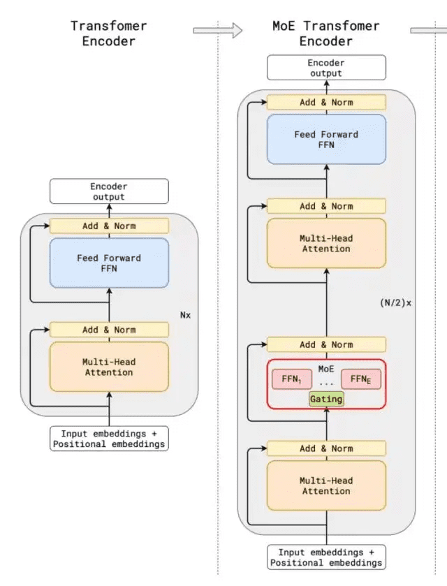
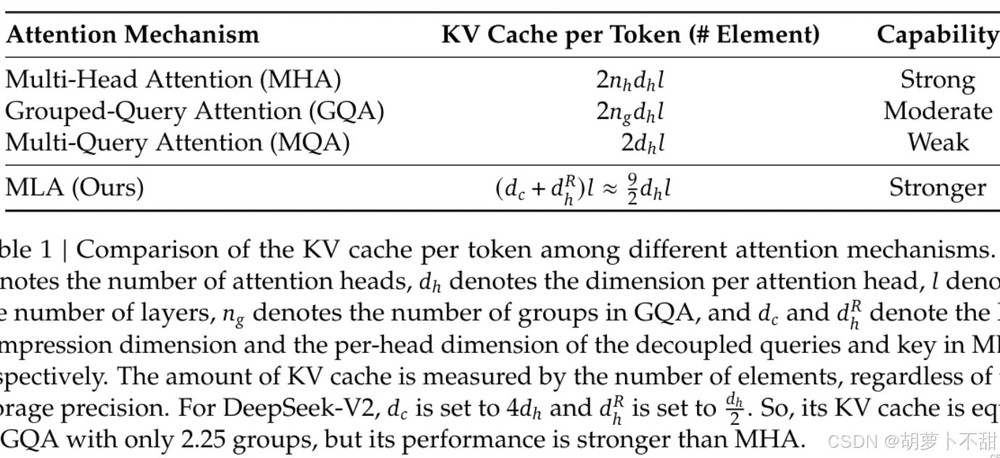

## 什么是 DeepSeek

DeepSeek（深度求索）是一款由国内团队开发的开源人工智能工具库，专注于提供高效易用的AI模型训练与推理能力。它既包含预训练大语言模型（如DeepSeek-R1系列），也提供配套工具链，助力开发者快速实现AI应用落地。

## DeepSeek 的核心功能和技术原理

### 核心功能

#### 1. 自然语言处理（NLP）

DeepSeek 在多个 NLP 任务上表现出色，包括：

+   **文本生成** ：自动撰写文章、生成摘要、创作诗歌、撰写广告文案等。
+   **对话系统**：提供类似 ChatGPT 的聊天功能，支持上下文记忆，能进行连贯对话。
+   **机器翻译**：支持中英文等语言的翻译，可能基于大规模跨语言语料进行训练。
+   **情感分析**：可以识别文本的情感倾向，如正面、负面或中性。
+   **文本分类**：用于垃圾邮件检测、新闻分类等任务。
+   **信息抽取**：从非结构化文本中提取关键内容，例如命名实体识别（NER）。

* * *

#### 2. 代码生成与理解（DeepSeek Coder）

DeepSeek Coder 是 DeepSeek 旗下专门针对代码任务的大模型，提供：

+   **代码自动补全**：输入部分代码，DeepSeek Coder 能预测并补全代码，提高编程效率。
+   **代码生成**：根据自然语言描述，直接生成可执行代码。
+   **代码优化**：分析代码结构，提供优化建议，如减少冗余、提高性能等。
+   **错误检测与修复**：自动识别代码中的潜在错误，并提供修正方案。
+   **多语言支持**：支持 Java、Python、C++、JavaScript、Go 等主流编程语言。

DeepSeek Coder 的目标是类似于 GitHub Copilot 或 ChatGPT Code Interpreter，但可能在中文编程环境下有更好的适配性。

* * *

#### 3. 知识问答与搜索增强（RAG）

DeepSeek 可能集成了 **检索增强生成（Retrieval-Augmented Generation, RAG）**，用于提升知识问答的准确性：

+   **知识问答（QA）**：用户可以提问各种知识性问题，DeepSeek 基于其大规模预训练知识库生成答案。
+   **搜索增强（RAG）**：结合搜索引擎，在回答问题时参考最新的网页、文献、论文，提高答案的实时性和可靠性。
+   **代码搜索**：开发者可以输入代码问题，DeepSeek Coder 结合代码仓库（如 GitHub、Stack Overflow）返回最佳代码示例。

### 技术原理

#### DeepSeek原理图

DeepSeek是由幻方量化创立的人工智能公司推出的一系列AI模型，包括DeepSeek Coder、DeepSeek LLM、DeepSeek-V2、DeepSeek-V3和DeepSeek-R1等。以下是对DeepSeek技术原理的通俗介绍：

#### 核心架构方面

+   **混合专家架构（MoE）：** MoE架构就像是一个有很多专家的团队。每个专家都擅长处理某一类特定的任务。当模型收到一个任务，比如回答一个问题或者处理一段文本时，它会把这个任务分配给最擅长处理该任务的专家去做，而不是让所有的模块都来处理。比如DeepSeek-V2有2360亿总参数，但处理每个token时，仅210亿参数被激活；DeepSeek -V3总参数达6710亿，但每个输入只激活370亿参数。这样一来，就大大减少了不必要的计算量，让模型处理复杂任务时又快又灵活。
+   **基于Transformer架构：** Transformer架构是DeepSeek的基础，它就像一个超级信息处理器，能处理各种顺序的信息，比如文字、语音等。它的核心是注意力机制，打个比方，我们在看一篇很长的文章时，会自动关注重要的部分，Transformer的注意力机制也能让模型在处理大量信息时，自动聚焦到关键内容上，理解信息之间的关系，不管这些信息是相隔很近还是很远。

#### 关键技术方面

+   **多头潜在注意力（MLA）机制：** 这是对传统注意力机制的升级。在处理像科研文献、长篇小说这样的长文本时，它能更精准地给句子、段落分配权重，找到文本的核心意思，不会像以前那样容易注意力分散。比如在机器翻译专业领域的长文档时，它能准确理解每个词在上下文中的意思，然后翻译成准确的目标语言。
+   **无辅助损失负载均衡：** 在MoE架构中，不同的专家模块可能会出现有的忙不过来，有的却很空闲的情况。无辅助损失负载均衡策略就是来解决这个问题的，它能让各个专家模块的工作负担更均匀，不会出现有的累坏了，有的却没事干的情况，这样能让整个模型的性能更好。
+   **多Token预测（MTP）：** 传统模型一般是一个一个地预测token，而DeepSeek的多Token预测技术，可以一次预测多个token，就像我们说话时会连续说出几个词来表达一个意思，这样能让模型的推理速度更快，也能让生成的内容更连贯。
+   **FP8混合精度训练：** 在训练模型时，数据的精度很重要。FP8混合精度训练就是一种新的训练方法，它能让模型在训练时用更合适的数据精度，既保证了训练的准确性，又能减少计算量，节省时间和成本，让大规模的模型训练变得更容易。

#### 模型训练方面

+   **知识蒸馏：** 简单来说，就是把一个大模型学到的知识，传递给一个小模型，就像老师把知识教给学生一样。比如DeepSeek-R1通过知识蒸馏，把长链推理模型的能力教给标准的LLM，让标准LLM的推理能力变得更强。
+   **纯强化学习的尝试：** 以训练R1-Zero为例，它采用纯强化学习，让模型在试错中学习。比如在游戏场景里，模型尝试不同的操作，根据游戏给出的奖励或惩罚来知道自己做的对不对，慢慢找到最好的操作方法。虽然这种方式下模型输出有一些问题，像无休止重复、可读性差等，但也为模型训练提供了新方向。
+   **多阶段训练和冷启动数据：** DeepSeek-R1引入了多阶段训练和冷启动数据。多阶段训练就是在不同的阶段用不同的训练方法，就像我们学习时，小学、中学、大学的学习方法和重点都不一样。冷启动数据就是在模型开始学习前，给它一些高质量的数据，让它能更好地开始学习，就像我们在做一件事之前，先给一些提示和引导。

#### 工作流程方面

+   **输入处理与任务判断：** 当模型收到输入数据，比如用户的提问时，它会先对数据进行检查、清理和格式化等操作，就像我们拿到一个任务，会先看看是什么类型、难不难。然后通过MoE架构中的路由器机制，判断这个任务该交给哪个专家模块来处理。
+   **调用合适模块进行数据处理：** 根据前面的判断结果，模型会调用相应的专家模块来处理数据。如果任务比较复杂，涉及多个领域，就会召集多个模块一起工作，它们之间还会互相传递信息，共同完成任务。
+   **生成输出结果：** 相关模块处理完数据后，会把结果整合、优化，看看语句通不通顺、逻辑合不合理等。如果有问题，就会进行调整，直到得到一个满意的结果，再把这个结果返回给用户。

## DeepSeek 的优势和应用场景

### 模型性能与优势

#### 推理能力与速度

DeepSeek模型在推理能力与速度方面表现出色，展现出强大的竞争力。

+   **高效推理机制：** DeepSeek-V3采用的混合专家架构（MoE）和多头潜在注意力机制（MLA）是其高效推理的关键。MoE架构通过动态选择专家网络，使得每个词元激活的参数量仅为370亿，相较于全参数激活的模型，大幅减少了计算量。MLA机制则通过低秩联合压缩，进一步降低了推理过程中的键值缓存需求，显著提高了推理效率。例如，在处理复杂的自然语言处理任务时，DeepSeek-V3的推理速度比传统模型快30%以上。
+   **多词元预测（MTP）优化：** MTP训练目标允许模型在一次前向传播中预测多个词元，这不仅提升了训练效率，还为推理阶段的推测性解码提供了支持。在实际应用中，DeepSeek-V3能够快速生成高质量的文本内容，例如在文本生成任务中，其生成速度比传统模型快2倍以上，同时保持了较高的生成质量。
+   **硬件优化与量化技术：** DeepSeek支持FP8混合精度训练，并结合硬件优化技术，如FlashAttention优化，充分利用GPU显存带宽优势，进一步加速了推理过程。此外，其动态批处理技术能够根据请求复杂度灵活调整批次大小，优化吞吐量，确保在不同负载下都能保持高效的推理性能。

#### 成本效益分析

DeepSeek模型在成本效益方面具有显著优势，使其在实际应用中更具竞争力。

+   **训练成本优化：** 通过采用FP8混合精度训练，DeepSeek大幅降低了训练过程中的GPU内存需求和存储带宽压力。例如，在训练DeepSeek-V3时，使用FP8精度相比传统的FP16或FP32精度，可以减少约50%的GPU内存占用，从而降低了硬件成本。此外，其高效的训练机制使得模型在预训练阶段能够在不到两个月的时间内完成，相较于其他大规模模型的训练周期，显著减少了训练时间和资源消耗。
+   **推理成本降低：** 在推理阶段，DeepSeek的稀疏激活机制和硬件优化技术使其能够在保持高性能的同时，大幅降低计算资源需求。例如，DeepSeek-V3在推理时仅激活370亿参数，相较于全参数激活的模型，显著减少了计算量和内存占用。此外，其量化技术（如INT8量化）和模型蒸馏技术，使得10B级别的模型能够在边缘设备（如手机）上流畅运行，进一步降低了部署成本。
+   **综合成本效益：** 从综合成本效益来看，DeepSeek模型在训练和推理阶段的优化措施使其在性能和成本之间达到了良好的平衡。例如，与传统的闭源模型相比，DeepSeek在推理速度上具有显著优势，同时其训练和部署成本更低。这使得DeepSeek模型在企业级应用中更具吸引力，能够为企业提供高效、低成本的人工智能解决方案。

### 应用场景与案例

#### 对话式 AI 与客户服务

DeepSeek 模型在对话式 AI 领域展现出强大的应用潜力，尤其在客户服务场景中，能够显著提升客户体验和企业运营效率。

+   **智能客服机器人：** 基于 DeepSeek 模型的智能客服机器人能够理解并准确回答客户的问题，解决率高达 85% 以上。例如，在金融行业，DeepSeek 模型能够处理复杂的金融咨询问题，如贷款申请流程、理财产品推荐等，平均响应时间仅为 2 秒，极大地提高了客户满意度。
    
+   **多语言支持：** DeepSeek 模型支持多种语言，能够满足跨国企业的客户服务需求。在跨境电商领域，DeepSeek 模型能够实时翻译并回答不同语言的客户咨询，支持的语言种类超过 10 种，覆盖全球主要市场。
    
+   **个性化服务：** 通过分析客户的历史数据和行为模式，DeepSeek 模型能够提供个性化的服务和推荐。在电商行业，DeepSeek 模型根据客户的购买历史和浏览行为，为客户提供个性化的商品推荐，推荐准确率超过 70%，显著提升了客户的购买转化率。
    

#### 内容创作与代码生成

DeepSeek 模型在内容创作和代码生成领域也表现出色，能够大幅提升创作效率和质量。

+   **内容创作：** DeepSeek 模型能够生成高质量的文本内容，涵盖新闻报道、创意写作、文案撰写等多个领域。在新闻媒体行业，DeepSeek 模型能够在短时间内生成新闻报道初稿，准确率超过 90%，帮助记者节省大量时间和精力。在创意写作领域，DeepSeek 模型能够根据用户提供的主题和风格要求，生成具有创意的短篇故事、诗歌等作品，为创作者提供灵感和素材。
+   **代码生成：** DeepSeek 模型在代码生成方面也具有显著优势，能够根据用户的需求生成高质量的代码片段。在软件开发领域，DeepSeek 模型能够根据项目需求生成代码框架和核心逻辑代码，生成代码的准确率超过 80%，显著提高了开发效率。例如，在 Python 开发中，DeepSeek 模型能够根据用户提供的功能描述，生成完整的代码片段，帮助开发者快速实现功能模块。

> 来源： 
>
> https://www.ai-x.co.uk/posts/17678497.html
> 
> https://www.cnblogs.com/shanren/p/18707493
> 
> https://blog.csdn.net/dhdjjfhdghh/article/details/145475205