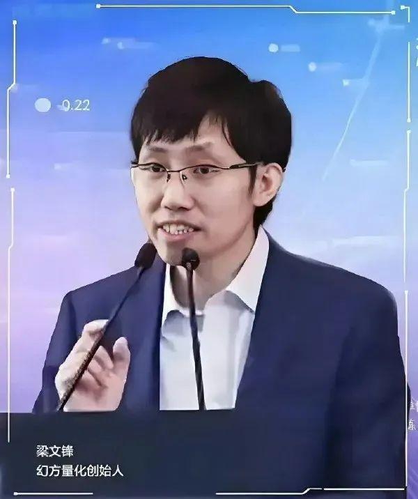
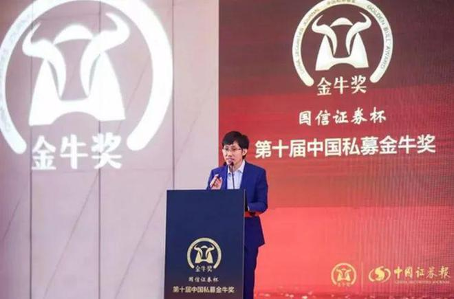
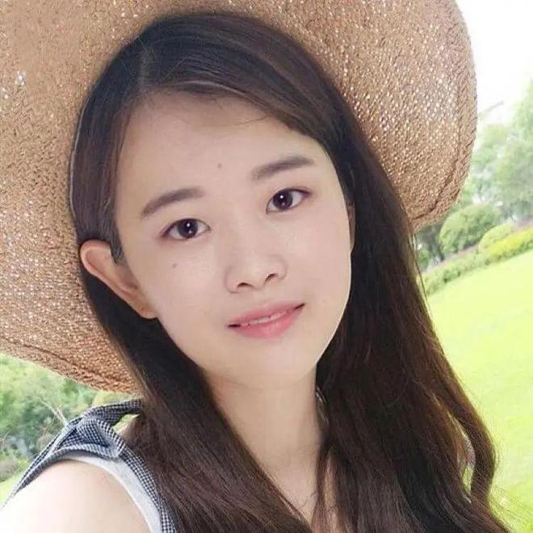

## 创始团队背景和创业故事

DeepSeek 的故事始于创始人梁文锋，这位1985年出生于广东湛江的数学天才，从小就表现出非凡的学习能力和对数字的敏感。梁文锋是典型的“小镇做题家”，1985年出生于广东湛江的五（三）线城市，父母均是小学教师。他自小在学习上展现出很高天赋，尤其是在数学领域。

初中就完成高中数学课程，开始学大学数学，17时以吴川市第一中学「高考状元」身份，进入浙江大学信息与电子工程学系，获得本硕学位，于2010年毕业。

在校期间，梁文锋对金融市场产生了浓厚的兴趣，2008年全球金融危机之际，他带领团队探索机器学习技术在全自动量化交易中的应用潜力。

梁文锋决定量化投资，但这个决定并不容易，毕竟当时量化还是个新事物，很多人不相信量化可以赚钱。

梁文锋苦熬了2年，2010年，沪深300股指期货推出，量化投资迎来了春天，梁文锋和他的团队大赚一笔，自营资金超过5亿元。

他才刚从学校毕业就赚到了一大桶金，这实际上为他后来的创业铺平了道路。

2023年，梁文锋正式成立DeepSeek，一家专注于人工智慧大模型技术研发的创新公司。

成立1年后，DeepSeek就拿出让业界关注的产品，去年5月，公司发布DeepSeek-V2，以其创新的模型架构和史无前例的性价比（CP值）引发关注。

Deepseek人才招募原则是「只招1%的天才，去做99%中国公司做不到的事情。」

团队不大，约只有 140 人，当中人才都来自清华、北大、北航等顶尖大学的应届博士毕业生及在校学生，据说并没有「海归」的海外留学生，只重用国内本土人才。

DeepSeek-R1的成功，也让天才工程师罗福莉一举成名。

罗福莉是名95后（1995年后生），硕士毕业于北京大学计算语言学专业。2019年还在北大读硕士期间，便于人工智能领域顶级国际会议ACL上发表8篇论文，被称为「AI天才少女」。

2022年，罗福莉跳槽到DeepSeek担任深度学习研究员，参与研发MoE大模型DeepSeek -V2。

Deepseek的崛起，刚上任的美国总统川普表示，「我正面看待这件事情。」因为美国企业也做得到，未来不必再花这么多钱来达到相同的结果。

## 技术发展和产品愿景

### 技术的未来发展趋势

DeepSeek技术将继续保持快速发展态势，并在多个方面取得新的突破。首先，随着5G、物联网等新兴技术的普及，DeepSeek技术将进一步拓展应用场景。例如，在智能家居领域，DeepSeek技术可以通过连接各种智能设备，实现家居环境的智能化管理。用户可以通过手机APP远程控制家电、照明等设备，享受更加便捷的生活体验。此外，DeepSeek技术还可以应用于工业互联网，通过连接生产设备和管理系统，实现生产过程的智能化监控和优化。

其次，DeepSeek技术将在算法优化和模型训练方面取得新的进展。随着计算能力的不断提升，DeepSeek技术将能够处理更加复杂的数据集，进一步提高数据处理的速度和准确性。例如，在自动驾驶领域，DeepSeek技术可以通过实时处理车辆周围的环境数据，实现更加精准的路径规划和避障操作。此外，DeepSeek技术还将探索更多的人工智能前沿领域，如量子计算与AI的结合，为未来的科技发展开辟新的道路。

最后，DeepSeek技术将更加注重用户体验和安全性。随着人们对隐私保护和数据安全的关注日益增加，DeepSeek技术将加强在数据加密、隐私保护等方面的研究，确保用户数据的安全性和隐私性。例如，在金融领域，DeepSeek技术可以通过加密算法保护用户的交易信息，防止数据泄露和非法访问。同时，DeepSeek技术还将不断优化用户界面，提升用户体验，让用户更加方便地使用各项功能。

总之，DeepSeek技术的未来发展前景广阔，将在技术创新、应用场景拓展和用户体验提升等多个方面取得新的突破，为我国人工智能技术的发展注入源源不断的动力。

### DeepSeek的产品愿景

DeepSeek将继续保持强劲的发展势头，成为引领全球人工智能创新的关键力量。一方面，随着5G网络的普及和云计算技术的成熟，DeepSeek将进一步提升其数据处理能力和响应速度，为用户提供更加优质的服务体验。预计到2025年，DeepSeek的日均处理数据量将达到PB级别，服务覆盖超过1亿用户。

另一方面，DeepSeek将不断深化与其他前沿技术的融合，如量子计算、区块链等，探索更多未知领域。例如，在金融风控领域，DeepSeek结合区块链技术，构建了一个去中心化的信用评估系统，有效解决了传统金融机构面临的信任危机问题。此外，DeepSeek还将加大对基础研究的投入，培养更多高素质的专业人才，为行业的可持续发展奠定坚实基础。

总之，DeepSeek以其独特的技术优势和广阔的市场前景，必将在未来的竞争中脱颖而出，开启一个充满无限可能的新时代。无论是个人用户还是企业客户，都将受益于DeepSeek带来的变革与创新，共同见证人工智能的美好未来。

参考：
> https://www.163.com/dy/article/JN0HHUSA0515DN7K.html
> 
> https://www.showapi.com/news/article/67a95ffc4ddd79f11a01407f
> 
> https://www.showapi.com/news/article/67a55bc44ddd79f11a6435e7