> 动漫创作介绍

MidJourney 的 Niji 模型是专为动漫和东方美学设计的 AI 图像生成工具，与 Spellbrush 合作开发，特别适合生成动漫风格的插画。Niji V5 和 V6 是该系列中的两个重要版本，分别在 2023 年 4 月和 2024 年 6 月发布。

## Niji V5 的内置风格

Default Style（默认风格）、Expressive Style（表现力风格）、Cute Style（可爱风格）、Scenic Style（场景风格）以及Original Style（原始风格）。

- Cute：生成可爱的角色和场景，通常使用柔和的色彩，适合卡哇伊风格。

- Expressive：更成熟的插画感，色彩饱和，类似西方动画风格。

- Original：使用 V5 的原始风格，色彩柔和，类似于传统日本动漫。

- Scenic：专注于背景和电影感，带有光晕和戏剧性照明，适合奇幻场景。


### Default风格

```Markdown
Prompt:night sky and lanterns fantasy landscape in the style of Genshin Impact --niji 5 --ar 16:9

提示词：《原神》风格的夜空和灯笼幻想景观
```

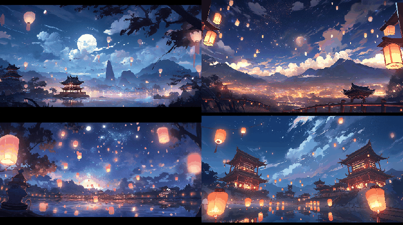


### Expressive风格

```Markdown
Prompt:(best quality,masterpiece), a girl，pose,wind, upper body, blue and pink color scheme,simple background, look at the viewer --niji 5 --style expressive

提示词：(最佳质量，杰作)，一个女孩，摆姿势，风，上半身，蓝色和粉色配色方案，简单背景，看着观众
```
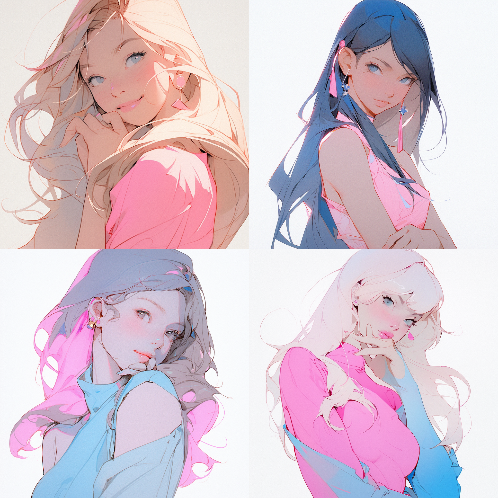

### Cute风格

Cute Style的最大特点是设计出更为可爱的眼睛效果。

```Markdown
Prompt:a girl with a kitty --niji 5 --style cute

提示词：小女孩和小猫咪
```
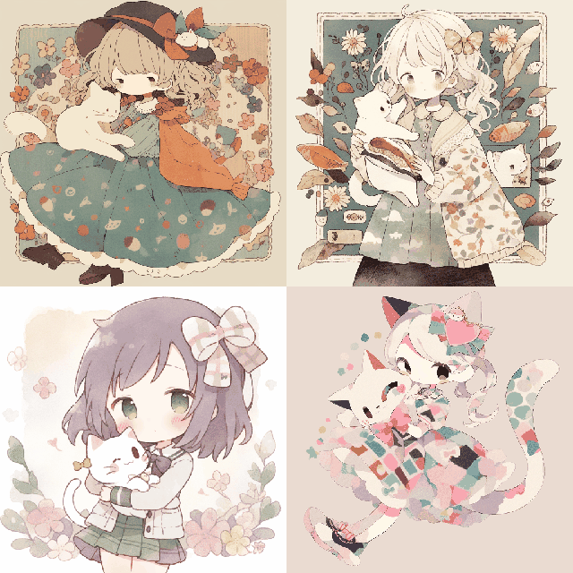

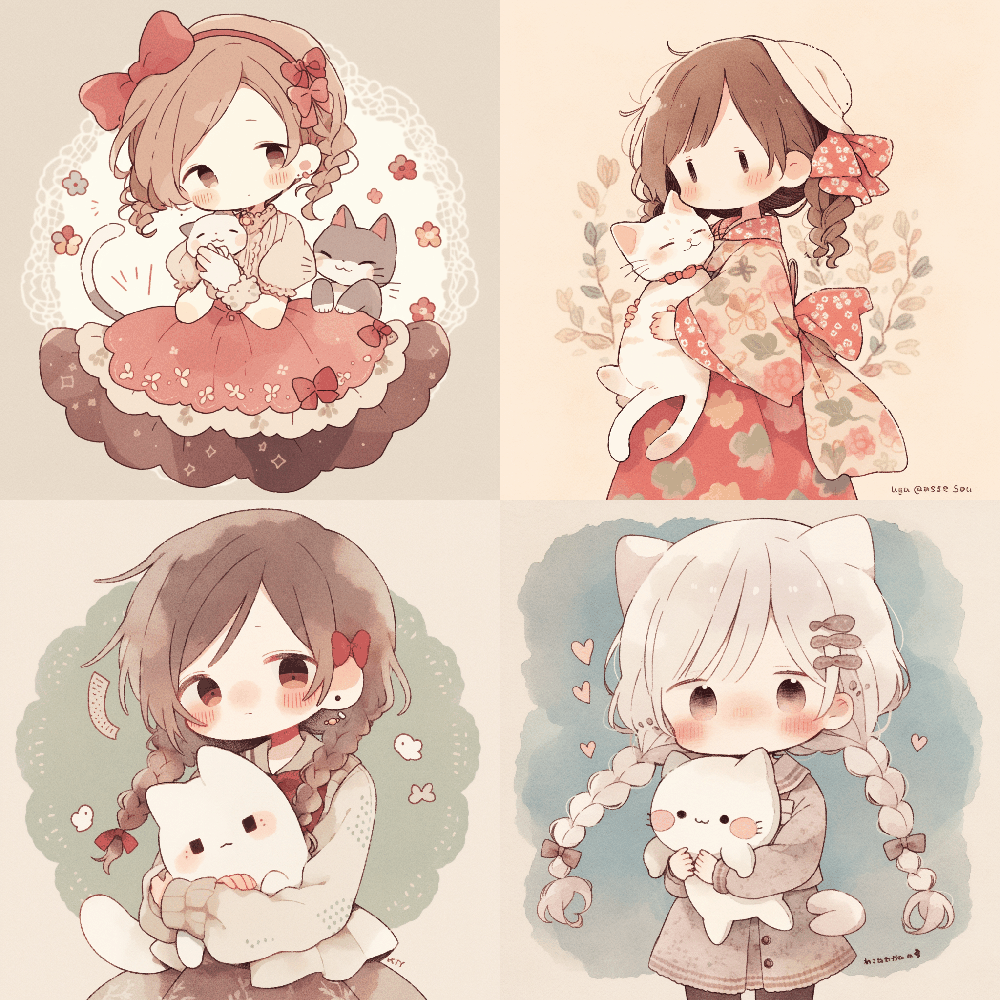
seed：883258226

### Scenic风格

```Markdown
Prompt:sunrise at the beach --niji 5 --style scenic

提示词：海滩日出
```


## Niji V6 的风格

Niji V6 是 2024 年 6 月 7 日发布的最新版本，专注于提升动漫美学，特别是在日文文本渲染、动漫眼睛细节和图像伪影处理上。因为 V6 是全新版本，V5的内置风格可能不再适用。下面的内容提到 V6 支持 32 种艺术风格，但这些更多是用户定义的提示词组合，而非内置参数。



具体特点包括：

- 改进的渲染能力：V6 能更好地处理日文短假名文本，甚至简单中文字符，适合动漫相关创作。

- 细节提升：特别是动漫眼睛的结构，图像细节更精细，减少了之前的伪影问题。

- 角色一致性：通过 `--cref` 参数（根据历史对话），V6 提升了角色特征的稳定性，适合生成系列角色。

- 线条与颜色控制：用户可以更精细地控制线条和色彩，背景与角色的融合更自然。

- 高分辨率支持：V6 默认生成更高分辨率的图像，适合印刷或高清屏幕使用。

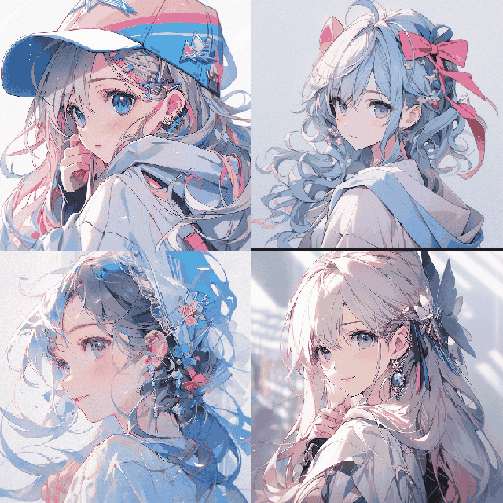


## 模仿动漫艺术家风格创作动漫

使用Midjourney创作动漫作品时，最简单有效的方法就是在提示词中插入一位著名的动漫艺术家的名字，Midjourney会根据这些艺术家的作品风格和审美特点，生成相应风格的动漫图像。

需要注意的是，虽然在提示词中提及动漫艺术家的名字有助于指导图像的生成，但最终生成的图像并不会完全模仿这些艺术家的作品。Midjourney会结合其他提示词，创作出独特而富有个性的动漫图像。

提示词结构如下：
```Markdown
动漫内容描述 + by 动漫艺术家英文名 / in the style of 动漫艺术家英文名
```

下面是一些著名的动漫艺术家及其代表作:
- Hayao Miyazaki, Spirited Away / 宫崎骏，《千与千寻》
- Makoto Shinkai, Your Name / 新海诚，《你的名字。》
- Isao Takahata, Grave of the Fireflies / 高畑勋，《萤火虫之墓》
- Mamoru Hosoda, The Girl Who Leapt Through Time / 细田守，《穿越时空的少女》
- Satoshi Kon, Paprika / 今敏，《红辣椒》
- Katsuhiro Otomo, Akira / 大友克洋，《阿基拉》
- Hideaki Anno, Neon Genesis Evangelion / 庵野秀明，《新世纪福音战士》
- Yoshiyuki Tomino, Mobile Suit Gundam / 富野由悠季，《机动战士高达》
- Leiji Matsumoto, Space Battleship Yamato / 松本零士，《宇宙战舰大和号》
- Osamu Tezuka, Astro Boy / 手冢治虫，《铁臂阿童木》
- Naoko Takeuchi, Sailor Moon / 武内直子，《美少女战士》
- Rumiko Takahashi, Inuyasha / 高桥留美子，《犬夜叉》
- Eiichiro Oda, One Piece / 尾田荣一郎，《海贼王》
- Akira Toriyama, Dragon Ball / 鸟山明，《龙珠》
- CLAMP, Cardcaptor Sakura / CLAMP，《魔卡少女樱》
- Masaaki Yuasa, Mind Game / 汤浅政明，《心灵游戏》
- Kunihiko Ikuhara, Revolutionary Girl Utena / 几原邦彦，《少女革命》
- Gainax Studios, Gurren Lagann / GAINAX，《天元突破》
- Shinichiro Watanabe, Cowboy Bebop / 渡边信一郎，《星际牛仔》
- Mitsuru Adachi, Touch / 安达充，《棒球英豪》
- Yasuo Otsuka, The Legend of the White Snake / 大冢康生，《白蛇传》
- Takehiko Inoue, Slam Dunk / 井上雄彦，《灌篮高手》
- Hisashi Hirai, Mobile Suit Gundam SEED / 平井久司，《机动战士高达SEED》
- Yoshihiro Togashi, Hunter × Hunter / 富坚义博，《全职猎人》
- Fujiko Fujio (Hiroshi Fujimoto), Doraemon / 藤子·F·不二雄，《哆啦A梦》
- Yoh Yoshinari, Little Witch Academia / 吉成曜，《小魔女学园》
- Momoko Sakura, Chibi Maruko-chan / 樱桃子，《樱桃小丸子》
- Yasuhiro Nightow, Trigun / 内藤泰弘，《枪神》
- Clamp, xxxHolic / CLAMP，《四月一日灵异事件簿》
- Go Nagai, Devilman / 永井豪，《恶魔人》
- Tite Kubo, Bleach / 久保带人，《死神》

```Markdown
Prompt: the little girl riding an electric scooter,in a beautiful anime scene by Hayao Miyazaki: a snowy Tokyo city with Miyazaki clouds floating in the blue sky, enchanting snowscapes of the city with bright sunlight,Miyazaki's landscape imagery,Japanese art --niji 6

提示词：骑电动车的小女孩，美丽的宫崎骏动画场景：白雪皑皑的东京市，巨大的宫崎骏风格的云朵在蓝色的天空中飘荡，迷人的雪景城市，有着刺眼的阳光，宫崎骏风格的风景画面，日本艺术
```


Seed:9749258


## 创作复古风格的动漫

复古风格动漫关键词有:

- 1970s anime / 20世纪70年代动漫
- 1980s anime / 20世纪80年代动漫
- 1990s anime / 20世纪90年代动漫
- retro anime / 复古动漫

```Markdown
Prompt: 1980s anime, girl and boy having coffee at a coffee shop, retro fashion，muted colors --ar 3:2 --niji 6

提示词：20世纪80年代的动漫，一个女孩和一个男孩在咖啡馆喝咖啡，复古、时尚，柔和的颜色
```
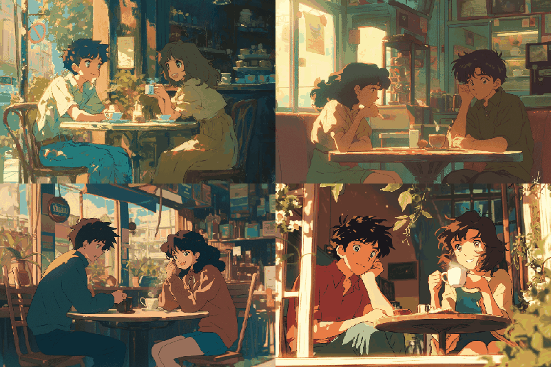
Seed:2989139897


## 创作未来注意风格的动漫

未来主义风格的动漫艺术，以科技为主题，结合透明乙烯基衣服、透明PVC 材料、反光服装和未来主义服装等元素，可以构建一个充满科幻色彩的画面。	

首先，未来主义风格的动漫人物不仅要展现出未来的科技和时尚元素，而且要具有辨识度和独特性。这时，可以利用Mdjourney的功能，为人物设计透明乙烯基衣服和透明PVC材料制作的配件。这样的衣服和配件可以使人物看起来更具未来感。

其次，反光服装和未来主义服装也是未来主义风格常用的元素,在 Midjourney中，可以利用“reflectiveclothing”(反光服装)和“futurisix clothing”(未来主义服装)这两个关键词，创造出独特的未来主义服装民格。反光服装可以使人物在任何环境下都能成为焦点，而未来主义服装则可以突出人物的个性和身份。

此外，为了强调未来感和科技感，还可以利用Midjourney的功能，为作品添加“chromatic aberration”(色差)、“holographic”(全息的)和“iridescent opaque thin filmRGB”(彩虹色不透明薄膜RGB)等效果，色差可以增加画面的视觉冲击力，全息的元素可以增添神秘和高科技感，彩虹色不透明薄膜 RGB效果则可以使画面看起来更加丰富和有深度。

常用的未来主义风格关键词有:

- chromatic aberration / 色差光晕（镜头色散产生的红蓝边缘光效）

- holographic / 全息投影（三维立体幻影视觉效果）

- iridescent opaque thin film RGB / 虹彩薄膜RGB（不透明渐变反光材质）

- transparent vinyl clothing / 透明乙烯基服饰（类塑料光泽的透视服装）

- transparent PVC / 透明PVC材质（聚氯乙烯透明塑胶质感）

- reflective clothing / 反光服饰（高光面料的光线反射效果）

- futuristic clothing / 未来主义服装（科技感剪裁与材质组合）


```Markdown
Prompt: Pixiv,hyper detailed, Harajukufashion，futuristic fashion, anime girl, headphone, colorful reflective fabric inner, transparent PVC jacket, in Tokyo city center --niji 6

提示词：Pixiv，极高的细节，原宿时尚，未来主义时尚，动漫女孩，耳机，彩色反光面料内衬，透明PVC夹克，在东京市中心
```
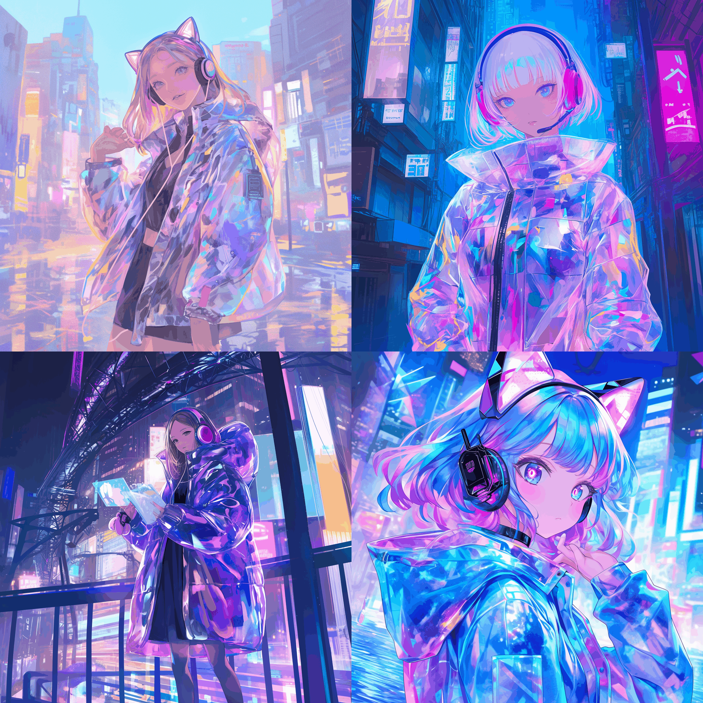

Seed:3336286182


```Markdown
Prompt: girl, anime, looking at viewer, bubbles, highly detailed, reflective transparentiridescent opaque jacket, long transparent iridescent RGB hair --niji 6

提示词：动漫风格的女孩，正在直视观众，周围飘浮着气泡，图像细节精致且复杂，展示了一件反光的、半透明且拥有彩虹般色彩的夹克，长发透明且色彩斑斓，呈现出一种独特的RGB色彩的彩虹效果
```
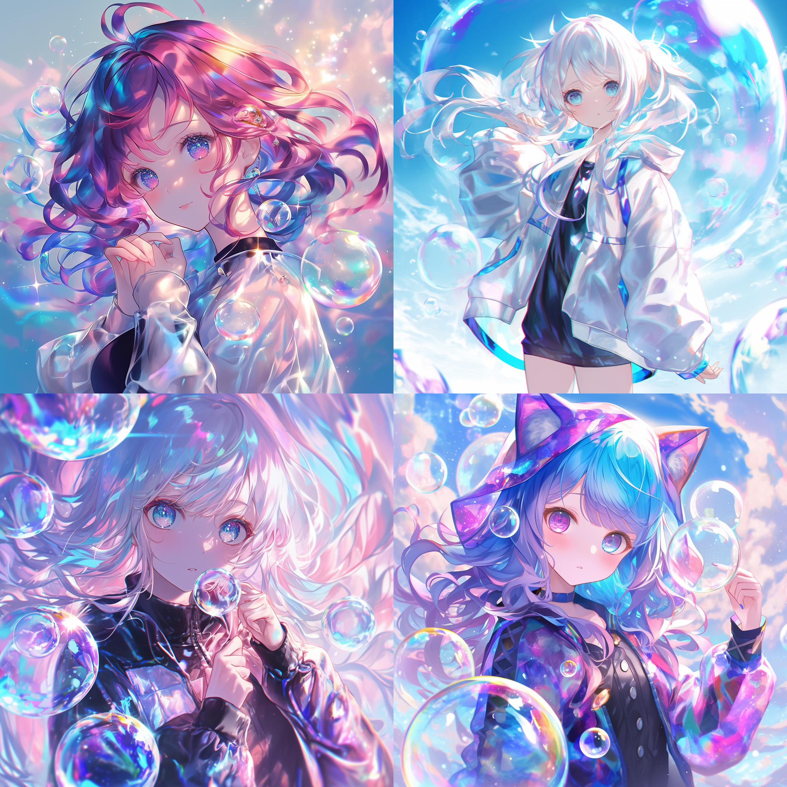

Seed:2094266009


## 创作漫画

漫画常用关键词有:

- manga drawing / 日式漫画线稿（强调典型的日漫勾线风格）

- manga shading / 漫画式阴影（网点纸或排线构成的明暗处理）

- manga screentone / 漫画网点纸（传统印刷用的灰度纹理贴片）

- largely and widely-spaced dots / 疏点网点（大间距点阵，营造浅灰效果）

- halftone pattern / 半调网屏（通过密度变化表现渐变的印刷工艺）

- manga comic strip / 漫画分镜格（多格叙事性画面组合）

为了绘制复古类型的漫画，也可以添加年代关键词:1980s，1990s等。

```Markdown
Prompt: a 1980s Japanese manga drawing, a girl with cat ears and a dress --ar 3:2 --niji 6

提示词:一幅20世纪80年代的日本漫画，一个长着猫耳朵、穿连衣裙的女孩
```
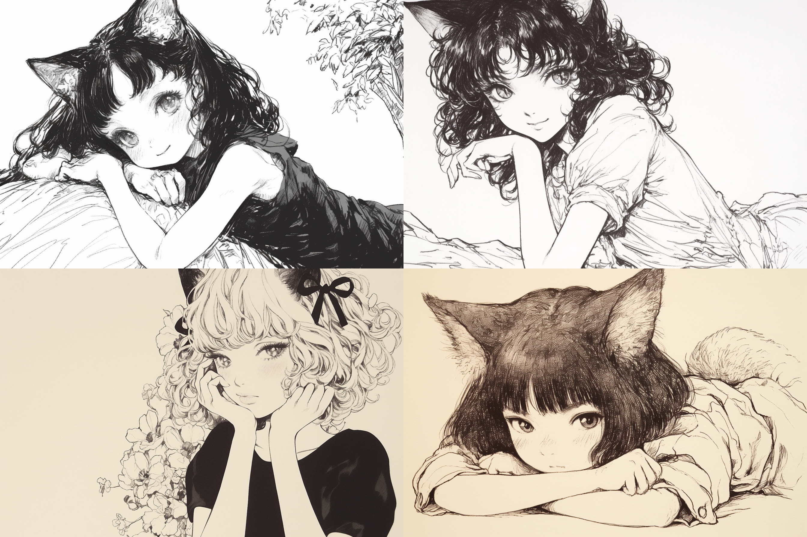

Seed:1776427383

```Markdown
Prompt: samurai, manga screentone, screen tone patterns, dot pattern, largely and widely-spaced dots, high quality --ar 3:2 --niji 6

提示词：武士，采用漫画屏幕调色板，屏幕色调图案，具有点状图案，使用大间距和广泛的点阵，高质量
```


Seed:1794585528

```Markdown
Prompt: a page from manga comic strip book with Daniel Craig fighting with bad guys, featured on Pixiv, underground comix, cyber-punk, concept art --ar 3:2 --niji 6

提示词：一本漫画连环画书中的一页，描绘了丹尼尔·克雷格与坏人战斗的场景，该作品在Pixiv网站上特色展示，地下漫画，赛博朋克，概念艺术风格
```
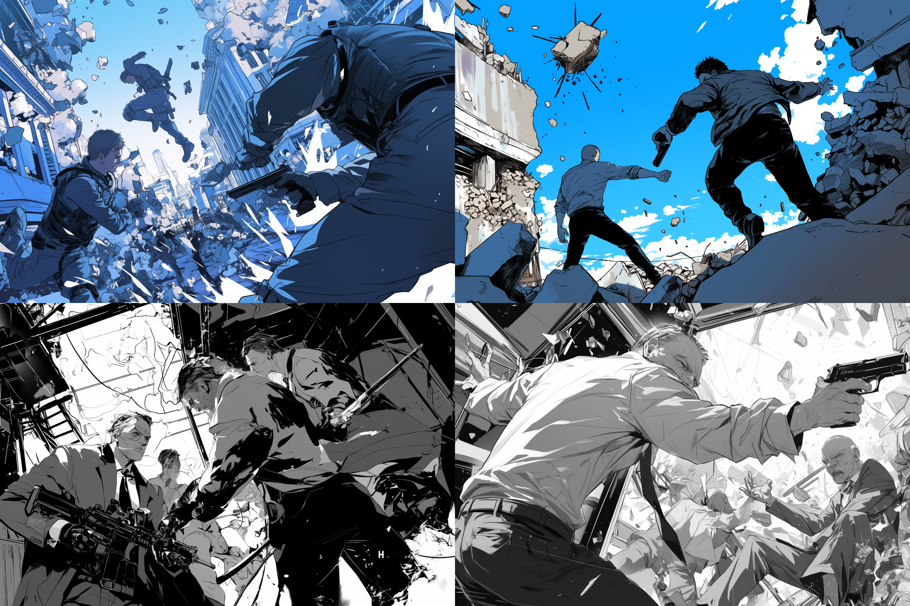
Seed:1107948332


## 创作人物和玩具动漫

Midjourney可以生成令人难以置信的动作人物、玩具和动漫人物的逼真图像，Prompt里可以尝试下面的关键词。

1. chibi character(赤字之心人物)。这是一种常见于日本动漫和漫画种的角色设计风格，通常表现为角色的头部与身体部分相比较大，以营造出一种可爱和夸张的效果。

2. miniature character(微型人物)。微型人物的设计通常在细节方面需要格外注意，尤其是当这些角色被放置在具有大量细节的环境中(例如一个精细的模型城市或房间内)时。

3. anime character(动漫人物)。动漫人物的设计风格非常广泛，可以根据角色的性格、故事背景等因素进行设计。

4. toy figure(玩具人物)。玩具人物的设计通常需要考虑实际的生产工艺，例如由塑料或聚酯油灰制成的玩具人物。

5. in a glass display case(装在一个玻璃展示柜里)。这是一个特定的场景描述，可以用来在Midjourney中生成特定的环境。例如，可以在提示词中添加“一个精心布置的玻璃展示柜中放置着各种各样的玩具人物”。

6. made of plastic(塑料制成)和made of polyester putty(聚酯油灰制成)。这两个提示词用于描述人物或物品的材质。例如，可以在提示词中添加“由塑料制成的动漫人物，其细节精致且色彩鲜艳”或者“由聚酯油灰制成的微型人物，看起来就像真实的微缩模型”。

通过适当的组合和调整这些关键词，可以在Midjourney种创造各种各样的动画和人物形象。

```Markdown
Prompt: chibi Japanese boy photographer, eggshell, space, mart, pastel, 3D, gradient --niji 6

提示词：赤子之心日本男孩摄影师，蛋壳，空间，集市，粉彩，3D，渐变
```


Seed:1107948332

```Markdown
Prompt: toy figure, anime, blue cute,dress --niji 6

提示词：玩具人物，动漫，蓝色、可爱，连衣裙
```
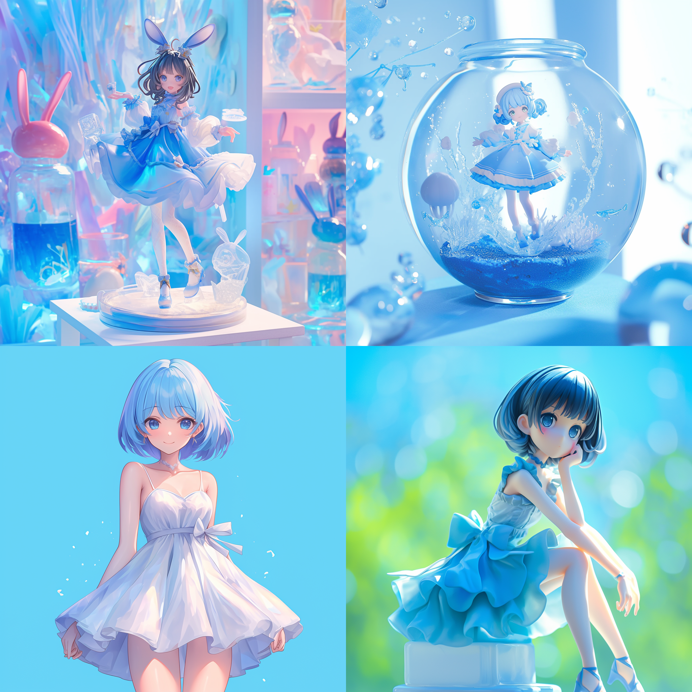
Seed:2748333407

```Markdown
Prompt: A meticulously arranged glass display case showcases a variety of toy figures. --niji 6 

提示词：一个精心布置的展柜中放置着各种各样的玩具人物
```
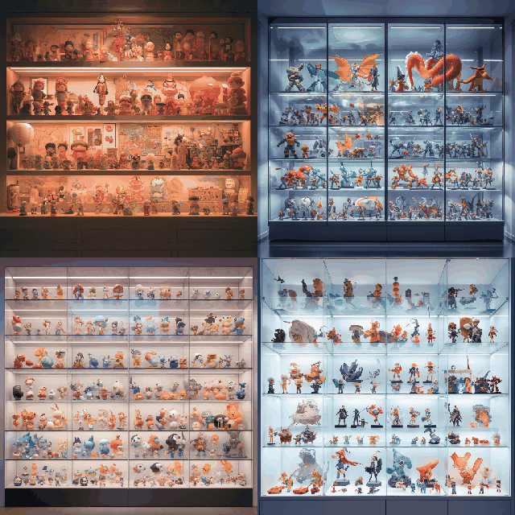
Seed:528324644

```Markdown
Prompt: Made of plastic, anime character, intricate details, vibrant colors. --niji 6 

提示词：塑料制成，动漫人物，细节精致，色彩鲜艳
```
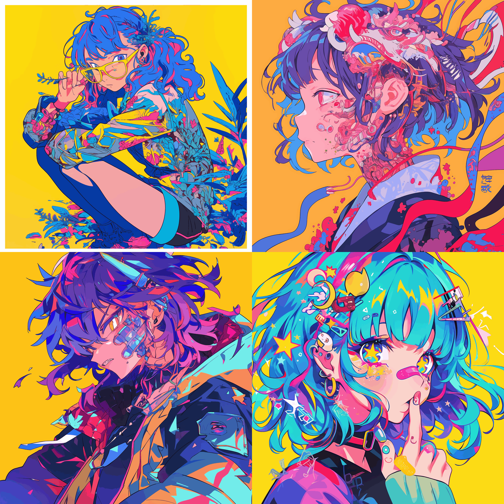
Seed:528324644

```Markdown
Prompt: Made of polyester putty, miniature character, realistic, scale models. --niji 6 

提示词：由聚酯油灰制成，微型人物，真实的，微缩模型
```
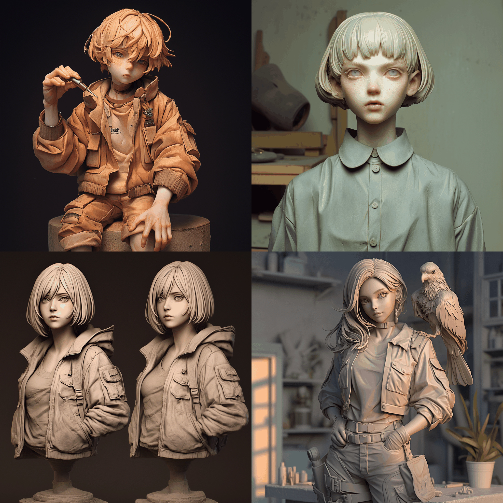
Seed:528324644

## 动漫角色设计

Midjourney可以帮助你轻松成为一名优秀的动漫设计师，创造一致性的角色，完成表情的多样化，让创作变得更加轻松有趣。

角色表情表。让角色拥有丰富的情绪表达，喜怒哀乐都可轻松呈现。

```Markdown
Prompt: Character expression sheet, a girl, big eyes --niji 6
```

Seed:1459230394

角色设计表。帮助完善角色的基本要素，如体型、发型、服饰等。

```Markdown
Prompt: Character design sheet, a girl, big eyes --niji 6
```
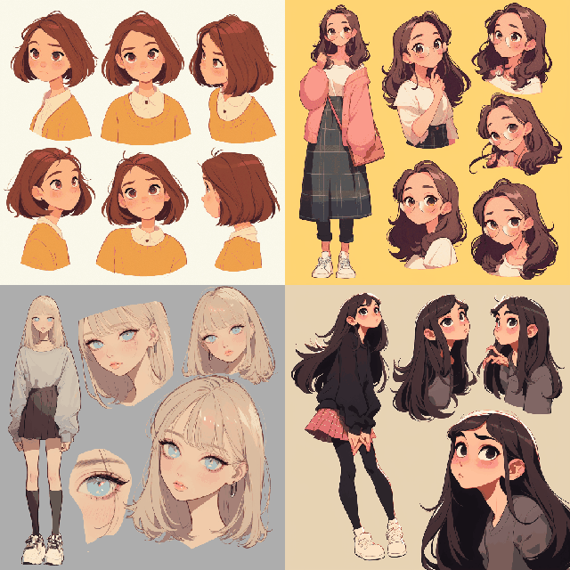
Seed:1459230394

角色姿态表。通过不同的动作和姿势，展现角色的活力和个性。

```Markdown
Prompt: Character pose sheet, a girl, big eyes --niji 6
```
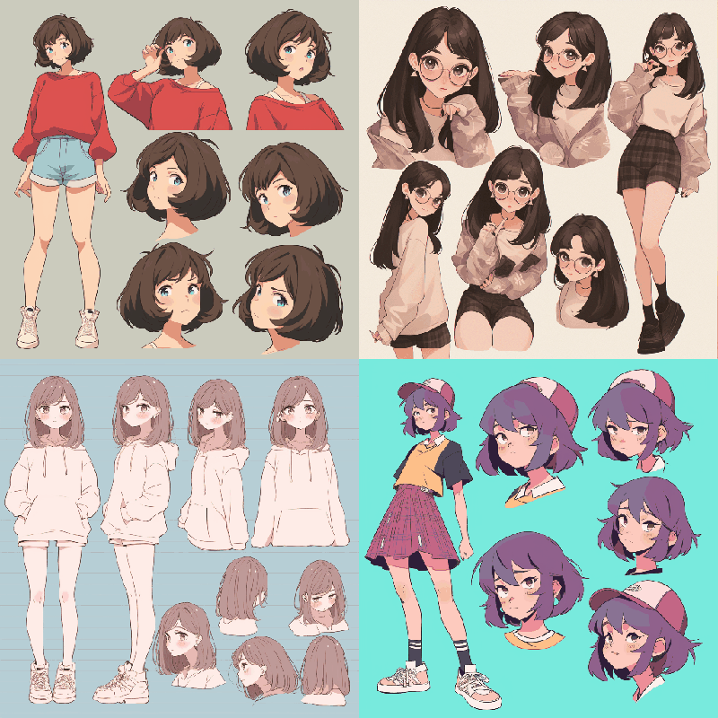
Seed:1666699582

转折表。透视和角度的转变使角色更立体、更富动态感。

```Markdown
Prompt: Turnaround sheet, a girl, big eyes --niji 6
```
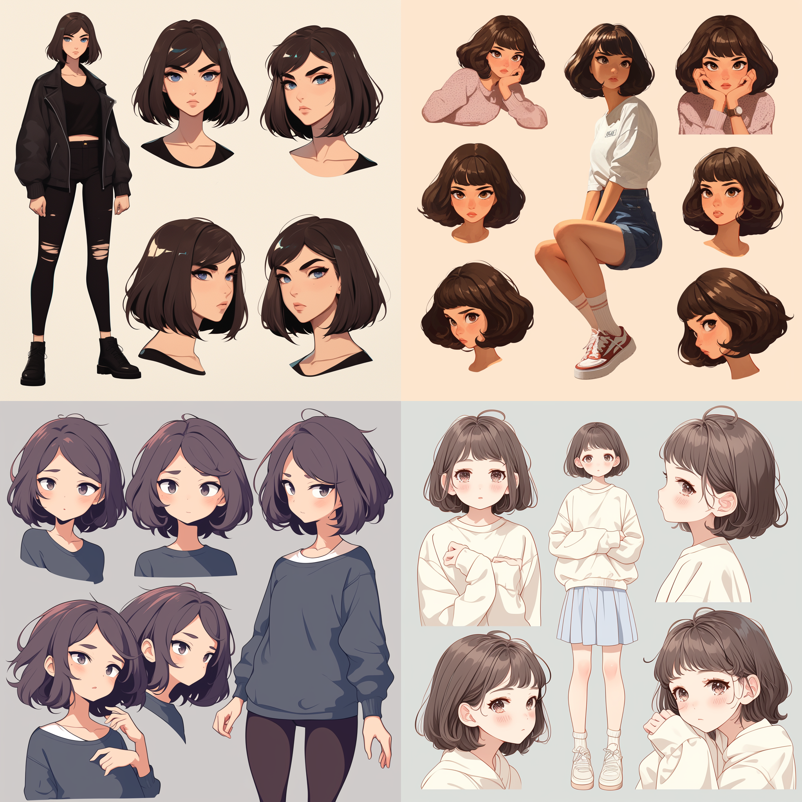
Seed:21200362

概念设计表。以此捕捉和明确角色的基本设定和特征。

```Markdown
Prompt: Concept design sheet, a girl, big eyes --niji 6
```
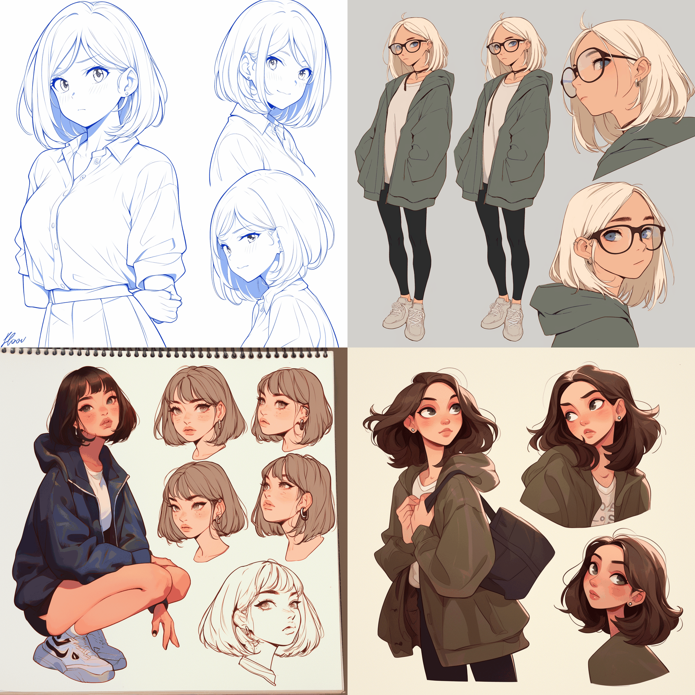
Seed:3885552193

物品表/配饰。为角色增加道具和配饰，丰富其故事背景和个人特色。

```Markdown
Prompt: Items sheet, a girl, big eyes --niji 6
```

Seed:380657276

装饰表/时尚表。利用不同的服饰款式和风格，打造角色的时尚形象。

```Markdown
Prompt: Dress-up sheet, a girl, big eyes --niji 6
```
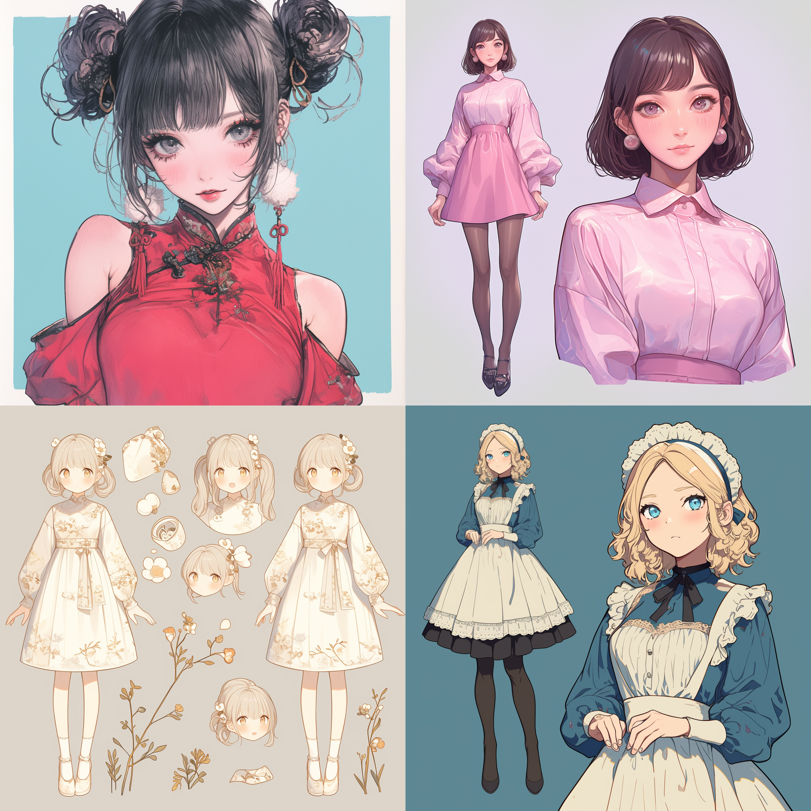
Seed:2167692125

全身画像。全身画像可帮助用户全面观察和设计角色，每个细节都一目了然。

```Markdown
Prompt: Full body portrait, a girl, big eyes --niji 6
```
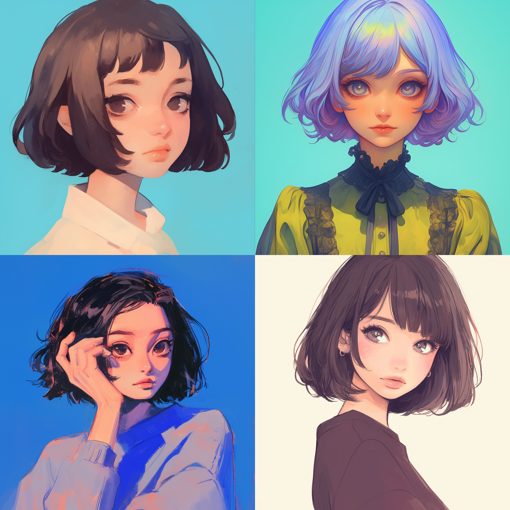
Seed:2955571956


