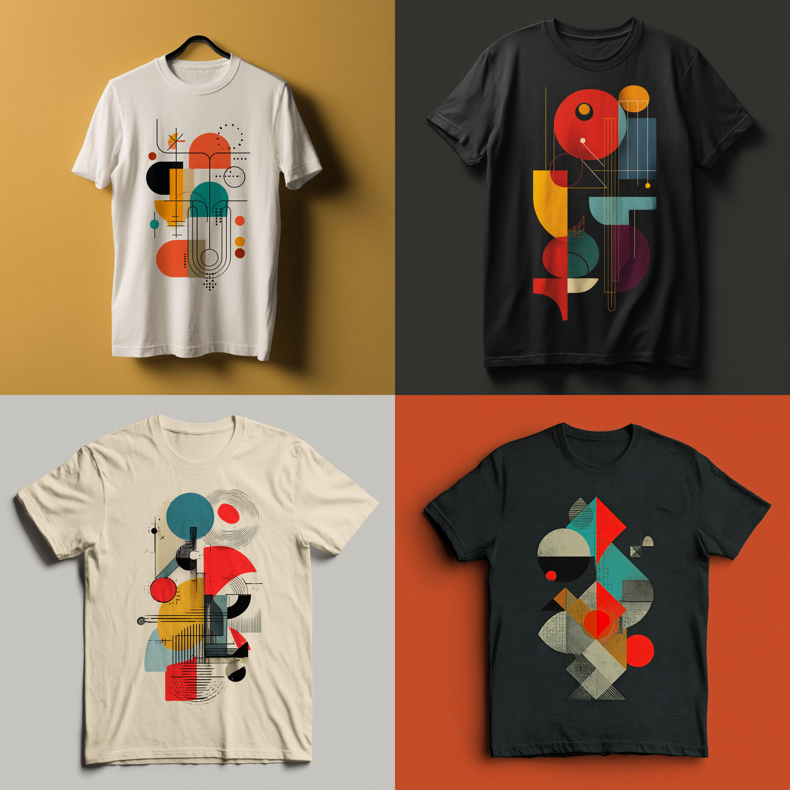
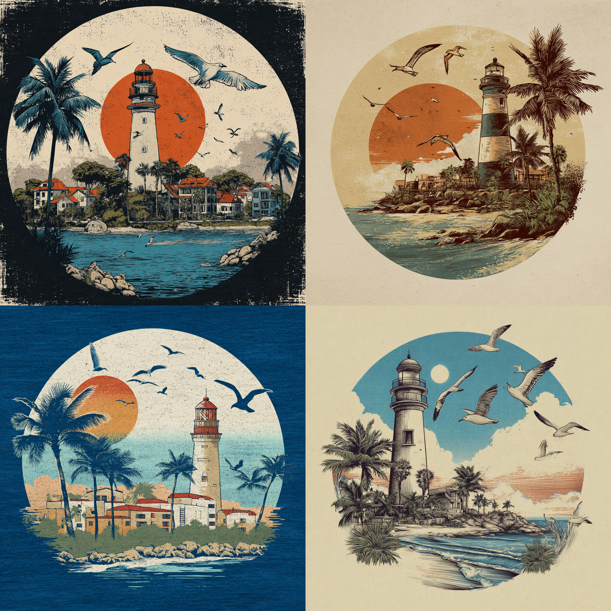
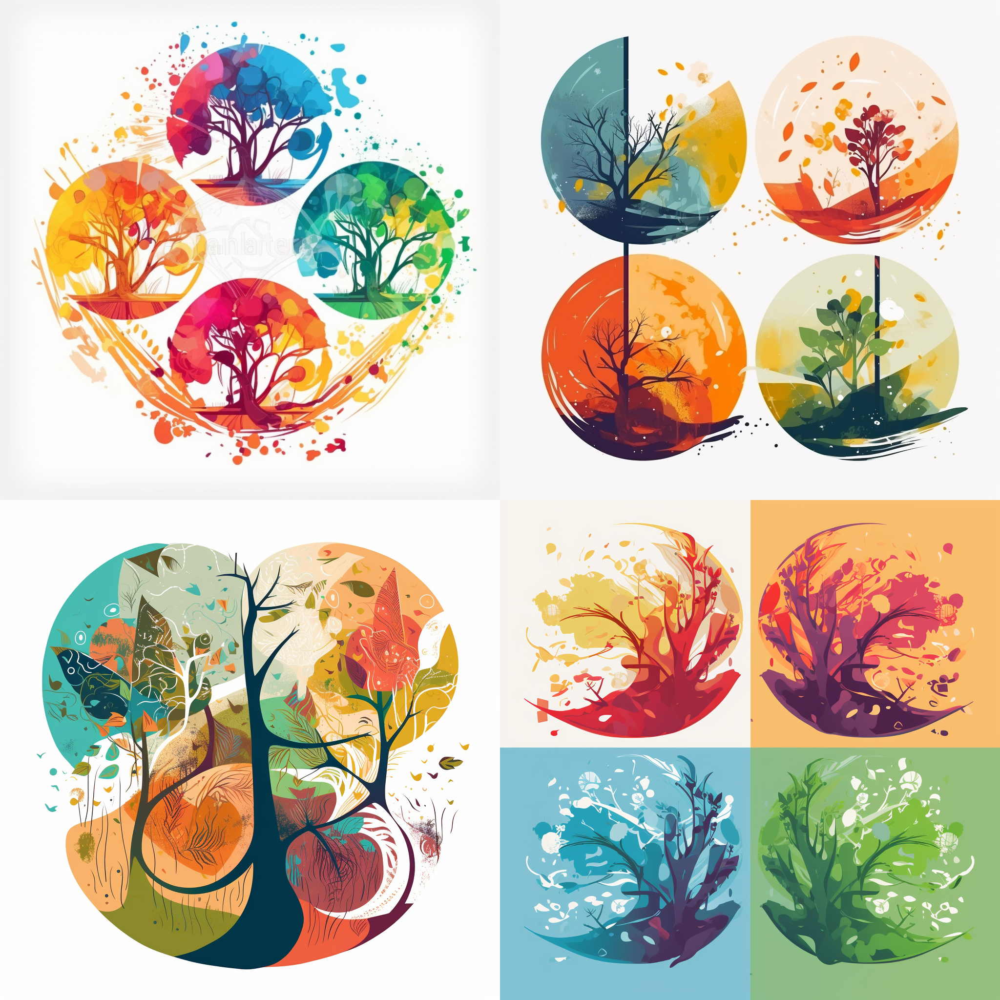

服装设计概述

服装设计是指将设计师的创意想法转化为实际可穿着的服装，主要涉及3个方面:造型设计、图案设计和面料选择。

**造型设计**包括服装款式、形状、剪裁和线条等方面。设计师通过对身体的形状和比例进行了解和分析，创造出独特的服装款式，使得服装既美观大方，又适合不同体形的人群穿着。

**图案设计**是服装设计中不可缺少的一环。通过图案的组合和色彩的搭配，可以使服装更具时尚感和视觉冲击力。不仅如此，图案还能够突出服装的主题和特点，进一步增强服装的个性化和品牌认知度。

**面料选择**是为了确保服装的质量和舒适性。不同的服装款式需要使用不同类型的面料，如棉、丝、麻、化纤等。设计师需要根据服装的使用场合和主题，选择最合适的面料，使服装的品质和美感得到最佳体现。

根据Midjourney的特点，创作者不仅可以尝试使用Midjourney来创意展现不同服装的造型款式，还可以很方便地展现不同图像印刷在衣服上的效果。

## 常见的不同服装关键词

为了正确描述服装的类型，创作者需要了解以下不同服装的关键词。

连帽衫 Hoodie、棒球夹克Baseball Jacket、羽绒服Down Jacket、风衣Trench coat、针织衫Sweater、运动夹克Track jacket、牛仔夹克 Denimjacket、衬衫Shirt、西服 Suit、短袖T恤 Short-sleeved T-shirt、长袖T恤Long-sleeved T-shirt、圆领T恤Crew Neck T-Shirt、马甲Vest、短裤Shorts、运动裤 Athletic pants、雨衣Raincoat、皮衣Leather jacket、羽绒服 Down jacket、牛仔衣Denm jacket、牛仔裤Denim jeans、毛衣Sweater、针织衫Knitted sweater、晚礼服Evening dress、中山装Zhongshan suit、唐装Tang suit、工作服 Work uniform、迷彩服 Camouflage uniform、汉服 HanFu、POLO衫Polo Shirts、打底裤 Leggings、婴儿连体衣 baby onesie 

## 常见的不同服装部位关键词

为了正确描述服装的部位及构件，创作者需要了解以下关键词。

领口Collar、领带Necktie、翻领Lapel、扣子Button、袖口Cuff、袖子 Sleeve、腰带 Belt、裤腰 Waistband、裤腿Trouser leg、衬衫领 Shirt collar、衬衫袖 Shirt sleeve、胸部Chest、胸口袋 Chest pocket、拉链Zipper、扣子Button

## T恤设计

T恤（T-shirt）是现代流行服装种最常见的一种类型，其设计简单，穿着舒适，能适应各种场合。T恤设计多种多样，其中图案和印花工艺起到重要作用。

T恤图案包括各种风格和主题，从简单的文字和标志到复杂的插画和艺术作品。图案通常可以表达个人风格、文化、信仰或是某种社交或政治立场，常见的图案类型有:文字和标语、品牌和标志、艺术插画、主题图案。

印花工艺是将图案印制到T恤上的技术，常用的印花工艺有:丝网印刷图案(screen printing)、数字印刷(digital printing)、热转印(heat transfer)、染料印刷(dye sublimation)。

T恤设计的提示词结构如下:

```markdown
T-shirt design+图案描述十风格
```

```markdown
Prompt: T-shirt design, minimalistic, growth, abstract geometric shapes and vibran colors,perseverance, and learning for T-shirt & merchandise design --ar 1:1 --v 7

提示词：极简主义，成长，抽象的几何形状和充满活力的色彩，毅力，对T恤和商品设计的学习
```



```markdown
Prompt: T-shirt design, an image depicting various outdoor ad-venture activities, such as hiking, camping, and mountain biking --ar 1:1 --v 7

提示词：T恤设计，描绘各种户外探险活动的图像，如徒步旅行、露营和山地骑行
```


```markdown
Prompt: create a vintage-style illustration of a coastal town with a lighthouse, palm trees, and seagulls for a summer feel, suitable for T-shirt & merchandise design --ar 1:1 --v 7

提示词：创建一幅复古风格的沿海小镇插图，配有灯塔、棕榈树和海鸥，带来夏日的感觉，适用于T恤和商品设计	
```


```markdown
Prompt: T-shirt design, colorful representation of the four seasons(spring, summer, fall and winter), abstract shapes --ar 1:1 --v 5

提示词：T恤设计，四季(春、夏、秋、冬)丰富多彩的表现，抽象造型
```


## 


