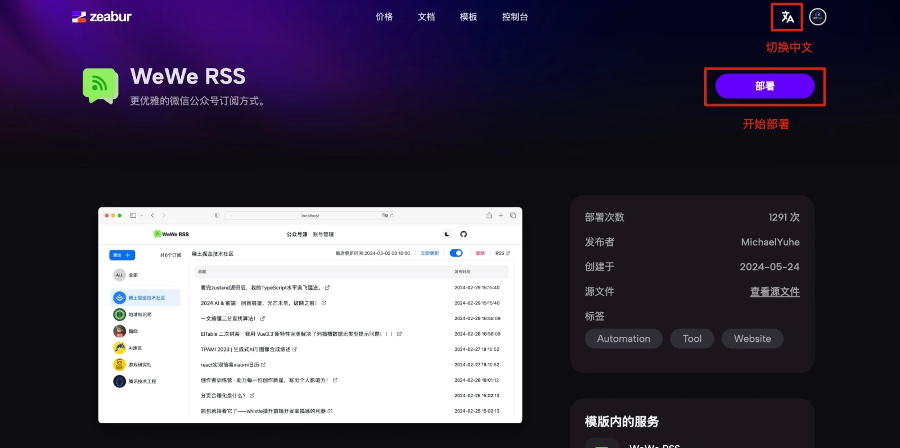
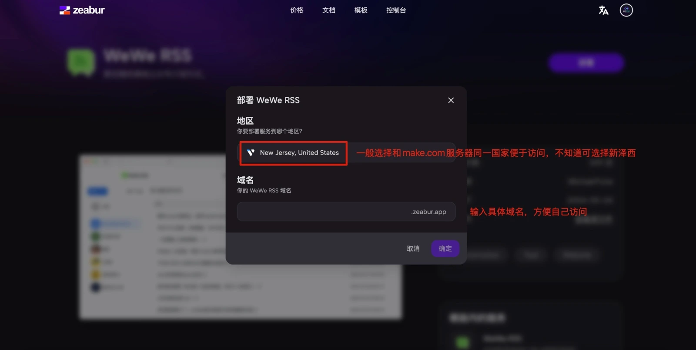
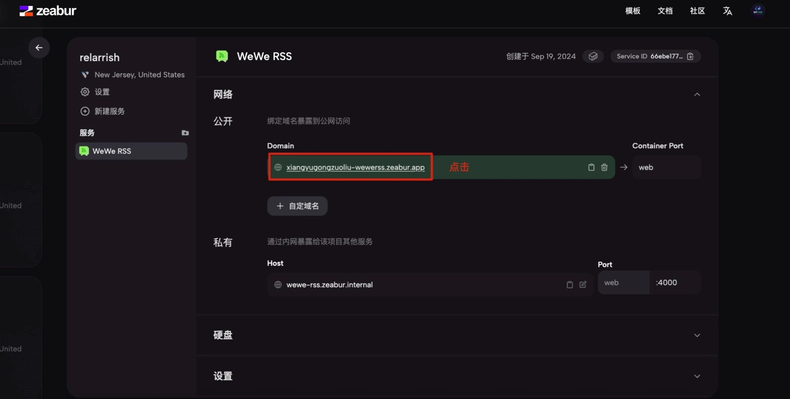
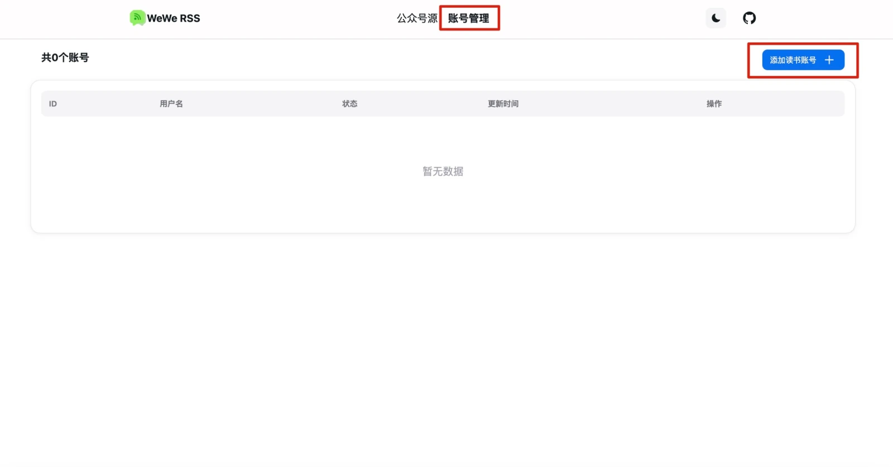
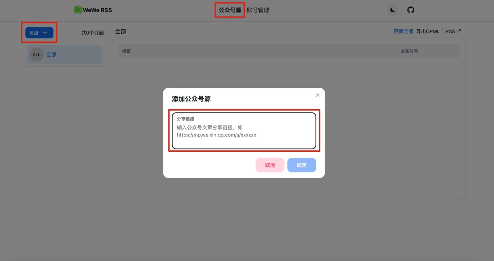
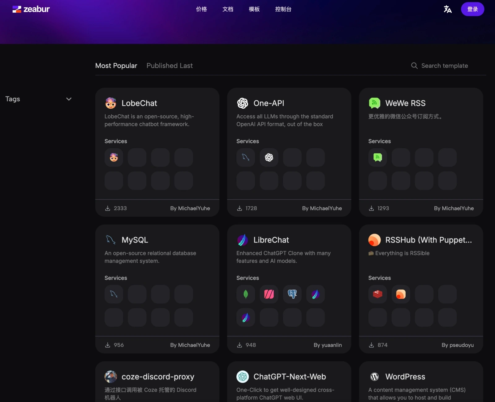

微信公众号作为优质的内容发布平台，凭借其图文混排的优势和专业的内容输出，成为个人和企业传播信息的重要渠道。它非常适合进行趋势分析、资讯获取、热点追踪和创作灵感的汲取。为方便会员高效获取微信公众号内容，本文介绍几种主流的获取方法和工具，请根据自身需求选择合适的方案。

**温馨提示**：

基础用户可选择“今天看啥”6元付费订阅服务；具备技术能力的用户可使用WeWe-RSS自行部署；若有批量下载需求，则可选择WechatDownload工具。

**注意事项**：

由于第三方服务可能存在不稳定性，可能随时失效，建议会员采取小额充值、按需使用的策略，避免大额充值带来的资金浪费。此外，务必注意保护个人信用卡信息，防范网络诈骗或数据泄露风险。

由于其中某些账号需要微信读书登录的授权页，根据自己的风险偏好进行选择。

另外，由于属于第三方服务，出现的任何使用问题与不稳定情况，可到相关网址进行解决方案的获取。

本文分享的所有数据获取方法和工具推荐仅供学习、交流和了解数据获取途径之用，禁止用于任何商业用途。会员在使用这些工具时应严格遵守相关法律法规，确保使用行为的合法性。

# 1. 今天看啥付费订阅服务

**“今天看啥”**（jintiankansha.me）是一个提供个性化推荐的内容聚合网站，支持多个平台的RSS订阅服务，包括微信公众号、B站、微博、雪球等。该平台运营时间较长，服务稳定，价格合理，特别适合基础用户通过RSS订阅获取公众号内容。

### **主要功能**：

- 提供现有的大量可订阅微信公众号，用户可以通过搜索直接订阅。

- 对于未收录的公众号，用户可以提交申请，平台通常会在几天内更新。

- 支持通过API进行调用，便于开发者集成和扩展。

### **API接口**：

- 基础API：获取内容RSS链接、获取专栏的RSS链接、查询订阅列表、获取最近的文章链接等。

- 高级API：支持获取所有文章数据、提交新公众号、查询订阅状态、开通极速订阅等功能。

### **订阅费用**：

- 免费会员：最多订阅2个公众号，期限为10天。

- VIP-0：6元/月，可订阅最多15个公众号。

- 高级VIP用户可订阅更多公众号，最高为VIP-6（60元/月），支持订阅最多450个账号。

**平台介绍及订阅详情**：

[https://www.jintiankansha.me/about](https://www.jintiankansha.me/about](https://www.jintiankansha.me/about))

# 2. WeWe-RSS（订阅大量公众号慎用）

**WeWe-RSS** 是一个开源的微信公众号RSS订阅工具，支持用户自行部署。它通过微信读书的公众号订阅功能，自动抓取微信公众号的文章并生成RSS源，供用户通过RSS阅读器订阅，避免广告和算法推荐的干扰。

### **主要功能**：

- 自动抓取微信公众号的最新文章。

- 支持生成 .rss、.atom、.json 格式的RSS源。

- 提供文章的全文输出，方便用户阅读。

- 支持OPML文件导出，便于管理和迁移订阅。

- 提供Docker一键部署，支持SQLite和MySQL数据库。

### **注意事项**：

- 可能会导致微信读书账号被限制，部分用户反馈使用WeWe-RSS后，账号会暂时无法使用订阅功能。

- 需要自行部署并定期维护，适合具备一定技术能力的用户。

### **部署建议**：

MetaX推荐使用Zeabur平台进行WeWe-RSS的部署。虽然WeWe-RSS是开源的免费项目，但Zeabur平台每月收费**5美元**，适合动手能力较强的用户。

### **WeWe-RSS部署步骤**：

**1. 打开 Zeabur WeWe-RSS 部署页面：**

访问 Zeabur WeWe-RSS 模板页面：[https://zeabur.com/zh-CN/templates/DI9BBD](https://zeabur.com/zh-CN/templates/DI9BBD)

**2. 切换语言并开始部署：**

点击页面右上角的语言按钮，切换为中文。接着点击“部署”按钮，开始部署 WeWe-RSS。

**3. 选择部署地址：**

根据页面提示选择部署地址，可以按图片提示选择，也可以输入自定义的域名。点击确认后等待部署完成。

**4. 访问控制台：**

部署完成后，复制页面生成的授权码。下滑页面，找到“网络”选项中的域名，点击该域名以访问 WeWe-RSS 控制台。

**5. 授权登录：**

在 WeWe-RSS 控制台中，输入复制的授权码完成授权。授权成功后，系统会跳转至控制台主页。

**6. 添加微信读书账号：**

在控制台点击“账号管理”，选择“添加读书账号”。生成二维码后，使用微信扫码进行授权登录。

**7. 添加公众号源：**

在控制台“公众号源”选项中，输入要订阅的微信公众号文章的链接，点击“确定”以添加该公众号。

**8. 获取RSS订阅链接：**

完成公众号添加后，点击右侧的“RSS”按钮生成对应的RSS订阅链接，复制后可用于RSS阅读器。

**9. 在Make平台使用：**

在Make平台上，可参照第9期实战视频《微信公众号图文混排文章自动化实战：利用Make 批量制作-Github微信公众号》或第3期《Jina Reader API实操：如何利用Make自动采集OpenAI官网新闻-新闻库》等教程，使用 RSS 模块来自动化处理公众号内容。

**10. 获取全文内容：**

如果需要获取微信公众号文章的全文内容，可以结合 Jina Reader 或 FireCrawl 工具，将文章转为 Markdown 格式。

# 3. WechatDownload

**WechatDownload** 是一款用于批量下载微信公众号文章内容的工具，适合需要大批量获取公众号内容的用户使用。该工具兼容Windows和MacOS平台，操作简便且功能丰富。有用户反馈被杀毒软件查杀，需自己甄别是否使用。

- **主要功能**：

- 支持下载微信公众号历史文章，保存为HTML、Markdown、PDF、DOCX等多种格式。

- 可下载评论、视频、音频和封面图，并提供文章阅读量、点赞数等相关数据。

- 支持自动监听剪切板，简化操作流程。

**项目地址**：

[https://github.com/qiye45/wechatDownload](https://github.com/qiye45/wechatDownload](https://github.com/qiye45/wechatDownload))

# 4.Wechat2RSS

Wechat2RSS是一个旨在将微信公众号内容转换为RSS格式的项目。该项目于2021年9月启动，目标是提供一个长期稳定的微信公众号RSS服务，确保文章更新周期在24小时内，从作者发布到RSS收录。

## 项目特点

+   **免费服务**：目前公开支持300多个公众号，用户可以通过该服务获取最新的公众号文章。
    
+   **更新通知**：用户可以关注该仓库，以便收到新公众号收录的通知。
    
+   **推荐功能**：欢迎用户推荐新的公众号进行收录，具体可参考项目的收录标准。
    
+   **私有部署**：项目还提供付费软件选项，供用户进行私有部署。
    

该项目的官方网站是 [wechat2rss.xlab.app](https://wechat2rss.xlab.app/)。

现在Wechat2RSS已经支持Zeabur一键部署，具体模版地址与使用方参加以下链接：

[https://zeabur.com/templates/OTAL86](https://zeabur.com/templates/OTAL86)

[https://wechat2rss.xlab.app/deploy/guide.html#zeabur%E9%83%A8%E7%BD%B2](https://wechat2rss.xlab.app/deploy/guide.html#zeabur%E9%83%A8%E7%BD%B2)

# 5.Zeabur 平台介绍

**Zeabur** 是一个新兴的云端服务部署平台，旨在帮助开发者快速、便捷地部署各种类型的服务。其简单的部署流程和对多种编程语言与开发框架的支持，使其在中文开发者社区中得到了广泛关注。

### 为什么推荐 Zeabur？

Zeabur 平台提供多种适合基础用户的即用模板，如 LobeChat、Notion-Next 等。平台操作简单，用户友好，非常适合对云端部署不太熟悉的初学者或需要快速部署服务的开发者。会员可以根据需求了解和使用此平台。

### **访问网址**：

[https://zeabur.com/referral?referralCode=metaxai](https://zeabur.com/referral?referralCode=metaxai)

### Zeabur 的主要特点

**1. 一键部署：**

Zeabur 提供一键部署功能，用户可通过 GitHub 将项目直接部署到平台上。系统会自动识别项目类型，完成相应的构建与部署，省去了手动配置复杂环境的麻烦。

**2. 按量计费：**

与传统固定费用模式不同，Zeabur 采用按量计费的方式。用户仅需为实际使用的资源付费一般为5美元每月，这种灵活的收费模式大大降低了开发成本，非常适合初创企业和个人开发者。

**3. 用户友好：**

Zeabur 平台的界面设计简洁直观，即使是初学者也能快速上手。此外，平台还提供中文客服支持，方便用户在使用过程中得到帮助。