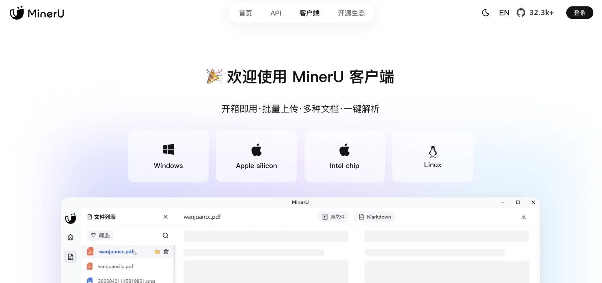
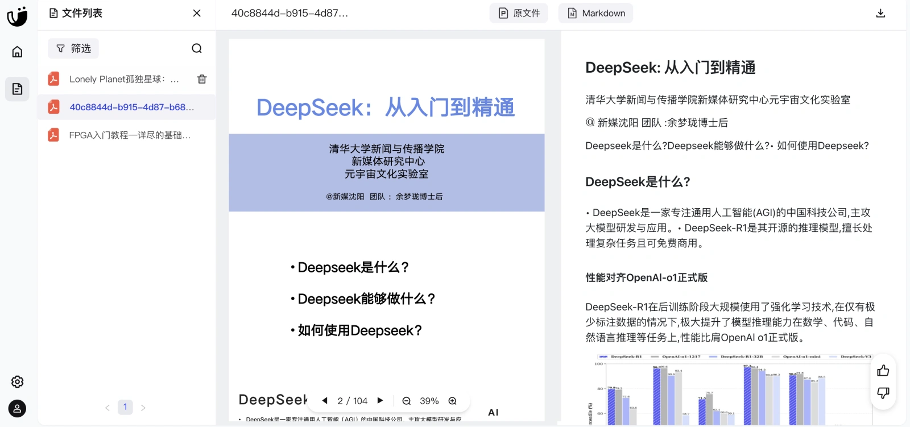
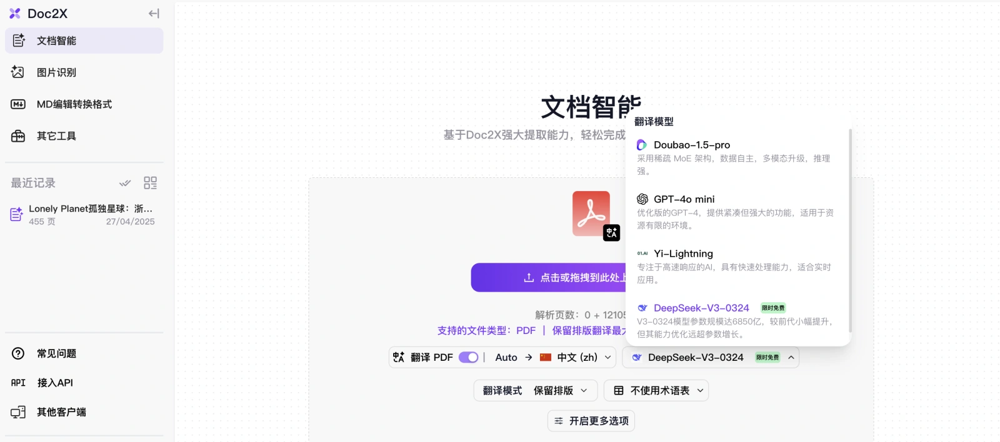
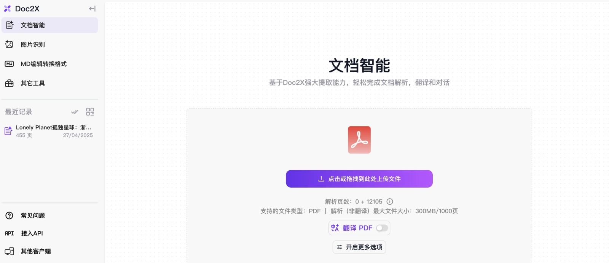
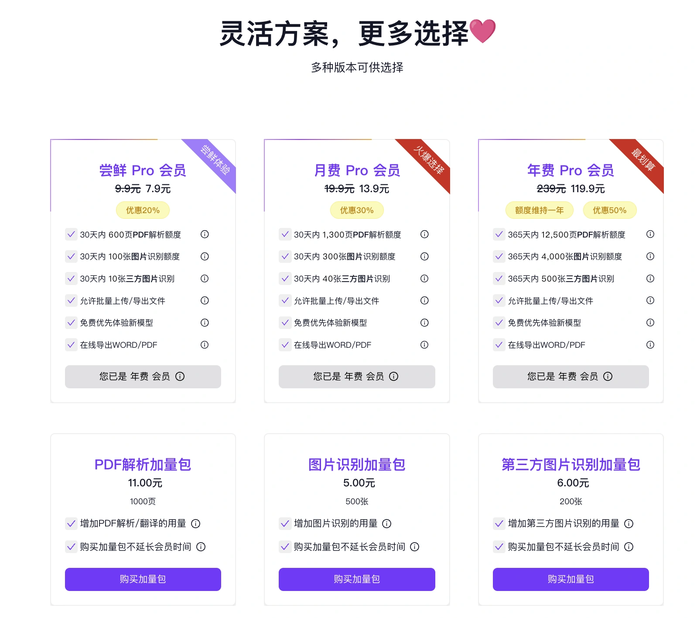
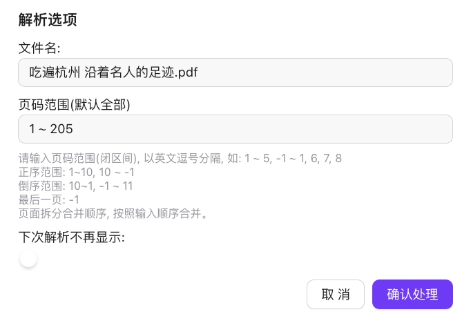
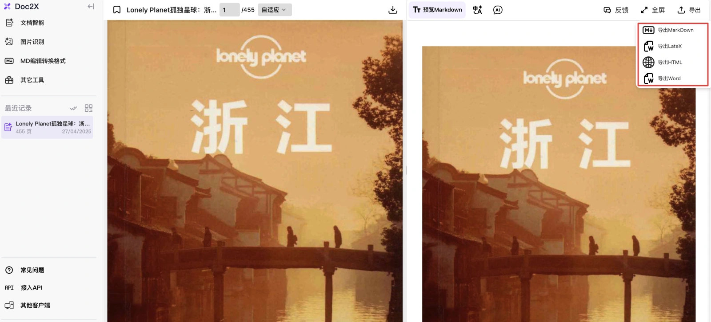
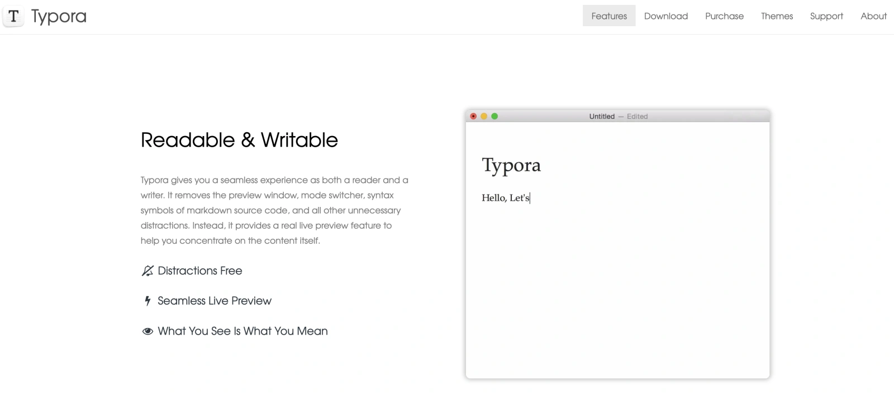

## **一. 背景**

在 n8n 中搭建 Retrieval-Augmented Generation（RAG）流程时，很多人习惯直接把 PDF 文件推入工作流，依靠分块节点进行内容切片。

但一旦遇到体积上百兆的大文件，或者是纯扫描版的 PDF，情况就变得复杂了：不仅需要额外跑 OCR，带来巨大的内存压力，而且网络传输过程中也容易出现不稳定、超时等问题，导致处理失败。

实际上，RAG 性能的真正瓶颈往往**不在向量库，而在于文档标准化和前期预处理。**

我一直强调：**RAG 成败的 90%，取决于清洗和标准化。**

如果前期文档整理不到位，即使搭建了再复杂的嵌入和检索流程，最终效果也很难保证。

**建立清晰、规范的知识体系**，才是打造高质量 RAG 系统的关键。

RAG，本质上更多是一个**体力活而非技术活**。

只要你把文档标准化处理好，知识体系搭建扎实，后续使用MetaX提供的 n8n 嵌入工作流，将会变得异常简单且高效。

## **二. 解决思路——把“重活”从 n8n 挪出去**

正确的处理流程应该是：**先通过专业的 OCR 工具进行预处理**，将大文件 PDF 转换成标准化的 Markdown、DOCX 或 HTML 文件。

随后，n8n 只需要接手已经清洗完成的**轻量级 Markdown 文档**，执行简单高效的处理链：

**内容分块 → 嵌入生成向量 → 写入向量数据库。** 这样就无需在工作流中反复进行 OCR 识别，**大幅降低内存消耗和出错概率**，让整个流程更加稳定顺畅。

为此，我常用的两把“锤子”是：

+   **MinerU**
    
+   **Doc2X**
    

接下来，我会详细介绍这两款工具的使用方法和适用场景。

## **三. MinerU**

**MinerU 是什么？**

MinerU 是一个开源的、本地可部署的文档解析工具，支持 OCR、结构提取，可以把 PDF 转成标准化的 Markdown、DOCX 或 HTML 文件。**该工具是MetaX认为中文专业领域效果最好的 PDF 标准化工具，而且还免费，强烈推荐！**

**MinerU 的优点：**

+   完全开源，免费
    
+   支持公式、表格、复杂排版的精准提取，效果最好
    
+   支持 Windows、Mac、Linux 本地部署
    
+   可以导出 doc/html/md 格式，适合不同场景
    
+   **MinerU 本地版** → 图片只能本地保存，需要手动上传图床，不自动生成外链。
    
+   **MinerU 云端版** → 图片直接上传图床，Markdown 文件里就是 https://cdn-xxx 的在线图片地址，方便直接用在博客、GitBook、Notion 等平台上。
    

> MinerU 项目本身就标榜“一站式开源高质量数据提取工具”  。

官网地址：

[https://mineru.net/](https://mineru.net/)

### 本地使用：

可以下载客户端到本地使用，也可以登录云端使用，方便快捷。

### 云端使用

右侧点击下载按钮即可导出

* * *

## **四. Doc2X**

Doc2X 访问地址：

[**https://bit.ly/Mdoc2x**](https://bit.ly/Mdoc2x)

Doc2X 是一款专业的在线文档解析平台，支持将 PDF 文件转换成 Markdown、LaTeX、DOCX、HTML 等格式，并且**自动将图片上传到图床**，Markdown 文件中直接引用外链，非常适合需要**图文混排展示**的场景。

除了基础的格式转换，Doc2X 还提供了**一键文档翻译功能**，可以将处理后的 Markdown 文档直接翻译成英文、日文、韩文等多种语言。这对于做跨境内容、建设多语言知识库特别有用，大大节省了人工翻译和格式整理的时间。

### 价格

**使用步骤**

1.  浏览器上传 PDF → 确认处理开始处理
    
2.  等待解析完成
    
  

解析完成之后在最近记录之中选择导出，选择不同的格式进行导出。

## 五.总结

另外如果希望在电脑上更好的预览 Markdown 文档，可以使用**Typora**它是一款极简主义风格的**所见即所得 Markdown 编辑器**，专为高效写作、文档整理和技术笔记而设计。它把 Markdown 写作中繁琐的预览与编辑分离问题彻底解决，**边写边看最终效果**，极大提升了写作流畅度。Typora 同时支持 **Windows、macOS、Linux** 三大平台，跨设备体验一致。

[https://typora.io/](https://typora.io/)

回到正题：如果追求性价比和效果，推荐云端使用 MinerU。如果项目需要快速生成图文内容，或者需要批量翻译成多语言，Doc2X 是目前最便捷的选择。

记住这条铁律：**RAG = 90 % 预处理 + 10 % 检索/生成**。前端花时间把文档标准化，后面的问题大半都不会发生。

MetaX希望大家少踩坑，把时间花在真正有价值的智能检索上。

