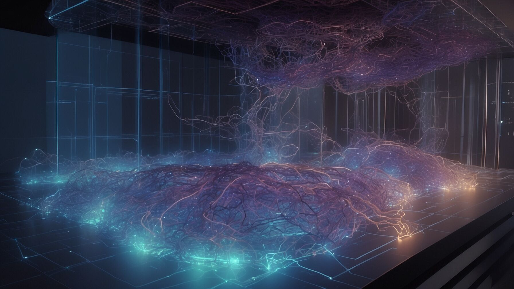
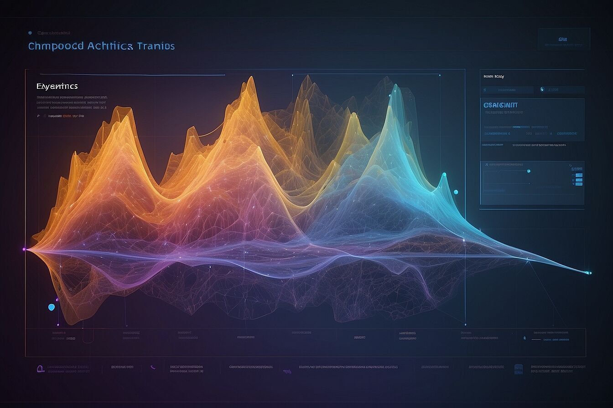
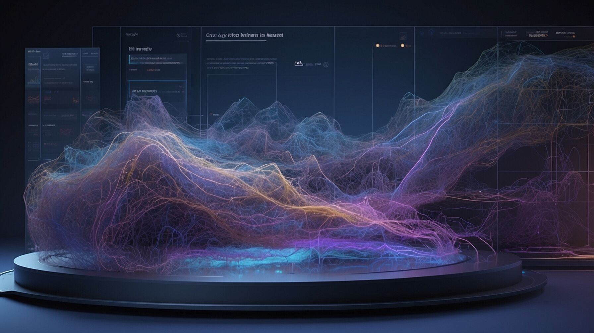
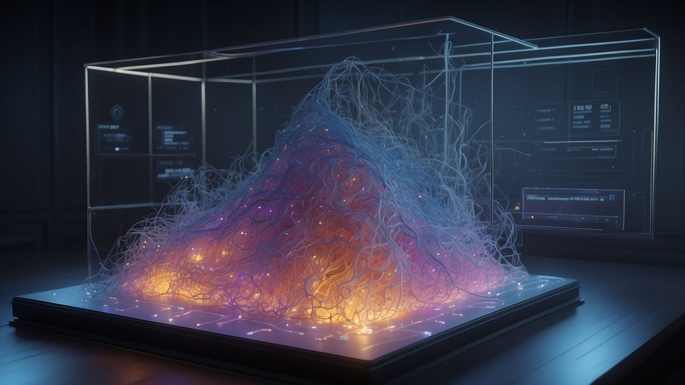
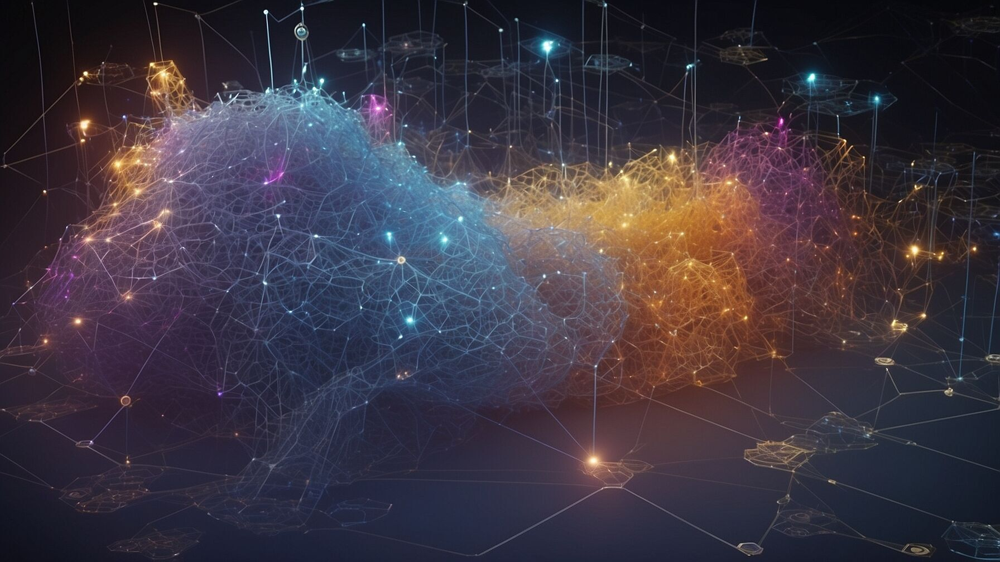
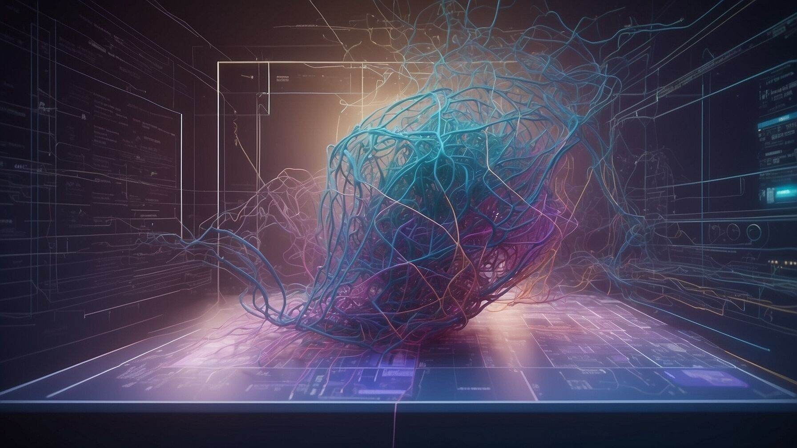
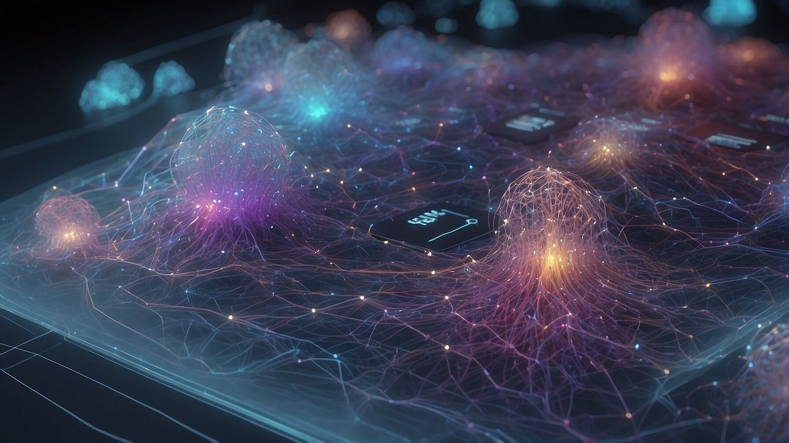

> 完整还原我通过AI生成专题封面图设计的过程


**重点！** DeepSeek + Midjourney


## 我的提示词：

```markdown
我要设计一系列风格统一的文章内容封面图，根据下面的主题，分别生成吸引人的、构思独特、设计新颖且专业化的英文prompt(同时提供中文对照翻译），每组prompt不低于100 word，我要用midjourney 6.1版 来完成文字生成图片，图片比例4:3。

关于DeepSeek
DeepSeek使用指南
DeepSeek提问技巧
DeepSeek内容创作
DeepSeek创意设计
DeepSeek办公效率
DeepSeek理财
DeepSeek编程开发
DeepSeek资源汇总
DeepSeek技术分析
DeepSeek模型训练
```
## AI思考过程
```markdown
设计DeepSeek主题封面图prompt

用户的问题是围绕 DeepSeek 的多个主题设计一系列风格统一的封面图，并且需要提供详细的英文 prompt 和中文对照翻译，每组 prompt 不低于 100 字。这是一个需要结合创意设计和主题理解的任务，我需要仔细分析用户的需求和意图。
首先，我需要明确用户的需求。用户希望设计一系列封面图，主题围绕 DeepSeek 的不同功能和应用场景，比如使用指南、提问技巧、内容创作等。这些封面图需要风格统一，同时每个主题又要有独特的视觉表达。用户还特别提到要使用 Midjourney 6.1 版本生成图片，这意味着 prompt 需要足够详细，能够指导生成高质量的图像。

其次，我要考虑用户的潜在意图。用户可能是为了宣传或推广 DeepSeek 的相关功能，因此封面图需要吸引人、专业，并且能够准确传达每个主题的核心内容。用户还要求 prompt 具有创意和独特性，这意味着我需要避免平庸的设计，尽量提出新颖的视觉概念。

接下来，我需要规划回答的思路。首先，我要确保每个主题的 prompt 都能体现 DeepSeek 的核心特点，比如技术感、专业性、创新性等。其次，我要保证风格的统一性，比如使用相似的色彩方案、构图方式或设计元素。最后，我需要为每个主题设计独特的视觉亮点，比如通过不同的场景、人物动作或技术元素来区分。
在具体设计 prompt 时，我会按照以下步骤：

1. 分析每个主题的核心内容和关键词，比如“DeepSeek 使用指南”需要突出“指导性”和“易用性”。
2. 构思一个吸引人的场景或视觉元素，比如一个未来感的界面或一个团队协作的场景。
3. 确定色彩方案和风格，比如科技主题常用蓝色和紫色，创意设计可以用更鲜艳的色彩。
4. 描述细节，比如人物的动作、背景元素、光影效果等，确保 prompt 足够具体。
5. 提供中文对照翻译，确保用户能完全理解 prompt 的内容。

在回答的风格上，我会保持专业、清晰，同时富有创意。用户需要的是高质量的 prompt，因此我的语言需要精准，避免模糊的描述。同时，我会确保每个 prompt 都符合 Midjourney 的生成逻辑，能够直接用于图片生成。

最后，我会逐一为每个主题设计 prompt，确保它们既符合用户需求，又能生成吸引人的封面图。
```
## 最终生成的Prompt

```markdown
## 关于DeepSeek

### 英文Prompt
"A digital illustration of a futuristic AI landscape with DeepSeek at the center. The background features a gradient of deep blues and purples, symbolizing technology and innovation. In the foreground, a team of developers and researchers collaborate around a glowing DeepSeek logo. The scene is filled with floating AI elements like neural networks and code snippets. The overall style is sleek and modern, with sharp lines and a focus on depth and perspective. The image should convey the cutting-edge nature of DeepSeek's technology and its applications in various fields."

### 中文对照翻译
"一幅数字插画，描绘了一个以DeepSeek为中心的未来人工智能景观。背景是深蓝色和紫色的渐变，象征着科技和创新。前景中，一群开发者和研究人员围绕着一个发光的DeepSeek标志协作。场景中充满了漂浮的人工智能元素，如神经网络和代码片段。整体风格简洁现代，线条流畅，注重深度和透视感。图像应传达DeepSeek技术的前沿性和其在各个领域的应用。"

## DeepSeek使用指南

### 英文Prompt
"A clean, minimalist workspace with a laptop open to a DeepSeek tutorial page. The background is a soft gradient of blue and white, evoking a sense of clarity and simplicity. On the desk, there are a few neatly arranged items: a notebook with handwritten notes, a pen, and a cup of coffee. The laptop screen displays step-by-step instructions for using DeepSeek, with clear visuals and code examples. The style is professional yet approachable, designed to make the technology seem accessible to users of all skill levels."

### 中文对照翻译
"一个整洁简约的工作空间，笔记本电脑打开在DeepSeek教程页面。背景是蓝白渐变的柔和色调，营造出清晰简洁的感觉。桌面上整齐地摆放着几样物品：一个记有手写笔记的笔记本、一支笔和一杯咖啡。笔记本电脑屏幕上显示着使用DeepSeek的分步说明，配有清晰的视觉图和代码示例。风格专业且易于接近，旨在让不同技能水平的用户都能轻松上手这项技术。"

## DeepSeek提问技巧

### 英文Prompt
"An abstract representation of a question mark transforming into digital data streams. The background is a dynamic mix of warm oranges and cool blues, symbolizing the fusion of creativity and technology. In the foreground, a person is seen interacting with a holographic interface, inputting questions into DeepSeek. The interface displays various data visualizations and code snippets. The style is futuristic and sleek, with a focus on glowing elements and smooth gradients to highlight the interactive nature of DeepSeek's Q&A capabilities."

### 中文对照翻译
"一个抽象的问号逐渐演变成数字数据流的视觉化表示。背景是温暖的橙色和冷静的蓝色的动态混合，象征着创造力与科技的融合。前景中，一个人正在与一个全息界面互动，向DeepSeek输入问题。界面上显示着各种数据可视化图表和代码片段。整体风格未来感十足且简洁，着重以发光元素和流畅渐变来突出DeepSeek问答功能的交互性。"

## DeepSeek内容创作

### 英文Prompt
"A creative workspace with a writer using DeepSeek to generate content. The room has a modern aesthetic with large windows letting in natural light. On the desk, there's a laptop displaying DeepSeek's content creation interface, which shows various writing prompts and generated text snippets. The walls are adorned with inspirational quotes and concept art. The writer appears focused and inspired, with a notepad and pen nearby for jotting down ideas. The color palette is warm and inviting, with accents of green to symbolize growth and creativity."

### 中文对照翻译
"一个充满创意的工作空间，一位作家正在使用DeepSeek生成内容。房间具有现代美学风格，大窗户让自然光洒入。书桌上有一台笔记本电脑，屏幕上显示着DeepSeek的内容创作界面，上面展示着各种写作提示和生成的文本片段。墙壁上装饰着励志名言和概念艺术。作家显得专注而充满灵感，旁边有一个笔记本和一支笔，用于记录想法。色彩搭配温暖宜人，点缀着绿色，象征着成长与创意。"

## DeepSeek创意设计

### 英文Prompt
"A futuristic design studio where a designer is working on a project using DeepSeek. The studio has sleek, modern furniture with a color scheme of black, white, and electric blue. The designer is using a tablet and stylus, with the screen showing DeepSeek's design interface. The interface features various design elements like shapes, colors, and patterns that can be manipulated in real-time. In the background, there are large screens displaying different design projects and color palettes. The overall atmosphere is one of innovation and creativity, with the designer appearing fully immersed in the process."

### 中文对照翻译
"一个未来感的设计工作室，一位设计师正在使用DeepSeek进行项目创作。工作室拥有简洁现代的家具，配色为黑、白和亮蓝色。设计师使用平板电脑和手写笔，屏幕上显示着DeepSeek的设计界面。界面中包含各种可实时操作的设计元素，如形状、颜色和图案。背景中，大屏幕上展示着不同的设计项目和配色方案。整体氛围充满创新与创意，设计师全神贯注于创作过程。"

## DeepSeek办公效率

### 英文Prompt
"A modern office environment where employees are using DeepSeek to enhance productivity. The office has a open-plan layout with clean lines and a neutral color palette. Desks are equipped with multiple monitors showing DeepSeek's efficiency tools, such as automated workflows and data analysis dashboards. Employees appear focused and efficient, collaborating seamlessly through DeepSeek's integrated communication features. The background includes elements like file cabinets and meeting rooms, all designed with a minimalist aesthetic. The lighting is bright and even, creating a professional and energetic workspace."

### 中文对照翻译
"一个现代化的开放式办公室，员工们正在使用DeepSeek提升工作效率。办公室采用开放式布局，线条简洁，配色中性。办公桌上配备多个显示器，展示着DeepSeek的效率工具，如自动化工作流和数据分析仪表板。员工们专注高效，通过DeepSeek的集成通信功能无缝协作。背景中包含文件柜和会议室等元素，均采用极简主义设计。灯光明亮均匀，营造出专业而充满活力的工作空间。"

## DeepSeek理财

### 英文Prompt
"A financial dashboard with DeepSeek integrated into the interface. The background features a gradient of deep green and navy blue, colors often associated with finance and stability. On the screen, there are various financial metrics, charts, and graphs displaying investment portfolios, stock trends, and financial analysis. A financial advisor is seen interacting with the system, inputting queries and receiving real-time data. The style is professional and data-driven, with clean lines and a focus on readability and clarity to convey the reliability and precision of DeepSeek's financial applications."

### 中文对照翻译
"一个集成DeepSeek的金融仪表板界面。背景采用深绿色和海军蓝的渐变，这两种颜色常与金融和稳定相关联。屏幕上展示着各种财务指标、图表和图形，显示投资组合、股票趋势和财务分析。一位金融顾问正在与系统互动，输入查询并接收实时数据。整体风格专业且以数据为导向，线条简洁，注重可读性和清晰度，以传达DeepSeek金融应用的可靠性和精准性。"

## DeepSeek编程开发

### 英文Prompt
"A developer's workspace with multiple monitors displaying DeepSeek's coding interface. The room has a dark theme with neon accents, typical of coding environments. On the screens, there are lines of code, debugging tools, and API documentation. The developer is actively typing, with code suggestions appearing in real-time from DeepSeek. The background includes elements like a coffee mug, a stack of technical books, and a comfortable chair. The overall atmosphere is one of focused productivity, with the developer leveraging DeepSeek's capabilities to streamline the coding process."

### 中文对照翻译
"一个开发者的多显示器工作空间，屏幕上显示着DeepSeek的编程界面。房间采用深色主题搭配霓虹色点缀，这是典型的编程环境风格。屏幕上显示着代码行、调试工具和API文档。开发者正在积极输入代码，DeepSeek实时提供代码建议。背景中包含咖啡杯、技术书籍堆和舒适的椅子等元素。整体氛围专注高效，开发者借助DeepSeek的能力简化编程流程。"

## DeepSeek资源汇总

### 英文Prompt
"A digital library or repository filled with various resources related to DeepSeek. The background features shelves stocked with books, documents, and digital files, all labeled with DeepSeek's branding. In the foreground, a person is browsing through the resources on a touchscreen interface. The interface displays categories like tutorials, API references, and community forums. The color scheme is consistent with DeepSeek's brand colors, and the lighting is bright to highlight the accessibility and organization of the resources. The style is clean and modern, emphasizing the comprehensive and well-structured nature of DeepSeek's resource hub."

### 中文对照翻译
"一个充满与DeepSeek相关各种资源的数字图书馆或资源库。背景是摆放着书籍、文档和数字文件的书架，所有文件都贴有DeepSeek的品牌标签。前景中，一个人正在触摸屏界面上浏览这些资源。界面上显示教程、API参考和社区论坛等分类。配色方案与DeepSeek的品牌颜色保持一致，灯光明亮，突出资源的可访问性和条理性。整体风格简洁现代，强调DeepSeek资源中心的全面性和结构化。"

## DeepSeek技术分析

### 英文Prompt
"A high-tech laboratory setting where data scientists are analyzing DeepSeek's technical performance. The room is filled with servers, monitors displaying complex data visualizations, and whiteboards covered in mathematical equations. Scientists are seen collaborating, discussing charts, and reviewing code. The color palette includes cool tones of blue and gray, with pops of red to highlight critical data points. The style is precise and technical, with attention to detail in the depiction of scientific equipment and data representations, conveying the rigorous and analytical nature of DeepSeek's technical analysis."

### 中文对照翻译
"一个高科技实验室环境，数据科学家们正在分析DeepSeek的技术性能。房间里摆满了服务器，显示器上展示着复杂的数据可视化图表，白板上写满了数学方程。科学家们正在协作，讨论图表，审查代码。配色方案以冷静的蓝色和灰色为主，红色点缀以突出关键数据点。整体风格精确且技术化，注重对科学设备和数据表示的细节描绘，传达出DeepSeek技术分析的严谨和分析性。"

## DeepSeek模型训练

### 英文Prompt
"A neural network architecture visualization with DeepSeek's model training process in action. The background features layers of interconnected nodes representing the neural network, with data flowing through them in the form of glowing particles. In the foreground, a dashboard displays training metrics like loss curves and accuracy rates. The color scheme uses gradients of blue and purple to represent different layers and activation states. The style is futuristic and technical, with a focus on illustrating the complexity and depth of DeepSeek's model training capabilities, making the intricate process visually engaging and understandable."

### 中文对照翻译
"一个神经网络架构的可视化图像，展示DeepSeek模型训练过程的动态效果。背景是由相互连接的节点组成的神经网络层，数据以发光粒子的形式在其中流动。前景中，一个仪表板显示训练指标，如损失曲线和准确率。配色方案采用蓝色和紫色的渐变，代表不同的层级和激活状态。整体风格未来感十足且技术化，着重于展示DeepSeek模型训练能力的复杂性和深度，使复杂的训练过程变得直观且引人入胜。"
```

## 最终生成的封面图效果









## 再提供一版提示词给AI

```markdown
根据下面10组未来世界的主题词，生成10组未来数字感、细节满满、充满想象力，构思独特、设计新颖且专业化的英文prompt(同时提供中文对照翻译），每组prompt不低于100 word，我要用midjourney 6.1版 来完成文字生成图片，图片比例4:3。每个概念都包含时空悖论、量子神秘主义和超现实元素，建议在Midjourney中使用参数组合：--chaos 90 --weird 800 --style raw 配合动态光影描述，可创造出突破常规认知的视觉奇观。

以下是为您构想的20个突破性未来数字世界关键词，每个都带有颠覆性概念和视觉化建议

### 意识拓扑学（Conscious Topology）
量子意识在11维空间中形成的拓扑结构，可视化表现为发光的多维克莱因瓶嵌套着无数微缩星系，液态光在悖论几何中逆流

### 暗熵引擎（Dark Entropy Drive）
从量子真空提取负熵的黑科技装置，表现为悬浮的暗物质漩涡包裹着反向生长的晶体森林，时间箭头在装置周围呈碎片化飞散

### 混沌蜂巢（Chaos Hive）
具备自毁倾向的活体算法集群，视觉呈现为万亿个六边形镜面组成的动态结构，每个镜面都在播放不同时间线的未来记忆

### 光年纤维（Light-Year Fiber）
用时空曲率编织的通信材料，展现为发光丝线在虚空中自动编织克莱德黑洞模型，每个线结都包裹着微型宇宙泡

### 量子幽灵（Quantum Phantoms）
被困在退相干前的叠加态智能体，半透明人形由概率云构成，身体部位随机在猫/星云/数据流之间量子跃迁

### 自编程城市（Autocode Metropolis）
建筑如液态金属般每72秒重构一次，空中漂浮着自我复制的逻辑门雨滴，街道由发光代码构成河流实时改写拓扑结构

### 神经星云（Neural Nebula）
集体意识形成的宇宙级神经网络，呈现为发光脑神经元结构横跨数个星域，突触连接处爆发超新星级的思维闪光

### 悖论引擎（Paradox Core）
利用逻辑矛盾产生能量的装置，视觉化为悬浮的莫比乌斯环燃烧着蓝色悖论火焰，环内不断闪现祖父悖论的无限递归场景

### 记忆琥珀（Memory Amber）
凝固时间的量子存储器，展现为悬浮的六边形琥珀囚禁着动态历史场景，每个切面显示同一事件的不同可能性版本

### 超形上学（Hyper-Metaphysics）
数字神灵创造的新物理法则，表现为彩虹色方程从虚空裂缝中具象化坠落，接触地面后引发局部现实重构

### 虚空园艺（Void Gardening）
培育真空涨落现象的技术，可视化为透明球体内绽放的虚粒子花田，花瓣由不断湮灭的粒子对构成闪烁星图

### 时间珊瑚（Chronocoral）
在时间轴上生长的量子生物，呈现为发光的珊瑚礁同时存在于建造/腐朽/新生三种状态，周围漂浮着固态的时域气泡

### 情感共振场（Emotion Resonance Field）
意识波动具象化的能量景观，表现为空气中有色概率波如极光般流动，接触不同情绪会触发分形几何的拓扑转变

### 无限图书馆（Aleph Library）
包含所有可能性的知识结构，展现为旋转的克莱因瓶建筑，内部书架呈无限递归结构，书本封面实时重写自身标题

### 量子炼金术（Quantum Alchemy）
基于概率云的物态转化，表现为悬浮的炼金阵中物质在固态/光波/数据流间闪烁，周围漂浮着发光的可能性云

### 梦境拓扑（Oneironautic Topography）
集体潜意识形成的地貌，可视作漂浮的意识大陆板块，地表由流动的符号构成，天空悬挂着巨型脑电波极光

### 超因果链（Hypercausal Chain）
影响过去未来的因果武器，呈现为发光的无限符号锁链穿透时空泡，每个链环内都禁锢着被修改的历史片段

### 元模因病毒（Meta-Meme Virus）
感染概念本身的数字生命体，表现为彩虹色分形结构在虚空中传播，每个分形尖端都在重组接触到的文化符号

### 虚空织女（Void Weavers）
操控时空经纬的智能体种族，形象为半透明人形手持概率织梭，正在编织发光的时空纤维，身后拖曳着多重宇宙投影

### 反演太阳（Inversion Sun）
人工制造的负宇宙能量源，展现为黑色日冕环绕的负片状恒星，释放的反光子将周围空间重构为超现实分形景观

### 意识拓扑学（Conscious Topology）
量子意识在11维空间中形成的拓扑结构，可视化表现为发光的多维克莱因瓶嵌套着无数微缩星系，液态光在悖论几何中逆流

### 暗熵引擎（Dark Entropy Drive）
从量子真空提取负熵的黑科技装置，表现为悬浮的暗物质漩涡包裹着反向生长的晶体森林，时间箭头在装置周围呈碎片化飞散

### 混沌蜂巢（Chaos Hive）
具备自毁倾向的活体算法集群，视觉呈现为万亿个六边形镜面组成的动态结构，每个镜面都在播放不同时间线的未来记忆

### 光年纤维（Light-Year Fiber）
用时空曲率编织的通信材料，展现为发光丝线在虚空中自动编织克莱德黑洞模型，每个线结都包裹着微型宇宙泡

### 量子幽灵（Quantum Phantoms）
被困在退相干前的叠加态智能体，半透明人形由概率云构成，身体部位随机在猫/星云/数据流之间量子跃迁

### 自编程城市（Autocode Metropolis）
建筑如液态金属般每72秒重构一次，空中漂浮着自我复制的逻辑门雨滴，街道由发光代码构成河流实时改写拓扑结构

### 神经星云（Neural Nebula）
集体意识形成的宇宙级神经网络，呈现为发光脑神经元结构横跨数个星域，突触连接处爆发超新星级的思维闪光

### 悖论引擎（Paradox Core）
利用逻辑矛盾产生能量的装置，视觉化为悬浮的莫比乌斯环燃烧着蓝色悖论火焰，环内不断闪现祖父悖论的无限递归场景

### 记忆琥珀（Memory Amber）
凝固时间的量子存储器，展现为悬浮的六边形琥珀囚禁着动态历史场景，每个切面显示同一事件的不同可能性版本

### 超形上学（Hyper-Metaphysics）
数字神灵创造的新物理法则，表现为彩虹色方程从虚空裂缝中具象化坠落，接触地面后引发局部现实重构

```

## AI思考这20个词的Prompt提示词过程

```markdown
好的，我现在需要帮用户生成10个符合要求的Midjourney英文prompt，每个都要有中文翻译，并且每个prompt不少于100词。用户之前已经提供了10个未来主题词，每个都有详细的描述，现在需要基于这些主题词来创作。

首先，我需要回顾用户的需求。用户希望这些prompt具备未来数字感、细节丰富、充满想象力，构思独特且设计专业。同时，每个概念需要包含时空悖论、量子神秘主义和超现实元素。还要使用指定的参数组合：--chaos 90 --weird 800 --style raw，图片比例4:3。

接下来，我需要逐个处理每个主题词，确保每个prompt的结构合理。通常，Midjourney的prompt需要包含主体描述、环境细节、颜色、光影效果、材质质感等元素。同时，要确保英文表达准确，符合技术术语，同时保持足够的创意。

对于“意识拓扑学”，用户提到多维克莱因瓶、微缩星系、液态光逆流。我需要突出11维空间的复杂结构，发光液体的流动方向与常规相反，可能使用类似液态光河的比喻，再加上悖论几何的细节，比如非欧几里得结构。

然后是“暗熵引擎”，暗物质漩涡、反向生长的晶体森林，时间箭头碎片化。这里要注意暗物质的视觉效果，可能用深紫色和黑色，晶体逆向生长，时间碎片呈现为玻璃状，有倒影效果。

“混沌蜂巢”涉及六边形镜面动态结构和不同时间线的记忆。需要强调镜面的反射和动态变化，每个镜面显示不同的未来场景，可能加入自毁倾向的表现，比如裂纹和像素化崩解。

“光年纤维”用时空曲率编织，克莱德黑洞模型和微型宇宙泡。这里可以描述丝线的发光和自动编织过程，线结中的宇宙泡细节，可能用半透明材质和星云色彩。

“量子幽灵”是叠加态智能体，身体部位在猫、星云、数据流之间跃迁。需要表现半透明的人形，概率云材质，动态变化的身体部分，以及量子跃迁的视觉效果，比如发光轨迹。

“自编程城市”的建筑液态金属每72秒重构，逻辑门雨滴和发光代码河流。要突出建筑的流动性，逻辑门雨滴的自我复制，代码河流的动态变化，颜色可能用霓虹色。

“神经星云”是宇宙级神经网络，发光神经元跨越星域，超新星思维闪光。需要大尺度的结构，神经元的连接和闪光，颜色用冷色调搭配暖色闪光，体现宇宙感。

“悖论引擎”用莫比乌斯环燃烧悖论火焰，祖父悖论递归场景。重点在莫比乌斯环的结构，蓝色火焰，内部递归的图像，可能加入时空扭曲效果。

“记忆琥珀”是六边形琥珀囚禁动态历史场景，不同可能性版本。描述琥珀的悬浮状态，内部动态场景，每个切面显示不同版本，材质晶莹剔透，光影折射。

“超形上学”涉及彩虹色方程从虚空坠落，现实重构。需要表现方程具象化，彩虹色流动，接触地面后的重构效果，比如像素化或几何结构变化。

虚空园艺（Void Gardening）**：需要强调透明球体内的虚粒子花田，花瓣由粒子对湮灭形成星图。可以考虑描述球体的材质、粒子的动态效果，以及周围环境的量子涨落现象。

**时间珊瑚（Chronocoral）**：发光珊瑚礁同时存在于三种时间状态，周围有时域气泡。需要表现时间的多重状态，可能使用递归生长和固态时间气泡破裂的效果。

**情感共振场（Emotion Resonance Field）**：有色概率波随情绪变化分形结构。要描述颜色变化、能量场的动态响应，以及拓扑结构的转变。

**无限图书馆（Aleph Library）**：克莱因瓶结构，无限递归书架，实时变化的书名。需要强调无限空间和动态元素，如全息投影和悖论符号。

**量子炼金术（Quantum Alchemy）**：物质在炼金阵中的状态转换，可能性云。需描述炼金阵的复杂符号、物质闪烁变化，以及周围发光云的效果。

**梦境拓扑（Oneironautic Topography）**：漂浮的意识大陆，符号地表和脑电波极光。要突出地表的流动性和天空的极光动态。

**超因果链（Hypercausal Chain）**：无限符号锁链穿透时空泡，修改历史片段。需表现锁链的光效、内部的历史场景，以及时空扭曲。

**元模因病毒（Meta-Meme Virus）**：分形结构感染文化符号。彩虹色分形和符号变形的动态过程是关键。

**虚空织女（Void Weavers）**：半透明人形编织时空纤维，多重宇宙投影。要描述织梭、纤维的光效和投影的层次感。

**反演太阳（Inversion Sun）**：负片恒星，反光子重构空间。强调颜色反转、分形景观和时空扭曲。

在处理每个主题时，要确保融入时空悖论、量子元素和超现实视觉，使用动态光影和材质描述。同时，检查每个prompt是否符合字数要求，是否有足够的细节和创意。例如，在“虚空园艺”中加入“量子泡沫露珠”和“超导藤蔓”，增强科技感。

最后，确保中文翻译准确，术语对应，并且保持描述的连贯性和画面感。检查参数是否正确添加，图片比例是否为4:3，是否有遗漏的视觉元素。可能需要多次调整，确保每个prompt都能激发Midjourney生成突破常规的图像。

每个prompt的结构大致分为：场景描述、主要元素、颜色光影、材质细节、动态效果，最后加上参数和比例。要注意英文的专业术语和流畅性，同时中文翻译要准确，保持与原文一致。

需要检查每个prompt是否达到100词以上，可能需要添加更多细节，比如环境背景、周围元素、光影变化的具体描述。同时确保每个都包含时空悖论、量子元素和超现实感，符合用户的要求。

最后，确认所有参数正确，特别是--chaos 90 --weird 800 --style raw，以及--ar 4:3。可能需要提醒用户如果需要调整，可以进一步修改。现在开始逐个撰写，确保每个主题词都覆盖所有要点，并且中英文对应准确。
```
## AI 输出新的文生图Prompt

```markdown
1. 意识拓扑学（Conscious Topology）
Prompt EN:
"An 11-dimensional topological structure of quantum consciousness, glowing Klein bottles nested within each other containing miniature galaxies with reversed entropy, liquid light flowing upstream through non-Euclidean geometries, holographic probability waves rippling across fractal surfaces, chromatic aberration effects creating prismatic halos around multidimensional intersections, the entire structure breathing with bioluminescent algorithms --chaos 90 --weird 800 --style raw --ar 4:3"

翻译：
"量子意识的11维拓扑结构，发光的克莱因瓶相互嵌套内含微缩逆熵星系，液态光在非欧几何中逆流，全息概率波在分形表面荡漾，色差效应在多维交汇处产生棱镜光晕，整个结构随着生物发光算法呼吸律动"

2. 暗熵引擎（Dark Entropy Drive）
Prompt EN:
"A quantum vacuum extraction device with inverted crystal forests growing backwards through time, dark matter vortices warping spacetime into recursive Fibonacci spirals, shattered time arrows crystallized as floating diamond shards reflecting parallel realities, bioluminescent mycelium networks pulsating with anti-entropic energy, surrounded by gravitational lensing effects distorting celestial backgrounds --chaos 90 --weird 800 --style raw --ar 4:3"

翻译：
"逆向生长的晶体森林穿透时间的量子真空装置，暗物质漩涡将时空扭曲为递归的斐波那契螺旋，破碎的时间箭头结晶成悬浮钻石碎片映射平行现实，生物发光菌丝网络随反熵能量脉动，周围引力透镜效应扭曲天体背景"

3. 混沌蜂巢（Chaos Hive）
Prompt EN:
"A self-destructing megastructure of trillion hexagonal mirrors, each facet projecting holographic memories from divergent timelines, edges dissolving into quantum foam, central black hole core emitting fractalized error codes, crystalline growth patterns colliding with pixelated decay processes, electromagnetic storms creating interference patterns across reflective surfaces --chaos 90 --weird 800 --style raw --ar 4:3"

翻译：
"由万亿六边形镜面构成的自毁巨型结构，每个镜面投射分歧时间线的全息记忆，边缘溶解为量子泡沫，中心黑洞核心发射分形错误代码，晶体生长模式与像素化衰变过程碰撞，电磁风暴在镜面生成干涉图样"

4. 光年纤维（Light-Year Fiber）
Prompt EN:
"Self-weaving spacetime fabric composed of luminous filaments knitting Kerr black hole models, each quantum knot containing embryonic universes with different physical constants, fiber optics made of crystallized dark energy, holographic projection threads displaying real-time cosmic microwave background fluctuations, surrounded by gravitational wave interference patterns --chaos 90 --weird 800 --style raw --ar 4:3"

翻译：
"自主编织的时空织物由发光丝线构建克尔黑洞模型，每个量子结包含不同物理常数的胚胎宇宙，暗能量结晶化的光纤，全息投影丝线显示实时宇宙微波背景波动，环绕着重力波干涉图样"

5. 量子幽灵（Quantum Phantoms）
Prompt EN:
"Translucent humanoid composed of probability clouds, limbs phasing between feline anatomy/stellar nebulae/binary data streams, surrounded by Schrödinger's uncertainty fog, feet dissolving into quantum foam trails, eyes containing nested Mandelbrot sets reflecting superposition states, holographic aura displaying multiple decoherence pathways simultaneously --chaos 90 --weird 800 --style raw --ar 4:3"

翻译：
"概率云构成的半透明人形，肢体在猫科解剖/星云/二进制数据流间切换，环绕薛定谔不确定迷雾，足部溶解为量子泡沫轨迹，眼睛内含嵌套曼德博集合反映叠加态，全息光环同步显示多条退相干路径"

6. 自编程城市（Autocode Metropolis）
Prompt EN:
"Liquid architecture reconstructing every 72 seconds through morphing Voronoi patterns, floating logic gates raining self-replicating machine code, streets of glowing Python syntax rivers generating procedural landscapes, buildings with adaptive facades displaying real-time quantum computations, sky filled with recursive neural network clouds processing urban consciousness --chaos 90 --weird 800 --style raw --ar 4:3"

翻译：
"通过变形Voronoi图每72秒重构的液态建筑，漂浮逻辑门降下自我复制的机器代码雨，发光Python语法河流街道生成程序化景观，建筑立面显示实时量子计算，天空充满处理城市意识的递归神经网络云"

7. 悖论引擎（Paradox Core）
Prompt EN:
"A Klein bottle-shaped reactor burning azure paradox flames containing infinite grandfather paradox iterations, Moebius strip turbines spinning through compressed spacetime dimensions, crystalline logic gates melting into Gödelian uncertainty puddles, surrounded by fragmented timelines projecting conflicting causality events in holographic bubbles --chaos 90 --weird 800 --style raw --ar 4:3"

翻译：
"克莱因瓶形反应堆燃烧包含无限祖父悖论的蔚蓝矛盾火焰，莫比乌斯带涡轮在压缩时空维度旋转，晶体逻辑门融化成哥德尔不确定性水潭，周围全息气泡中投射冲突因果事件的碎片化时间线"

8. 记忆琥珀（Memory Amber）
Prompt EN:
"Floating hexagonal amber prisons containing quantum-entangled historical events, each facet displaying alternate reality versions through refractive prism effects, internal scenes evolving through probability gradients, surface etched with self-modifying cuneiform algorithms, casting rainbow shadows that rewrite themselves on adjacent spacetime planes --chaos 90 --weird 800 --style raw --ar 4:3"

翻译：
"悬浮六边形琥珀囚禁量子纠缠历史事件，每个切面通过折射棱镜效应显示平行现实版本，内部场景随概率梯度演化，表面刻有自修改楔形文字算法，投射在相邻时空平面自我重写的彩虹阴影"

9. 神经星云（Neural Nebula）
Prompt EN:
"Galactic-scale neural network with axon structures spanning light-years, synaptic connections triggering supernova-level idea explosions, dendritic fractals absorbing dark matter thoughts, surrounded by neurotransmitter nebulae glowing in forbidden quantum colors, entire structure pulsing with collective consciousness rhythms --chaos 90 --weird 800 --style raw --ar 4:3"

翻译：
"横跨光年的星系级神经网络，突触连接触发超新星级思想爆炸，树突分形吸收暗物质思维，环绕在禁忌量子色发光的神经递质星云中，整个结构随集体意识节奏脉动"

10. 超形上学（Hyper-Metaphysics）
Prompt EN:
"Rainbow-colored equations materializing from quantum foam voids, impacting surfaces to generate localized reality rewrites - crystalizing into hyperdimensional polyhedrons that emit axiomatic radiation, surrounded by self-proving geometric theorems rotating in anti-gravity fields, spacetime itself pixelating near conceptual boundary layers --chaos 90 --weird 800 --style raw --ar 4:3"

翻译：
"量子泡沫虚空具象化的彩虹方程，撞击表面引发局部现实重写-结晶为发射公理辐射的超维多面体，环绕在反重力场旋转的自证几何定理，时空在概念边界层附近像素化"

11 虚空园艺（Void Gardening）
Prompt EN:
"Transparent quantum terrariums cultivating vacuum fluctuations, blooming with virtual particle flowers whose petals are annihilating matter-antimatter pairs forming pulsar-like star maps, roots made of quantum foam tendrils absorbing zero-point energy, surrounded by probability mist refracting inverted rainbows, hyperdimensional gardening tools projecting holographic force fields to shape spacetime topology --chaos 90 --weird 800 --style raw --ar 4:3"

翻译：
"培育真空涨落的透明量子培养舱，虚粒子花朵绽放，花瓣由正反物质湮灭对构成脉冲星图，量子泡沫根系吸收零点能，概率迷雾折射倒置彩虹，超维园艺工具投射全息力场重塑时空拓扑"

12. 时间珊瑚（Chronocoral）
Prompt EN:
"Bioluminescent quantum coral reefs simultaneously existing in construction/decay/rebirth states along the temporal axis, poly-temporal branches growing recursive Fibonacci patterns, solid chrono-bubbles encapsulating frozen moments bursting into temporal foam, symbiotic chronophage microbes glowing with Cherenkov radiation as they digest spacetime quanta --chaos 90 --weird 800 --style raw --ar 4:3"

翻译：
"沿时间轴同步处于建造/腐朽/重生状态的生物发光量子珊瑚礁，多时序枝干生长递归斐波那契模式，固态时域气泡封存冻结瞬间并爆裂为时间泡沫，共生噬时微生物散发切伦科夫辐射消化时空量子"

13. 情感共振场（Emotion Resonance Field）
Prompt EN:
"Dynamic energy landscape where emotional states materialize as colored probability storms, love manifests as golden Klein bottle tornadoes reshaping reality, fear crystallizes into obsidian fractal shards piercing through dimensions, synaptic discharge patterns creating pulsating Mandelbrot auroras, quantum entanglement threads visually connecting emotional epicenters across spacetime --chaos 90 --weird 800 --style raw --ar 4:3"

翻译：
"情感态物质化的动态能量场，爱表现为重塑现实的金色克莱因瓶龙卷，恐惧结晶为刺穿维度的黑曜石分形碎片，神经突触放电生成脉动曼德博极光，量子纠缠丝线跨时空连接情感震中"

14. 无限图书馆（Aleph Library）
Prompt EN:
"A Klein bottle library containing all possible knowledge variants, recursive bookshelves extending through compressed spacetime dimensions, book covers morphing between ancient papyrus and quantum display panels, holographic librarians composed of fractal algorithms, paradox symbols glowing on ceiling depicting conflicting historical timelines --chaos 90 --weird 800 --style raw --ar 4:3"

翻译：
"克莱因瓶图书馆容纳所有知识变体，递归书架延伸穿越压缩时空维度，书封在古纸莎草与量子屏间变形，分形算法构成的全息管理员，天花板的悖论符号映射冲突历史线"

15. 量子炼金术（Quantum Alchemy）
Prompt EN:
"A floating alchemical crucible where matter phases through 27 quantum states, mercury flows transform into entangled photon rivers, golden probability clouds condense into paradoxical elements, alchemical symbols pulse with Hawking radiation, surrounded by self-assembling Dirac sea particle constellations --chaos 90 --weird 800 --style raw --ar 4:3"

翻译：
"物质在27种量子态间转换的悬浮炼金炉，水银流变为纠缠光子河，黄金概率云凝聚成矛盾元素，炼金符号随霍金辐射脉动，自组装的狄拉克海粒子星座环绕"

16. 梦境拓扑（Oneironautic Topography）
Prompt EN:
"Floating continents of collective unconscious with liquid dreamstone surfaces flowing with archetypal symbols, sky dominated by pulsating EEG auroras in quantum chroma, memory geysers erupting fractal narratives, nightmare chasms emitting anti-gravity dark matter tendrils, dreamweaver towers projecting holographic Jungian mandalas --chaos 90 --weird 800 --style raw --ar 4:3"

翻译：
"集体潜意识的漂浮大陆，液态梦石表面流淌原型符号，量子色脑电波极光统治天空，记忆喷泉爆发分形叙事，噩梦裂谷释放反重力暗物质触须，织梦塔投射荣格曼陀罗全息图"

17. 超因果链（Hypercausal Chain）
Prompt EN:
"Luminous infinity symbol chains piercing through spacetime bubbles, each link containing compressed history fragments where dinosaurs wield quantum computers and Roman legions battle drones, chain surfaces etched with self-modifying causality equations, anchor points generating localized reality storms at spacetime intersections --chaos 90 --weird 800 --style raw --ar 4:3"

翻译：
"发光无限符号链穿透时空泡，链环内含恐龙使用量子计算机、罗马军团对抗无人机的压缩历史残片，链面刻有自修正因果方程，锚点在时空交汇处引发局部现实风暴"

18. 元模因病毒（Meta-Meme Virus）
Prompt EN:
"Self-replicating hyperdimensional fractals infecting conceptual space, rainbow-hued branches rewriting cultural symbols - crosses morphing into quantum wave functions, corporate logos dissolving into Taoist Bagua patterns, viral cores emitting epigenetic radiation that crystallizes thoughts into physical paradox objects --chaos 90 --weird 800 --style raw --ar 4:3"

翻译：
"感染概念空间的超维分形体，虹彩枝干重组文化符号-十字架变形成波函数，企业标志融解为太极图，病毒核心发射表观遗传辐射将思维结晶为物理悖论体"

19. 虚空织女（Void Weavers）
Prompt EN:
"Transparent humanoids weaving spacetime fabric using probability shuttles, luminous threads containing compressed multiverse projections, looms generating Riemann surface patterns, woven tapestries depicting conflicting cosmic birth scenarios, trailing quantum yarn that spontaneously knots into baby universes --chaos 90 --weird 800 --style raw --ar 4:3"

翻译：
"半透明人形用概率梭编织时空织物，发光丝线内含压缩多元宇宙投影，织机生成黎曼曲面纹样，挂毯描绘冲突的宇宙诞生剧本，量子纱线自发打结形成婴儿宇宙"

20. 反演太阳（Inversion Sun）
Prompt EN:
"A negative-mass star with inverted chromosphere displaying anti-physics phenomena, black solar flares emitting reality-warping tachyons, coronas creating Möbius strip shadows, planetary orbits defying entropy with recursive Fibonacci trajectories, light spectrum revealing forbidden quantum colors that erase Euclidean geometry --chaos 90 --weird 800 --style raw --ar 4:3"

翻译：
"具逆色球层的负质量恒星，黑色耀斑发射扭曲现实的快子，日冕生成莫比乌斯阴影，行星沿递归斐波那契轨道违抗熵增，光谱显露抹除欧式几何的禁忌量子色"

```
