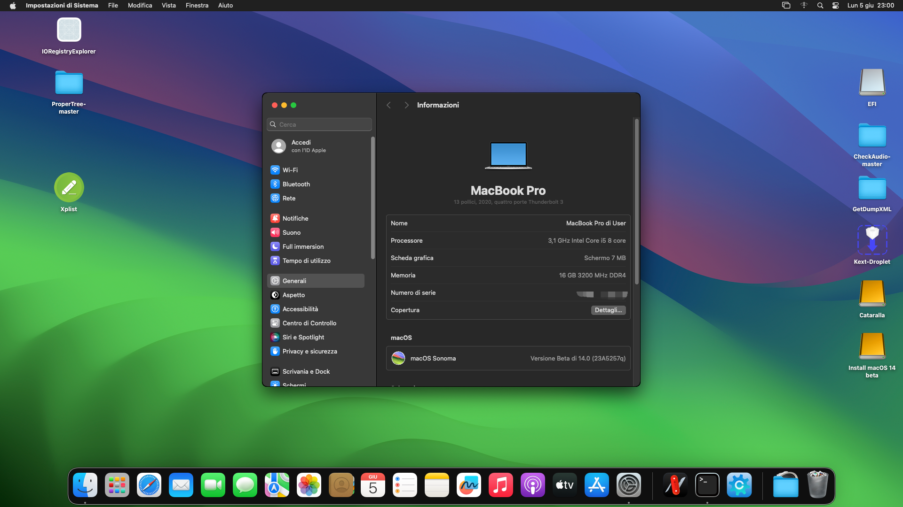

如果你想在 Windows 电脑 上体验苹果最新的 macOS 14 Sonoma 系统！

那么跟着我步骤来进行安装吧~



## 安装步骤

第1步：安装VMware虚拟机软件VMware Fusion Pro，这个软件已经正式免费提供给个人用户使用！

【[官方下载地址](https://blogs.vmware.com/teamfusion/2024/05/fusion-pro-now-available-free-for-personal-use.html)】或 网盘【[打包下载](https://pan.tuio.cc/s/4ktg)】

第2步：下载VMWare Unlocker【[官方下载](https://github.com/paolo-projects/unlocker)】，下载后以管理员身份运行 win-install

第3步：下载 macOS 14 索诺玛 （Sonoma）的 ISO 系统文件【[点击下载](https://www.mediafire.com/file/lzlounvkwazy948/macOS+Sonoma+ISO.iso/file)】

第4步：创建虚拟机，转到我的文档 -> 虚拟机 -> macOS 14 虚拟机文件，

然后在 右键单击​​ 2 KB 的macOS 14 (.VMX) 文件，然后选择使用记事本打开，并在文件代码底部输入以下内容：

```code
smc.version = "0"
```
同时搜索

```code
ethernet0.virtualDev = "e1000e" 
```
替换成

```code
ethernet0.virtualDev = "vmxnet3" 
```

