  
想找远程工作吗？我为您整理了一份包含30个优质远程工作网站的清单，帮助您在线搜索合法且高薪的远程职位。以下是寻找远程技术岗位、自由职业机会等的理想平台！

如今，线上寻找远程工作的理由越来越多，也比以往任何时候都更具意义。或许您是希望重返职场的全职妈妈，需要灵活安排时间接送孩子；或者您因身体或心理原因，更适合在家办公；又或者您是数字游牧者，渴望边旅行边通过网络工作。Flexjobs调查显示，若有选择，66%的员工更倾向于全职远程办公，尤其在疫情之后。

如果您对穿着舒适的家居服在家中办公感兴趣，或者即使在家工作不是您的首选，您依然有多种远程工作选项。远程工作不再是遥不可及的梦想，而是真实可行的选择！

在这篇文章中，我们列出了30个寻找远程工作的最佳网站。无论您需要全职、兼职，还是科技行业或其他领域的工作，这些网站都是您在家办公的绝佳资源！

让我们花点时间来澄清一下在家工作、远程办公和远程工作之间的区别。  

+   在家工作的工作顾名思义就是在家工作的工作。这个术语所指的假设是，工作要么在传统的办公室里完成，要么在客厅里完成，但对于许多人来说，在家里工作是一个完美的远程解决方案。
+   远程办公工作通常允许人们在家（或其他地方）为仍在其附近地区的公司或组织工作。每周在办公室工作三天，但在家工作两天的工作就是远程办公的典型例子。
+   远程工作是一个包罗万象的术语，适用于可以在世界任何地方完成的工作。由于在家工作和远程办公工作是远程工作的子集，因此我们更喜欢使用远程工作来描述任何不涉及特定办公室或工作场所的工作。如果你在家工作，那就是远程工作；如果您在联合办公空间、咖啡店或海滩工作，这也属于远程工作。

根据劳工统计局数据，即便在2020年前，远程工作的比例就已逐年上升。现在正是了解远程工作独特优势和好处的绝佳时机。如果您已准备好申请远程职位并了解相关流程，请参考我们的指南，获取更多信息。这些网站是您在线寻找远程工作的最佳起点！
  

**1\. FLEXJOBS（[https://www.flexjobs.com/](https://www.flexjobs.com/)）**  
  
拥有 50 多个远程工作类别，预先筛选的职位范围从自由职业、兼职工作到全职工作，远程职业从入门级到高管不等。该虚拟求职委员会目前发布了超过 20,000 个在家工作和数字游牧职位的招聘信息。  

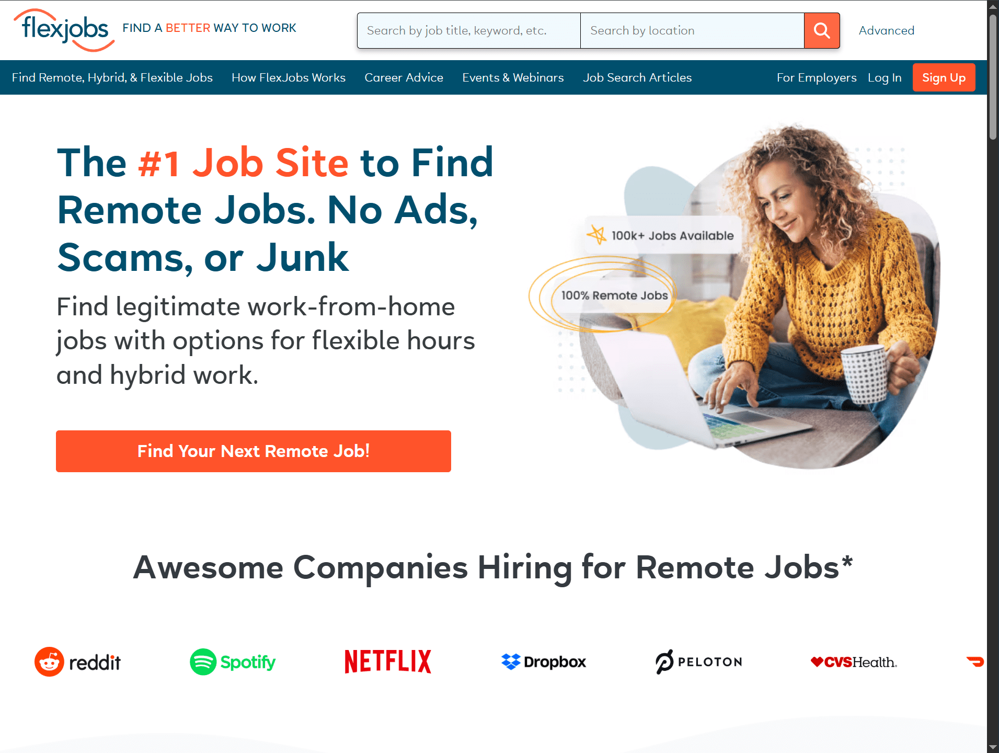

  
**2. Arc（[https://arc.dev/](https://arc.dev/)）**  
  
Arc 是一个为世界各地的开发人员提供的仅限远程的招聘网站。如果您是技术新手，这对您来说可能是一个很好的资源。扫描他们的远程初级开发人员职位和职位实习页面（在新选项卡中打开）获取专门为入门级申请人标记的职位列表。在那里找到真正的入门级开发人员工作可能很困难，但这是一个很好的起点。  

  
**3\. REMOTE.CO [https://remote.co/remote-jobs/](https://remote.co/remote-jobs/)）**  
远程公司（在新选项卡中打开）手动整理远程工作列表，并允许您按工作类型搜索或浏览。这些列表和职位类别包括：客户服务职位、设计机会、开发人员职位、招聘人员和人力资源职位、销售职位以及其他在线远程职位（包括作家、经理和营销人员）。  

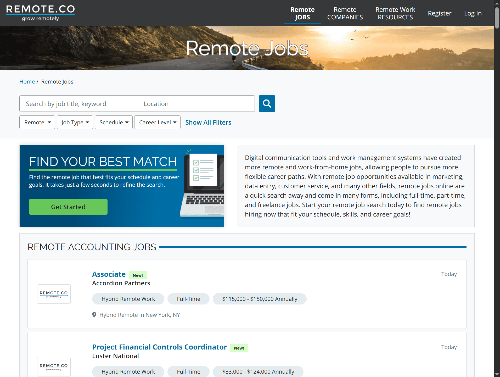

  
  
**4.JUSTREMOTE（[https://justremote.co/](https://justremote.co/)）**  
涵盖许多垂直工作和远程工作，包括：开发、营销和设计、人力资源和客户成功职位。您可以按地点过滤职位，他们的虚拟工作板会清楚地突出显示职位是否有特定的国家/地区或时间重叠要求。  

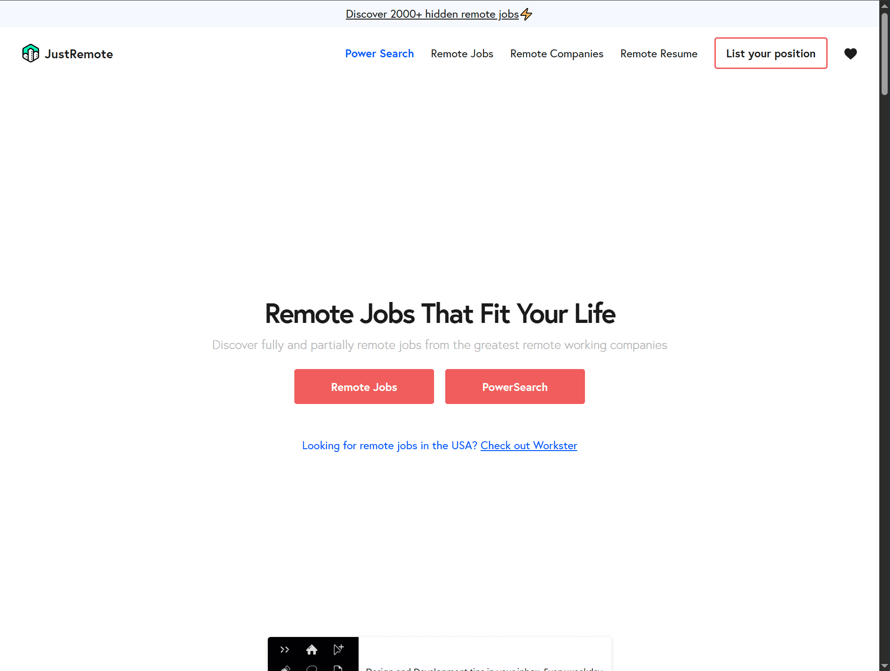

  
**5\. VIRTUAL VOCATIONS（[https://www.virtualvocations.com/](https://www.virtualvocations.com/)）**  
虚拟职业”（在新选项卡中打开）就业委员会在技术写作和律师助理等工作领域设有远程办公职位，并由完全远程的团队运营。除了他们的工作委员会之外，该网站的博客还有很棒的提示。  

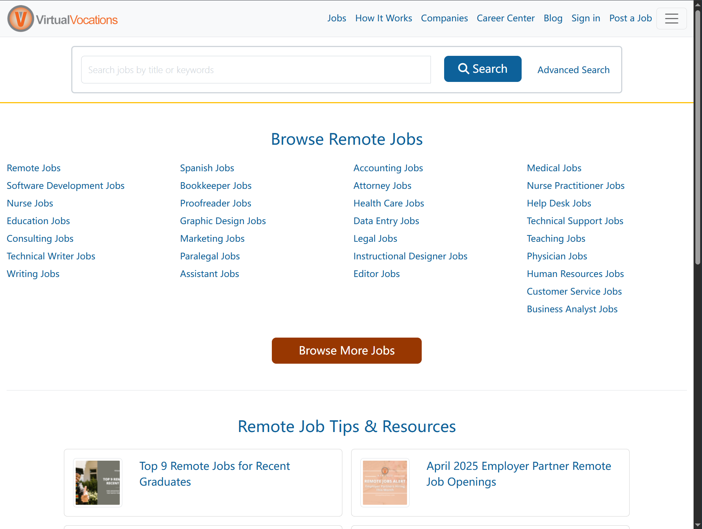

  
**6\. PANGIAN（[https://pangian.com/](https://pangian.com/)）**  
提供了一系列开放的远程职位，包括网络开发、用户体验设计、内容创建和数字营销，以及参与在线社区的机会。  

  
  
**7\. WE WORK REMOTELY（[https://weworkremotely.com/](https://weworkremotely.com/)）**  
布局简单明了，从客户服务到网页设计，再到编程。We Work Remotely 每月为超过 130,000 名用户提供远程办公机会。这是您立即获得远程就业机会的门票。  

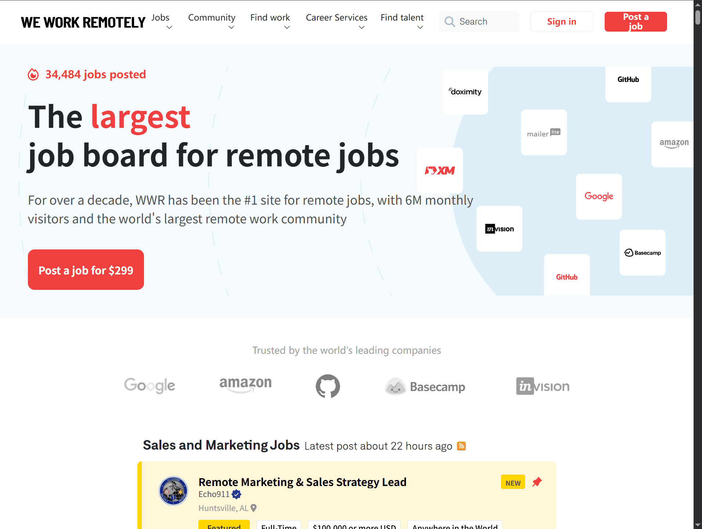

  
**8\. REMOTIVE（[https://remotive.com/](https://remotive.com/)）**  
是一份针对对远程工作感兴趣的求职者的双月刊通讯，其中包括按工作类别（销售、支持、产品工程、营销等）细分的远程职位的详细列表，使您可以轻松找到您想要的特定工作类型正在寻找。  

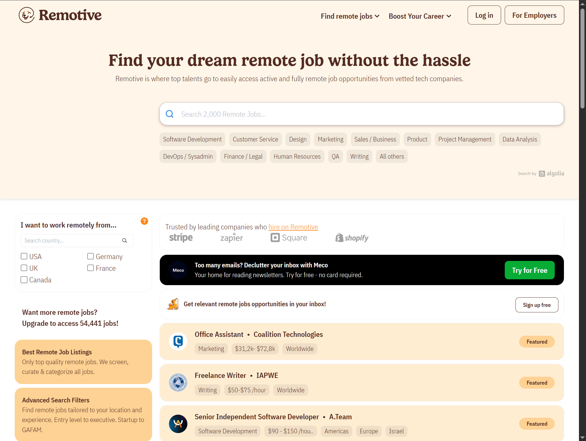

  
  
**9\. SKIP THE DRIVE（[http://skipthedrive.com](https://skipthedrive.com)）**  
这个虚拟工作板具有方便的资源选项卡和可靠的远程工作列表，忠实于其同名使命，您可以真正将早晨丑陋的交通堵塞换成悠闲的远程办公。  

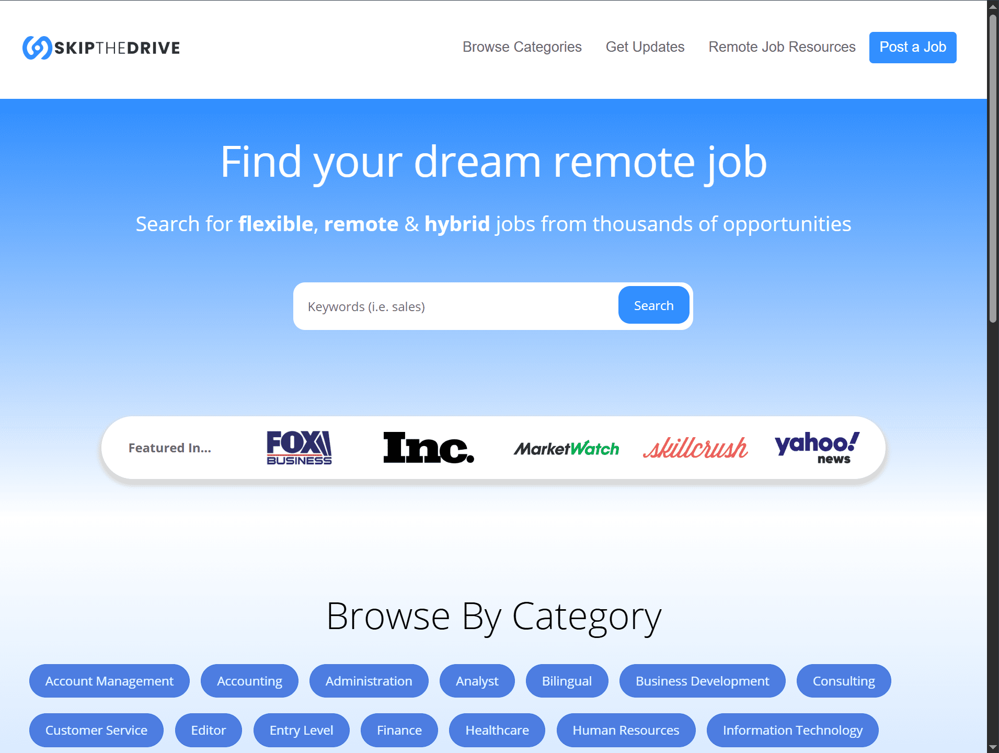

  
**10\. REMOTE OK（[https://remoteok.com/](https://remoteok.com/)）**  
它是一个远程招聘网站，标记了所有职位列表 - 您可以为所需的特定列表设置过滤器，包括招聘人员发布的职位、按经验级别（初级、高级等）、按职位类型（销售、营销、设计、开发等），甚至无论它们是技术相关工作还是非技术相关工作。  

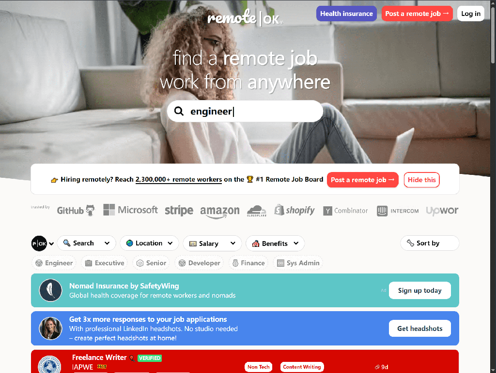

  
**11\. WORKING NOMADS（[https://www.workingnomads.com/jobs](https://www.workingnomads.com/jobs)）**  
专门为忙碌的数字游民提供的时事通讯服务。当您注册时事通讯时，Working Nomads 将直接向您的收件箱发送精选的远程工作列表。您可以选择每天或每周发送电子邮件，然后继续前往下一个城市，同时进行远程办公求职。  

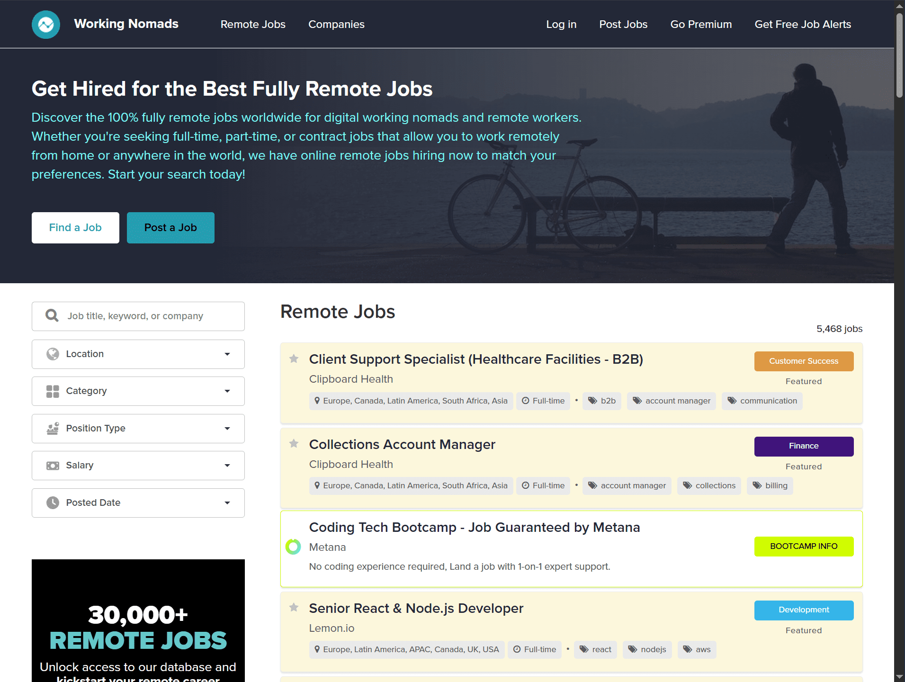

  
**12\. JOBSPRESSO（[https://jobspresso.co/](https://jobspresso.co/)）**  
  
工作压力（在新选项卡中打开）提供技术、营销、客户支持等方面的广泛策划工作。您可以在他们的虚拟求职板上搜索空缺职位，并发布您的简历以供潜在雇主搜索和查看。  

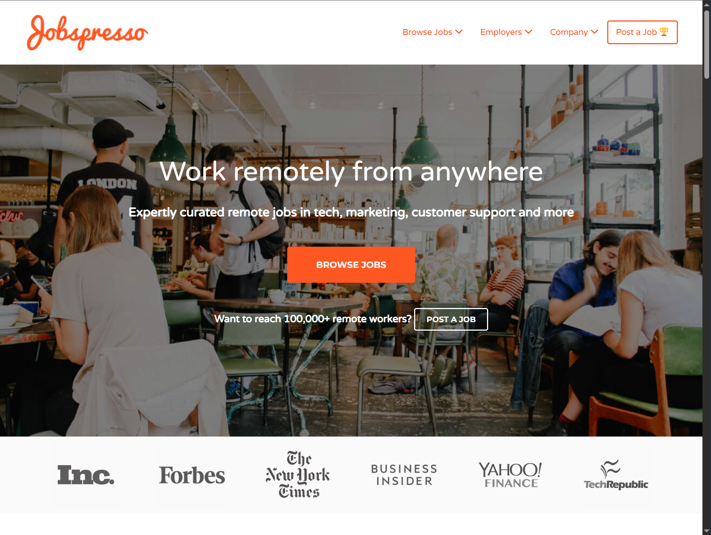

  
**13\. EUROPEREMOTELY（[https://euremotejobs.com/](https://euremotejobs.com/)）**  
如果您是一名求职者，希望在欧洲时区远程工作（无论您是否来自欧洲），您需要查看EuropeRemotely。这个虚拟求职板充满了来自乐于与在家和远程员工合作的公司的职位列表远程员工（在新选项卡中打开）有兴趣根据欧洲时区开展工作的人。  

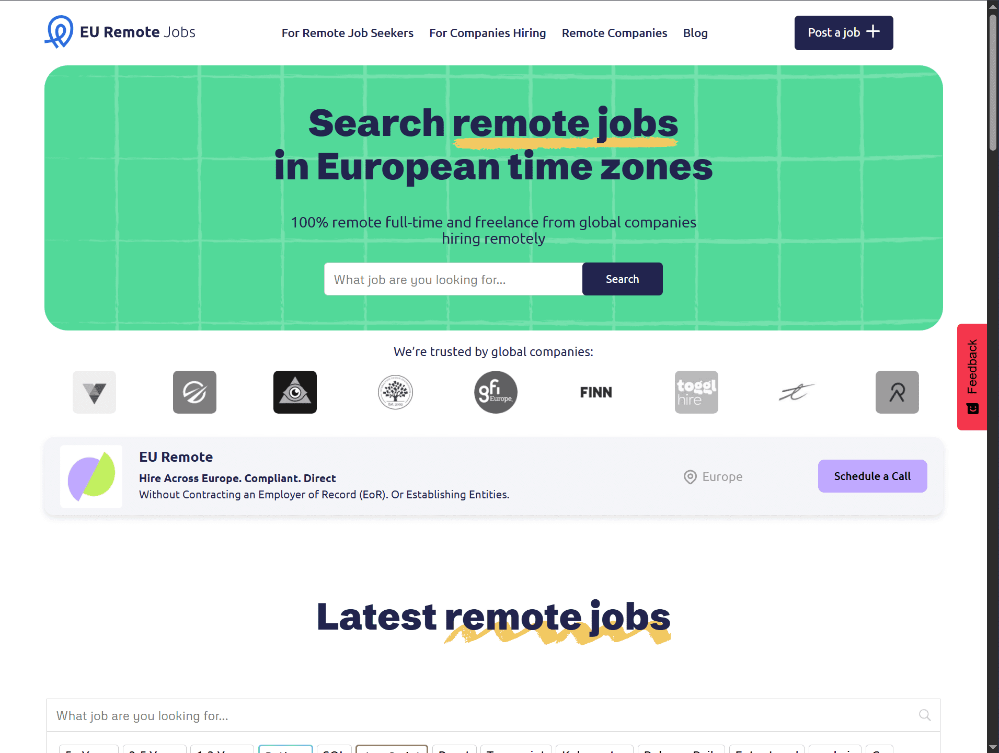

  
**14\. ALLREMOTE（[https://allremote.jobs/](https://allremote.jobs)）**  

一个专注于远程工作的求职平台，汇集了全球范围内的远程职位机会。无论你是自由职业者还是寻求灵活工作方式的专业人士，这里都能为你提供丰富的岗位选择，涵盖科技、设计、营销等多个领域。网站界面简洁，易于操作，帮助用户快速找到适合的远程工作机会，实现工作与生活的平衡。

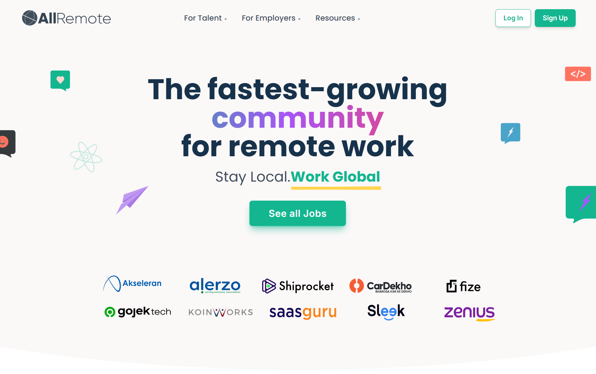

  
  
**正在寻找提供灵活的时间安排、高薪和创造性工作的远程公司吗？尝试这些具有远程选项的技术相关工作。**  
**15\. POWERTOFLY（[https://powertofly.com/](https://powertofly.com/)）**  
专注于为科技领域的女性匹配远程和在家工作的工作。如果您加入该网站的人才数据库，您将通过审查流程并与潜在雇主匹配进行付费试用（2-4 周的测试期）。  

  
**16\. LANDING.JOBS（[https://landing.jobs/](https://landing.jobs/)）**  
它们的科技工作机会中并没有很大一部分专门用于远程工作，但他们确实精心策划了他们的列表。作为额外的福利——与许多工作委员会不同——他们的网站允许你过滤搜索完全远程、部分远程、甚至物理通勤距离内远程的工作。  

  
**17.AUTHENTIC JOBS（[https://authenticjobs.com/](https://authenticjobs.com/)）**  
它自称是“网络专业人士的就业委员会”。单击网站用于职位搜索的“无线徽标”，然后按远程职位进行筛选。这是一个设计精美且易于使用的虚拟求职板，反映了其专注于为网页设计师和网页开发人员提供就业机会。  

  
**18\. DRIBBBLE（[https://dribbble.com/jobs](https://dribbble.com/jobs)）**  
最常被称为自由网页设计师分享他们的作品集并寻找下一份工作的支柱网站，但它也有一个鲜为人知的职位列表功能。屏幕顶部有一个位置选项卡，您可以在其中单击“远程/任何地方”，然后前往比赛寻找下一个在家工作的地方。  

  
  
**19.ANGELLIST（[https://wellfound.com/](https://wellfound.com/)）**  
您是否一直梦想在科技初创公司工作，但不住在科技中心？这就是远程工作的美妙之处——没关系！如果您前往AngelList- 启动职位列表的顶级来源 - 您可以输入职位搜索，然后在系统提示您输入搜索类型时单击“远程确定”。然后，无论是否是技术中心，您都可以找到一家适合您的初创公司。  

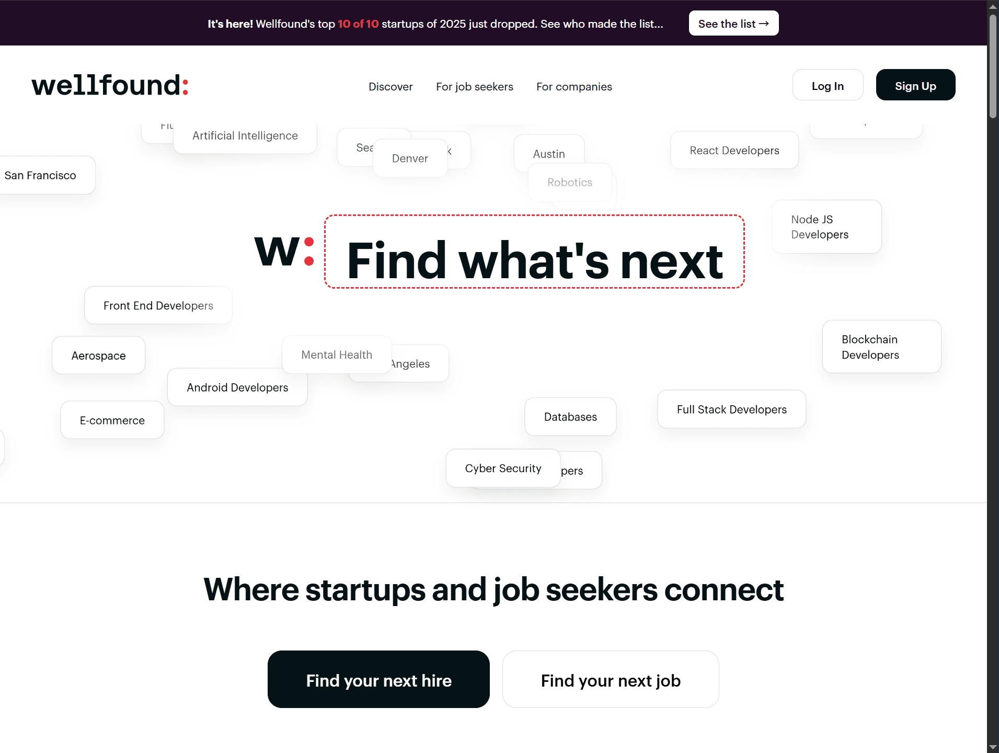
  
  
**20\. CAREER VAULT（[https://www.careervault.io/](https://www.careervault.io/)）**  
职业宝库跟踪 1800 多家公司，每天直接从他们那里拉出 200 多个新的远程工作岗位。它们会自动删除过期的职位，并提供许多不同领域的职位，例如：设计、营销、写作、支持和软件开发。  

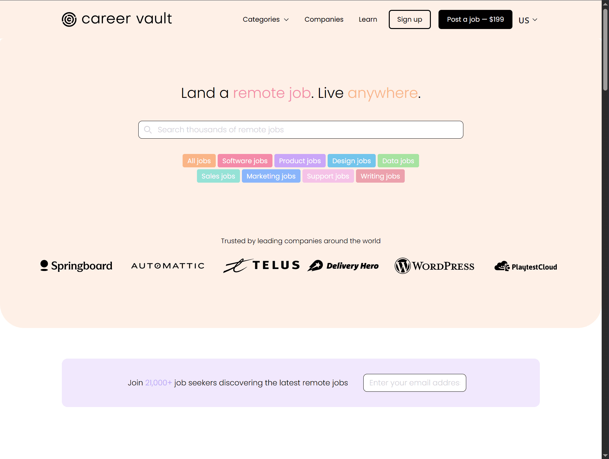

  
**21\. TOPTAL BUSINESS（[https://www.toptal.com/finance](https://www.toptal.com/finance)）**  
专注于将商业顾问与自由职业企业活动联系起来。无论您是拥有项目管理专业知识，还是构建财务模型的高手，Toptal Business 网站和模型都适合数字游牧者、远程工作和自由职业者。  

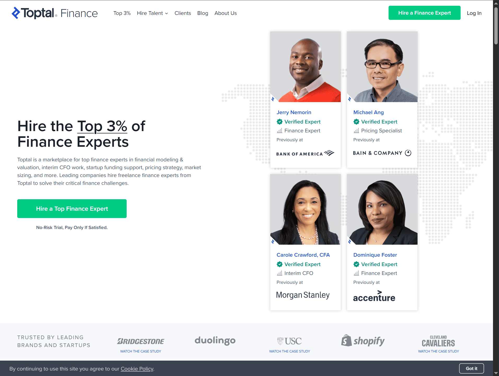

  
**22\. FIVERR（[https://www.fiverr.com/](https://www.fiverr.com/)）**  
可以帮助您找到第一份自由职业并快速建立自己的作品集。Fiverr 网站专注于“零工”或“微型工作”，例如在 Photoshop 中编辑图像、设计 Facebook 广告或集体讨论值得 SEO 排名的文章标题。  

）**  
提供一系列类别的自由远程工作列表：虚拟助理、移动应用程序开发人员和文案撰稿人等。Zendesk、Dropbox 和 Airbnb 等公司使用该网站雇用远程自由职业者，因此，如果您准备好开始为一些大客户做自由职业而无需踏入办公室，请尽快创建您的 Upwork 个人资料。  

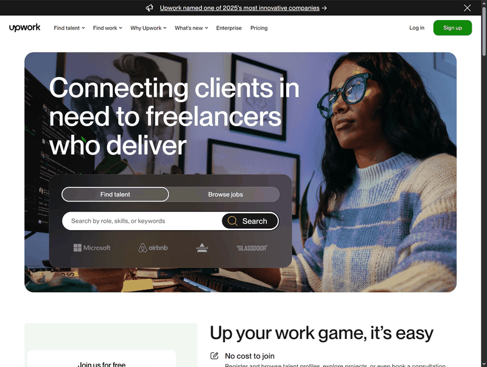

  
**24\. FREELANCER（[https://www.freelancer.com/](https://www.freelancer.com/)）**  
自由职业者网站声称是“世界上最大的外包市场”，并且充满了远程自由职业。它拥有超过 1300 万用户，为 PHP 开发人员、内容作家和网页设计师等提供自由职业。您所需要做的就是建立一个个人资料，然后您就可以开始竞标工作。  

  
**25.FREELANCERMAP（[https://www.freelancermap.com/](https://www.freelancermap.com/)）**  
  
自由职业者地图允许用户搜索数千个活跃的 IT 项目，寻找远程自由团队成员。该网站具有全球影响力，目前其首页上列出了美国、澳大利亚和捷克共和国公司的项目。  

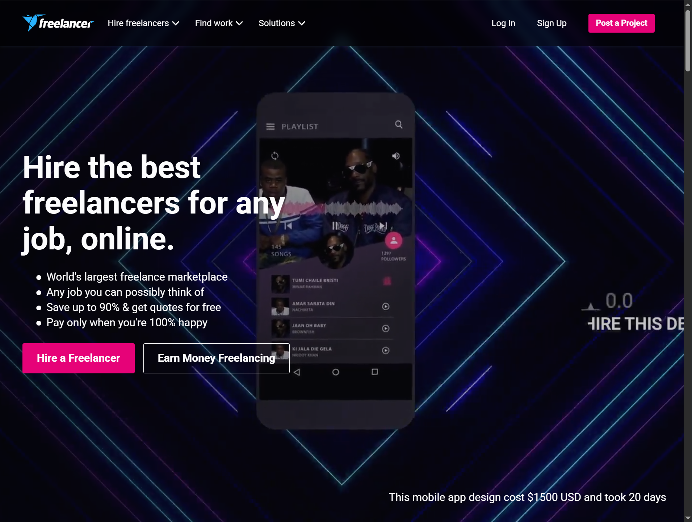

  
**26\. GUN（[https://gun.io/](https://gun.io/)）**  
是一个专为自由网络开发人员设计的自由平台。您可以通过 GitHub 注册（因此请确保您的 GitHub 个人资料是最新且有效的），他们将帮助您与需要您服务的公司进行匹配。  

  
**27\. THE MUSE（[https://www.themuse.com/search/](https://www.themuse.com/search/)）**  
The Muse 拥有华丽的用户界面以及有关所有公司和职位的广泛信息，The Muse（在新选项卡中打开）让在家搜索工作变得轻松。  

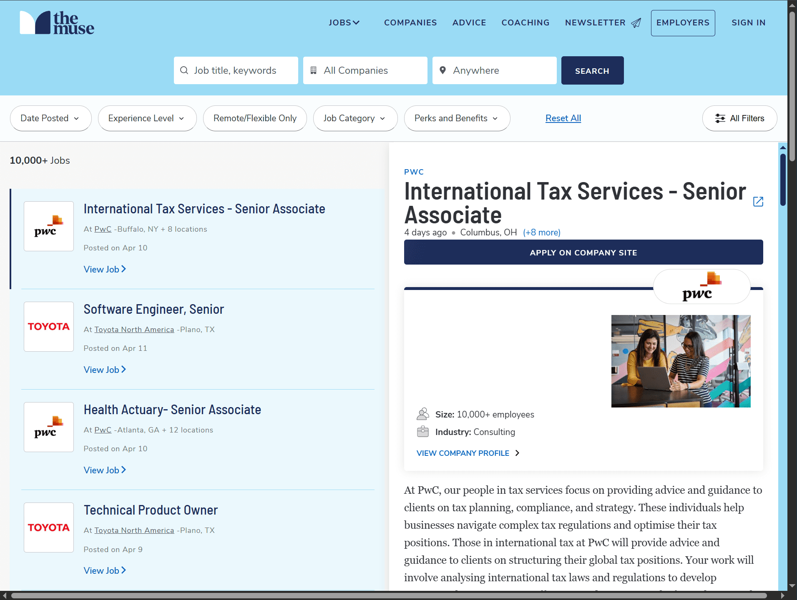

  
**28.INDEED（[https://hk.indeed.com/](https://hk.indeed.com/)）**  
它从互联网和世界各地提取职位数据，使其成为最强大的职位搜索引擎之一。截至撰写本文时，Indeed 对远程职位的搜索产生了 2,000 多个不同职位的列表。  

  
**29\. CAREER BUILDER（[https://www.careerbuildercareers.com/](https://www.careerbuildercareers.com/)）**  
该求职网站声称是美国最大的在线就业网站。只需输入“远程办公”或“远程”作为关键字，您就会找到 9,000 多个兼职、合同和全职工作。  

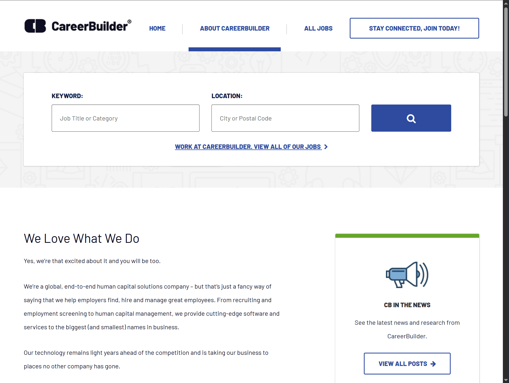

  
**30.IDEALIST（[https://www.idealist.org/](https://www.idealist.org/)）**  
它在全球范围内拥有数百个远程工作列表（只需单击位置下的“远程”即可）。所有这些工作都是为致力于为世界带来积极影响的组织和非营利组织提供的。在世界任何地方工作、获得报酬并为有价值的事业做出贡献？这是一场远程胜利。

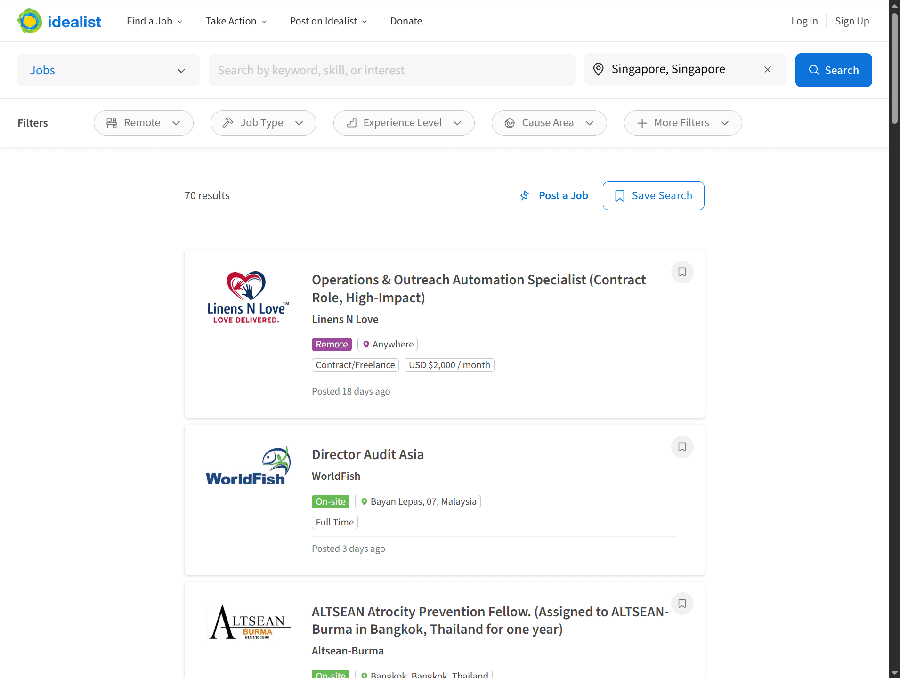

  
如此丰富的远程工作网站，想赚美金、欧元的老板们就赶紧开始注册行动起来吧。  

