xAI 公司重磅发布了全新一代大语言模型 Grok 3，其卓越的性能表现令业界瞩目。为了回馈广大开发者，xAI 平台目前正在开展一项超值优惠活动 - 只需充值 5 美元，即可获得每月高达 150 美元的 API 调用额度。现在可以直接通过 make 平台直接调用 Gork 3，是一个性价比不错的大模型。

为了帮助大家更便捷地使用 xAI 平台,MetaX特别准备了这份详细的充值教程。在开始之前,请注意以下几点:

1\. 本教程推荐使用虚拟信用卡进行充值[https://bewildcard.com/i/3ZTDHOAX](https://bewildcard.com/i/3ZTDHOAX)

当然,您也可以尝试使用国内信用卡(MetaX未进行测试)

2\. 最低充值金额为 5 美元

### 手把手教程：

1\. 访问 xAI 官网 ([https://x.ai/](https://x.ai/))，

点击顶部导航栏的 API 按钮，进入 API 页面

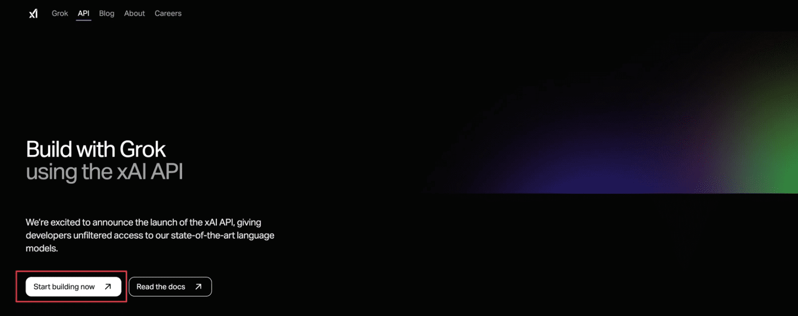

2.点击 "Start building now" 按钮，使用谷歌账号或 X 账号登录系统

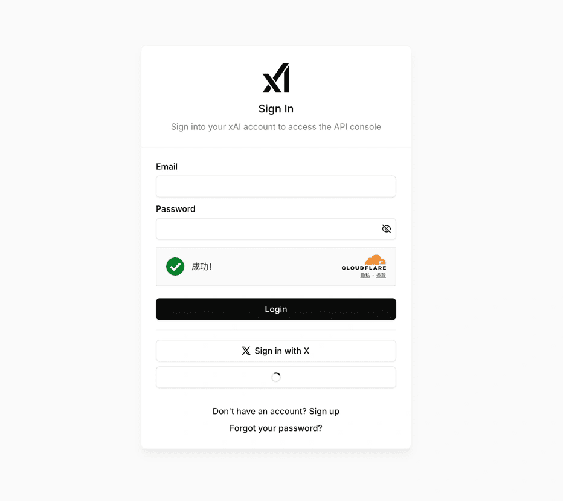

3\. 进入控制台后,点击"购买点数"按钮

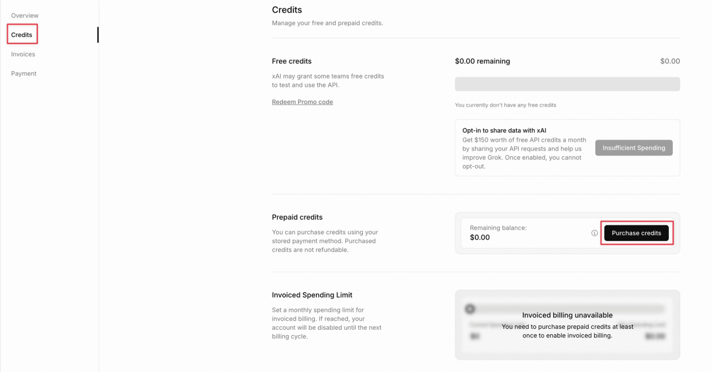

4\. 在弹出的地址页面中,根据野卡虚拟卡的地址信息进行填写

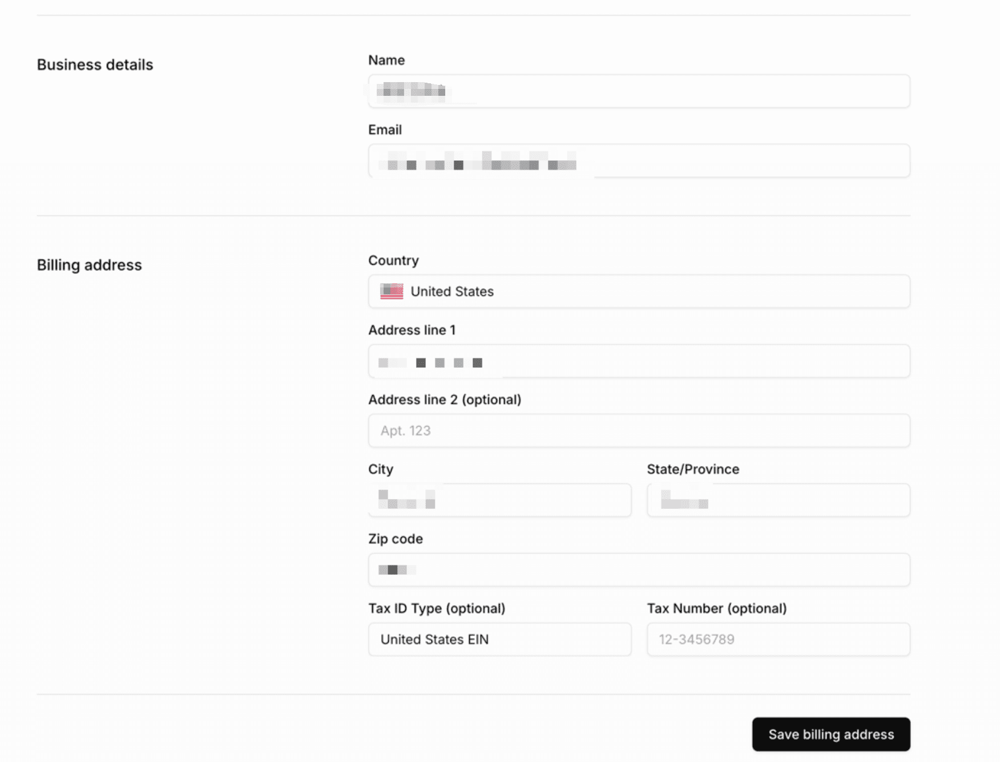

野卡地址，点击注册：

[https://bewildcard.com/i/3ZTDHOAX](https://bewildcard.com/i/3ZTDHOAX)

5.输入完成继续，购买点数流程:

\- 选择购买金额为 5 美元

\- 在侧边弹出的银行卡页面中填写野卡虚拟卡信息

\- 点击"继续"完成支付

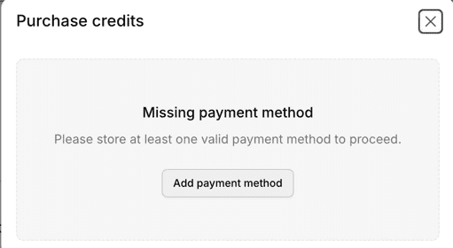

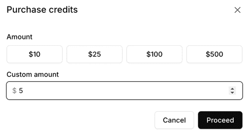

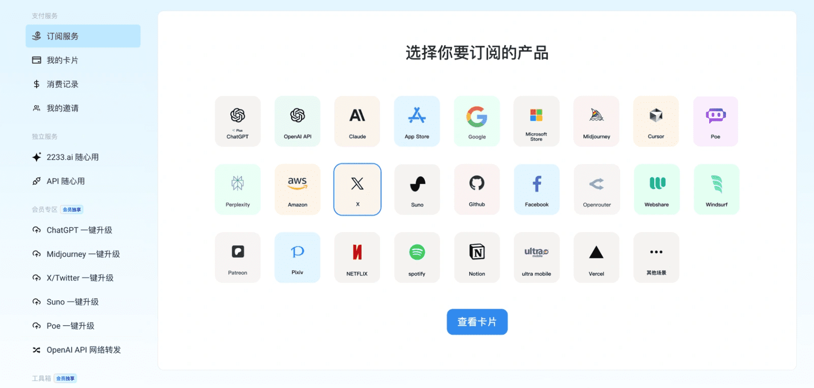

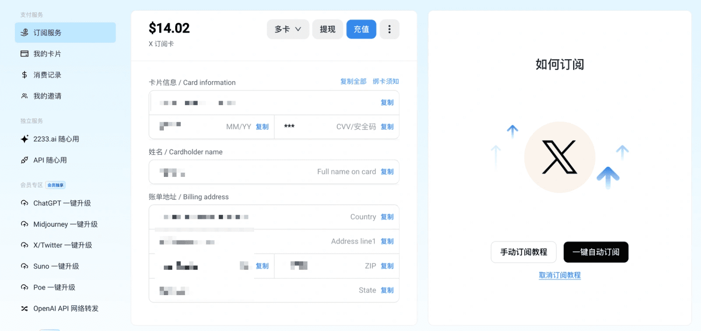

8\. 完成购买后:

\- 点击 "Share data"

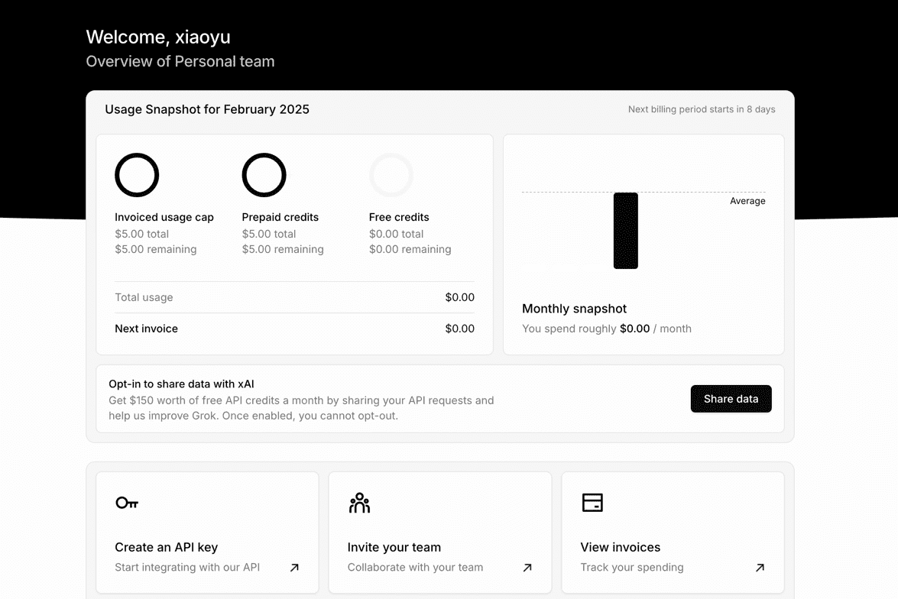

\- 允许将请求开放给 GORK

\- 获得每月 150 美元的调用额度

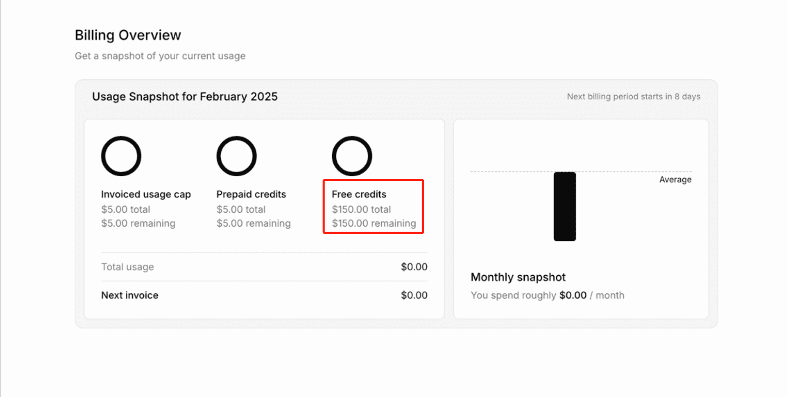

9.点击左侧 api 按钮，新建 API key，并复制该 key

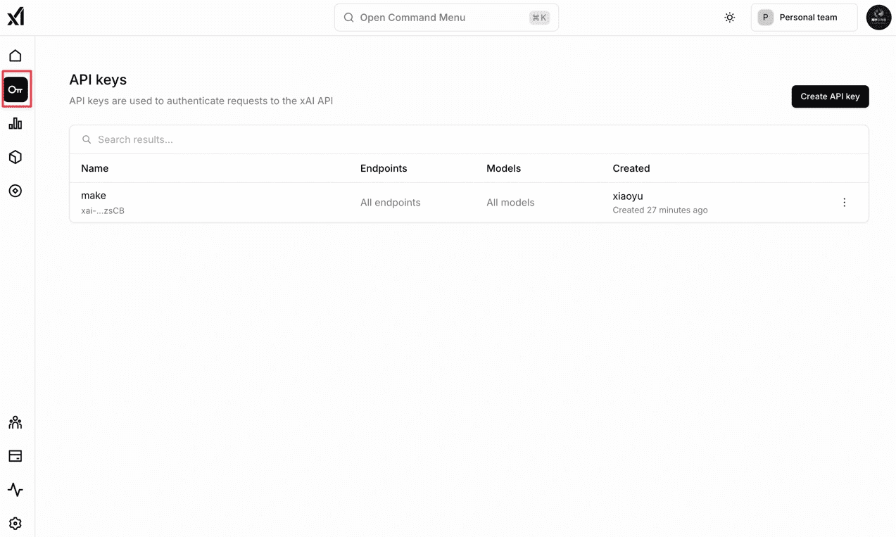

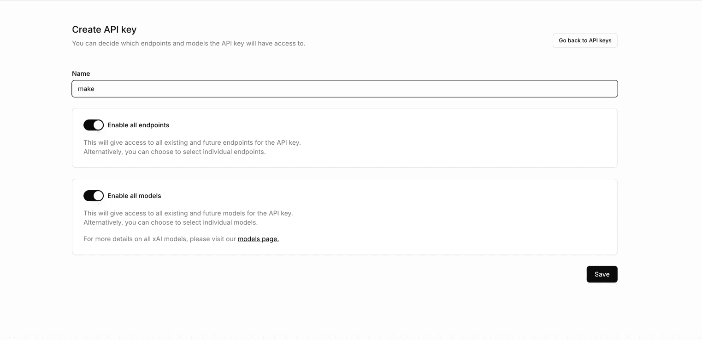

可以将该API Key用在相应的应用模块中了。