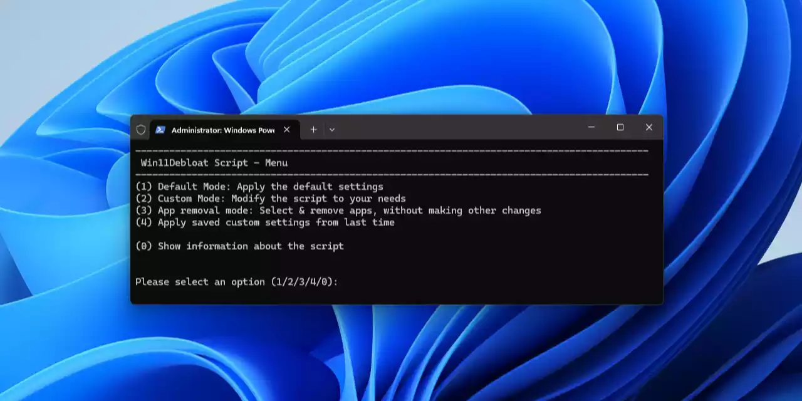
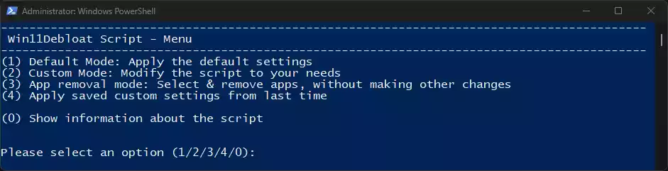

>Win11Debloat 是一个简单、易用且轻量级的 PowerShell 脚本，完全免费开源！可以删除预装的 Windows 臃肿软件应用程序、禁用遥测并通过禁用或删除侵入性界面元素、广告等来简化体验。无需亲自费力地完成所有设置，也无需逐个删除应用程序。Win11Debloat 使这个过程变得快速而简单！

您可以精确选择脚本要进行的修改，也可以使用默认设置。如果您对任何更改不满意，可以使用“Regfiles”文件夹中的注册表文件轻松恢复它们。所有被删除的应用程序都可以从 Microsoft 商店重新安装。

下载方式：【[官方下载](https://github.com/Raphire/Win11Debloat)】或 【[备用下载](https://www.dongli7.com/thread-154-1-1.html)】


应用程序删除
 

删除各种过度膨胀的应用程序。
从当前用户或所有现有用户和新用户的开始菜单中删除所有固定的应用程序。（仅限 Windows 11）
遥测、跟踪和推荐内容
 

禁用遥测、诊断数据、活动历史记录、应用程序启动跟踪和定向广告。
在开始、设置、通知、文件资源管理器和锁屏上禁用提示、技巧、建议和广告。
Bing 网页搜索、Copilot 等
 

从 Windows 搜索中禁用并删除 Bing 网络搜索和 Cortana。
禁用 Windows Copilot。（仅限 Windows 11）
禁用 Windows 调用快照。（仅限 Windows 11）
文件管理器
 

显示隐藏的文件、文件夹和驱动器。
显示已知文件类型的文件扩展名。
从文件资源管理器侧面板隐藏图库部分。（仅限 Windows 11）
从文件资源管理器侧面板隐藏 3D 对象、音乐或 onedrive 文件夹。（仅限 Windows 10）
从文件资源管理器侧面板隐藏重复的可移动驱动器条目，因此只保留“此电脑”下的条目。
任务栏
 

将任务栏图标左对齐。（仅限 Windows 11）
隐藏或更改任务栏上的搜索图标/框。（仅限 Windows 11）
隐藏任务栏中的任务视图按钮。（仅限 Windows 11）
禁用小部件服务并隐藏任务栏中的图标。
隐藏任务栏中的聊天（立即开会）图标。
上下文菜单
 

恢复旧的 Windows 10 样式上下文菜单。（仅限 Windows 11）
从上下文菜单中隐藏“包含在库中”、“授予访问权限”和“共享”选项。（仅限 Windows 10）
其他
 

禁用 Xbox 游戏/屏幕录制（也停止游戏覆盖弹出窗口）
高级功能
 

Sysprep 模式将更改应用于 Windows 默认用户配置文件。
默认模式
 

默认模式应用了针对大多数用户推荐的更改，请展开下面的部分以获取更多信息。
```
Default mode applies the following changes:
- Remove the default selection of bloatware apps. (See below for full list)
- Disable telemetry, diagnostic data, activity history, app-launch tracking & targeted ads.
- Disable tips, tricks, suggestions and ads in start, settings, notifications, File Explorer, and on the lockscreen.
- Disable & remove Bing web search & Cortana from Windows search.
- Disable Windows Copilot. (Windows 11 only)
- Show file extensions for known file types.
- Hide the 3D objects folder under 'This pc' from File Explorer. (Windows 10 only)
- Disable the widget service & hide the icon from the taskbar.
- Hide the Chat (meet now) icon from the taskbar.
 ```

