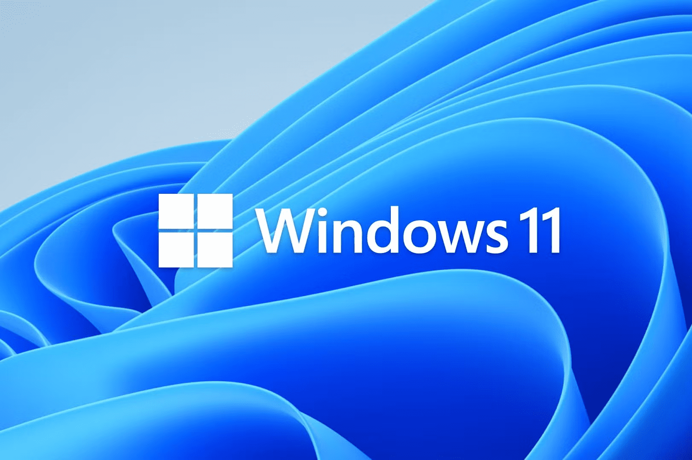

> Windows 11 （24H2 LTSC）是目前最干净最稳定的版本，最低2G内存的电脑都可以轻松安装使用！没有内置臃肿的功能，无任何广告打扰，系统优化更高级，推荐使用！



Windows11（24H2 LTSC） 下载方式：

1、最新版下载：【[点击前往](https://archive.org/download/26100-ltsc-x64-enus)】

2、网盘下载：【点击前往】

Rufus 系统制作工具：【[点击下载](https://rufus.ie/)】

MAS 激活：

在 powershell 下以管理员身份打开，最后执行下方的命令即可

```markdown
irm https://massgrave.dev/get | iex
```